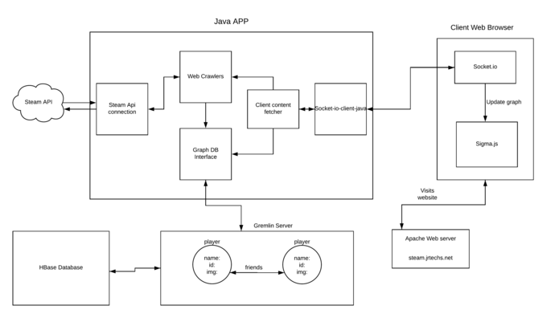
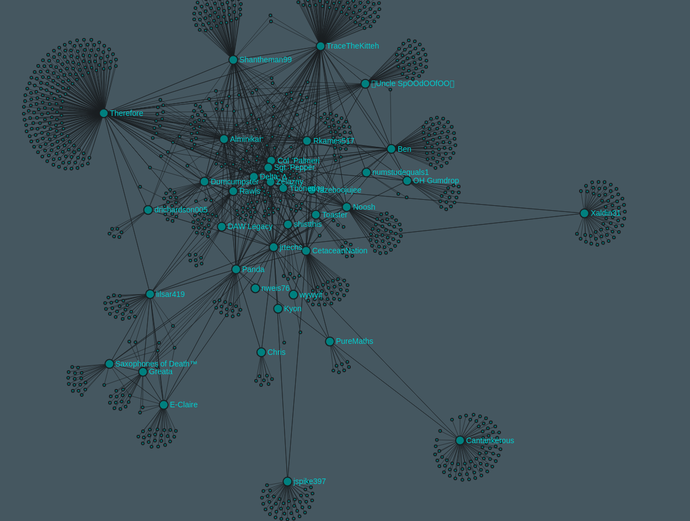
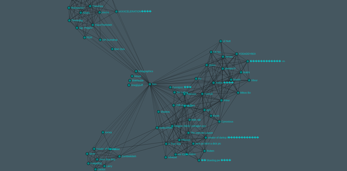
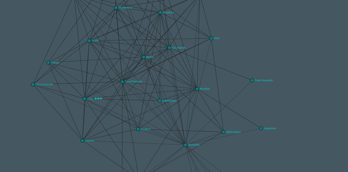

<iframe width="100%" height="315" src="https://www.youtube.com/embed/DoDaHmyIPvQ" frameborder="0" allow="autoplay; encrypted-media" allowfullscreen></iframe>

### Links

- [GitHub](https://github.com/jrtechs/SteamFriendsGraph)
- [Live Site](http://steam.jrtechs.net/)

### Project Description

This project utilizes the steam API and graph databases to create friend graphs for clients in a 
web browser. Currently there are two types of graphs available:
- Friends of Friends Graph:
    This graph displays all the steam friends of a single person and all their friend’s friends.
- Common Friends Graph:
     This graph will only display your friends; however, it will draw edges between your friends’ if 
     they are friends with each other. 

### Motivation

While learning about graph databases I thought that it would be awesome to create a massive graph
database with steam friends in it. After a quick google search, I realized that some other people have 
done similar things in python, however, nobody has ever made a live website do this. Using my prior 
knowledge of the steam API and new knowledge of gremlin, Hadoop and HBase, I figured that this would 
be a great weekend project. Although I got most of the functionality done in the first weekend, I 
ended up working on it for 3 weekends hammering out all the edges. After ample work, I am satisfied with 
the appearance and functionality of the website, but, I am looking forward to making some improvements 
in the future.

### Technical Details

At the core of this project there is a java backend and a JavaScript frontend. I needed a backend for
this project because you cannot distribute your steam API key, plus, this allows me to cache everything
in a local graph database. The second time a player is queried, it is extremely fast since all the steam 
friends are cached in a local
 [gremlin](http://tinkerpop.apache.org/docs/3.0.1-incubating/) server.
The only time-consuming operation that the backend must carry out is querying the steam API; querying the
 gremlin server is relatively fast.
On the front end I used [Sigma-JS](http://sigmajs.org/) with a web socket to render the steam graph.
Since creating a new graph on the back end can take up to 5 minutes (if the player has not been indexed), 
I continuously send new nodes to
the client as they arrive from the steam API. This prevents the client from staring at a loading bar
for 5 minutes; plus, it makes great time lapse videos. The only drawback to this is that you cannot
start applying a force to shake the graph until all the nodes are added to the graph. 

 ### Uses of Friends Graph Data Base
 
There are tons of [academic papers](http://infolab.stanford.edu/~ullman/mmds/ch10.pdf) 
written on the usages of friends’ graphs. What you may be able to do with friends 
graph may shock you. A popular use of friends’ graphs is to view friends’ clusters. Facebook may be able
 to identify someone's family, friends, and work groups by simply using their friend’s information. When looking
at steam friends graphs I could identify some people's high school and college friend’s groups. Another
famous example would be for friends’ identification; If a ton of people in your friends list are also
friends with a person, it is likely that they would also know that person. This is how 
websites like Snapchat, Instagram, and Facebook recommend people for you to follow. Similarly, you can
use this to identify people’s best friends. If two people share a ton of friends, it is 
more likely that they will be good friends vs the person which they only share one friend with.

Simple analysis of graphs like this may seem benign. However, there are tremendous implications when it
 comes to privacy and advertising. If websites chose to, they can harvest a ton of data and start 
 recommending you products based on not just what you like, but what your friends also like. Steam
already does this to a certain extent when they recommend you games that are popular among friends. 

### Hosting the Project

Hosting the front end of this project is easy, it is just thrown on an apache server. The backend
is trickier since it needs to run both a java app and a gremlin server. Currently I am hosting this
project on an Ubuntu VM with 4gb ram. At idle this project only takes 1gb of ram, however, under heavy 
loads it uses around 2 GB of ram and saturates my CPU.

### Future Plans for the Project

In the future I would love to add more graphs to this website. Instead of just displaying graphs it would
also be cool to create pages which tries to identify friends’ groups, people you may know, and best
friends. There is a ton of game information available on the steam API, it might be neat to make
graphs based on friends who play the same games.