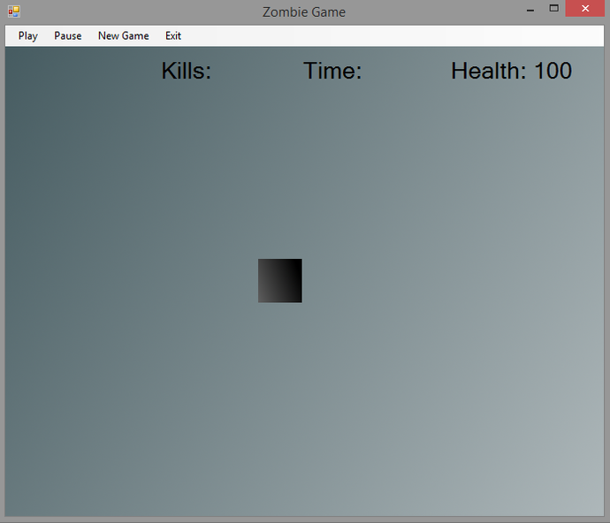
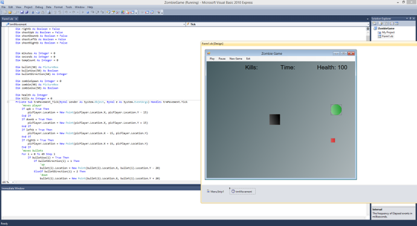

<iframe width="100%" height="315" src="https://www.youtube.com/embed/KC9zrgMt1FA" frameborder="0" allow="autoplay; encrypted-media" allowfullscreen></iframe>

This is a simple zombie shooter game that I made in visual basics. The graphics
are very basic due to copyrights that I wanted to avoid – and lack of artistic
abilities. However, this game is meant to be a demo so that you can learn
something from what I did. If you enjoyed this feel free to download the source
code (linked below).

The music used in the video was called Aurora Borealis and it was downloaded
from the YouTube Audio Library.

Downloads:

[Zombie Game YouTube demo](https://jrtechs.net/download/ZombieGameYoutube/)

