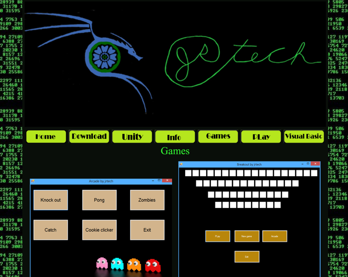
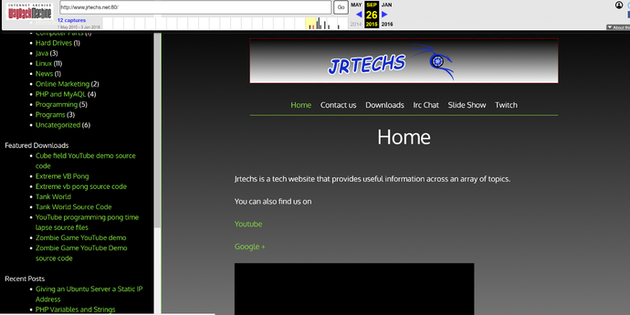
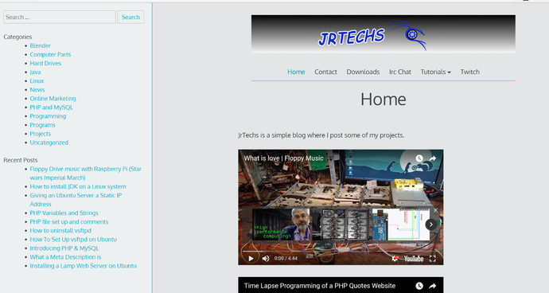
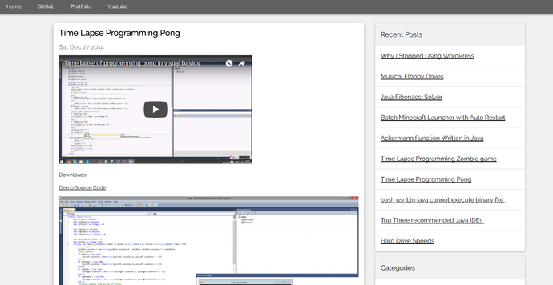

Original Site
-------------

Jrtechs initially started as a static HTML site that I created early 2014 to
build my HTML skills. I initially chose the name Jrtech, but that name was taken
so later changed it to Jrtechs. My old computer running ubuntu 12.04 hosted this
website. This website went though a lot of revisions as I learned more HTML/CSS.
When every you opened the webpage, the images slowly appeared since I was
hosting it on a DSL connection. This website **never** got any *real* traffic
since it mostly just hosted a few pictures of projects I was working on. My
vision for this website was just to be a place where I hosted projects that I
was working on.

Move to WordPress
-----------------

In 2015 I moved my website to the cloud and started a WordPress site. The
website was focused on turorial like blog posts.

New Theme
---------

Rebirth in Nodejs
-----------------

If you want to read about why I created a new content management system and left
WordPress read
[this](http://jrtechs.net/web-development/why-i-stopped-using-wordpress)
article. The short version of that article is that I was tired of the simplicity
of WordPress and wanted to learn Nodejs which is a robust JavaScript framework.

