CSCI-331 Intro to Artificial Intelligence exam 1 review.

# Chapter 1 What is AI

## Thinking vs Acting

## Rational Vs. Human like

Acting rational is doing the right thing given what you know.

Thinking rationality:
- Law of though approach -- thinking is all logic driven
- Neuroscience -- how brains process information
- Cognitive Science -- information-processing psychology prevailing orthodoxy of hehaviorism

# Chapter 2 Intelligent Agents

An agent is anything that can view environment through sensors and act with actuators.
A rational agent is one that does the right thing.

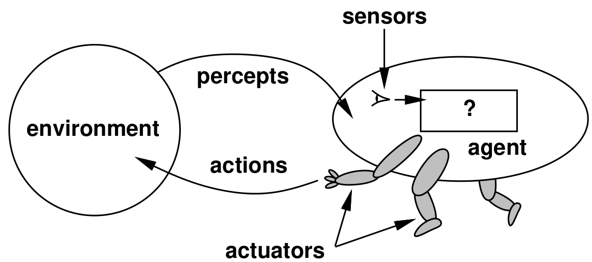

## PEAS

PEAS is an acronym for defining a task environment

### Performance Measure

Measure of how well agent is performing.

Ex: safe, fast, legal, profits, time, etc.

### Environment

Place in which the agent is acting.

Ex: Roads, pedestrians, online, etc.

### Actuators

Way in which agent acts.

Ex: steering, signal, jump, walk, turn, etc.

### Sensors

Way which the agent can see the environment.

Ex: Cameras, speedometer, GPS, sonar, etc.

## Environment Properties (y/n)

### Observable

Full observable if agent has access to complete state of environment at any given time.

Partially observable if agent can only see part of environment.

### Deterministic

If the next  state of environment is completely determined by current state it is **deterministic**, otherwise it is **stochastic**.

### Episodic

If agents current actions does not affect the next problem/performance then it is **episodic**, otherwise it is **sequential**

### Static

If environment changes while agent is deliberating it is **dynamic** otherwise it is **static**.

### Discrete

If there are a finite number of states in the environment it is **discrete** otherwise it is **continuous**.

### Single-Agent

Only one agent in environment like solving a crossword puzzle. A game of chess would be **multi-agent.

## Agent Types

### Simple Reflex

Simply responds to a given input based on a action rule set.

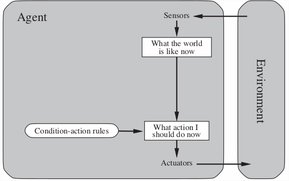

### Reflex with state

Understands to some extend how the world evolves.

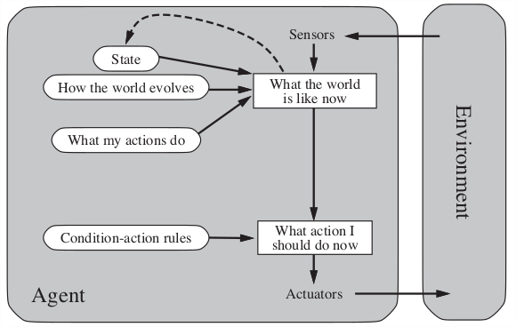

### Goal-based

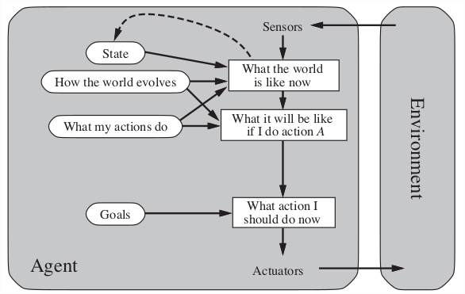

### Utility-based

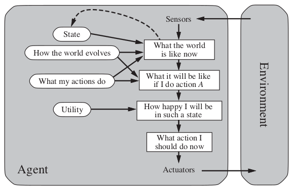

### Learning

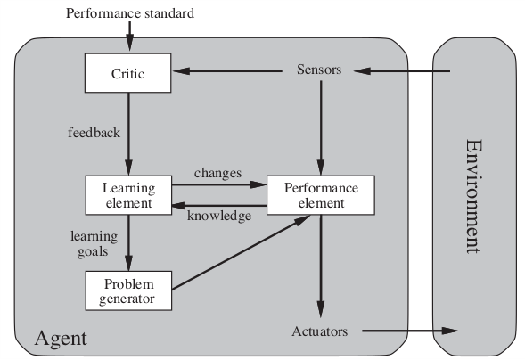

# Chapter 3 Problem Solving Agents

## Problem Formulation

Process of deciding what actions and states to consider, given a goal.

### Initial State

The state that the agent starts in.

### Successor Function

A description of the actions available to the agent. 

### Goal Test

Determines whether a given state is the goal.

### Path Cost (Additive)

A function that assigns a numerical cost to each path. The step cost is the number of actions required.

## Problem Types

### Deterministic, fully observable => single-state problem

Agent knows exactly which state it will be in; solution is a sequence.

### Non-observable => conformant problem

Agent may have no idea where it is; solution (if any) is a sequence

### Non-deterministic and/or partially observable => Contingency problem

- Percepts provide new information about current state
- solution is a contingent plan or a policy
- often interleave search, execution

### Unknown state space => exploration problem

Exploration problem

# Chapter 3 Graph and tree search for single-state problems

## Uniformed

AKA blind search.
All they can do is generate successors and distinguish a goal state from a non-goal state;
they have no knowledge of what paths are more likely to bring them to a solution.

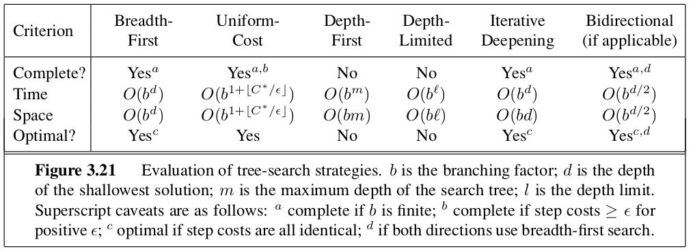

### Breadth-first

General graph-search algo where shallowest unexpanded node is chosen first for expansion.
This is implemented by using a FIFO queue for the frontier.
The solution will be ideal if the path cost between each node is equal.

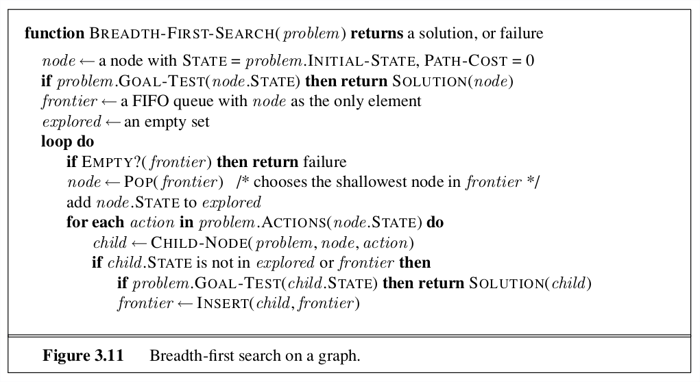

### Depth-first

You expand the deepest unexpanded node first.
Implementation: the fringe is a LIFO queue.

#### Depth Limited Search

To avoid an infinite search space, depth limited search provides a max depth that the search algo is willing to traverse.

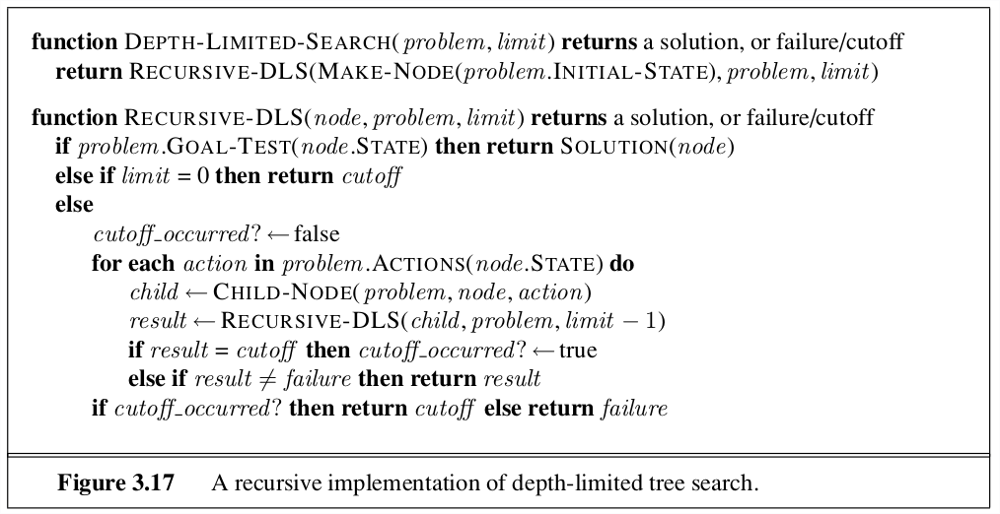

### Uniform-cost

Instead of expanding shallowest nodes, **uniform-cost search** expands the node *n* with lowest path cost: g(n).
Implementation: priority queue ordered by *g*.

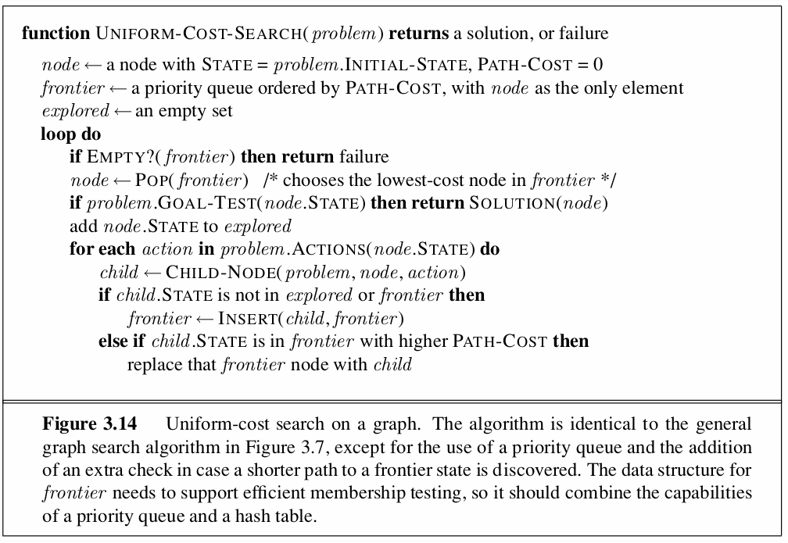

## Informed

Using problem-specific knowledge, applies an informed search strategy which is often more efficient than uninformed strategies. 

### Greed best-fit

Tries to expand node that is closest to goal. It evaluates each node by the heuristic function:

$$
f(n) = h(n)
$$

A common heuristic used is the euclidean distance (straight line distance) to the solution.
Note: this search method can be incomplete since it can still get caught in infinite loops if you don't use a graph search method or implement an max depth.

### A*

Regarded as the best best-first search algo.
Combines heuristic distance estimate with actual cost.

$$
f(n) = g(n) + h(n)
$$

*g* gives the cost of getting from the start node to the current node.

In order for this to give optimal cost, *h* must be an **admissible heuristic**: an heuristic which never overestimates the cost to reach the goal.

- Complete?? no

- Time?? $O(b^{d + 1})$ same as breadth first search but usually faster

- Space?? $O(b^{d + 1})$ keeps every node in memory

- Optimal?? Only if the heuristic is admissible.

## Evaluation

### Branching factor

### Depth of least-cost solution

### Maximum depth of tree

### Completeness

Is the algo guaranteed to fina a solution if there is one.

### Optimality

Will the strategy find the optimal solution.

### Space complexity

How much memory is required to perform the search.

### Time complexity

How long does it take to find the solution.

## Heuristics

A heuristic function *h(n)* estimates the cost of a solution beginning from the state at node *n*.

### Admissibility

These heuristics can be derived from a relaxed version of a problem.
Heuristic must never overestimate the cost to reach the goal.

### Dominance

If one heuristic is greater than another for all states *n*, then it dominates the other.
Typically dominating heuristics are better for the search.
You can form  a new dominating admissible heuristic by taking the max of two other admissible heuristics.

# Chapter 4 Iterative Improvement

Optimization problem where the path is irrelevant, the goal state is the solution.
Rather than searching through all possible solutions, iterative improvement takes the current state and tries to improve it.
Since the solution space is super large, it is often not possible to try every possible combination.

## Hill Climbing

Basic algorithm which continually moves in the direction of increasing value.

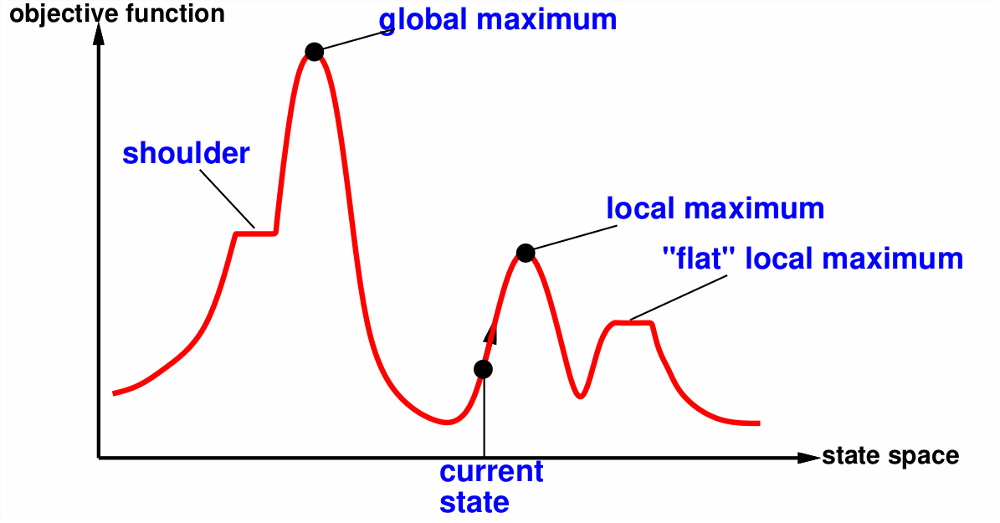

To avoid finding a local maximum several methods can be employed:

- Random-restart hill climbing
- Random sideways move -- escapes from shoulders loop on flat maxima.

## Simulated annealing

Idea: escape local maxima by allowing some bad moves but gradually decrease their size and frequency.
This is similar to gradient descent.
Idea comes from making glass where you start very hot and then slowely cool down the temperature.

## Beam Search

Idea: keep k states instead of 1; choose top k of their successors.

Problem: quite often all k states end up on same local hill. This can somewhat be overcome by randomly choosing k states but, favoring the good ones. 

## Genetic Algorithms

Inspired by Charles Darwin's theory of evolution.
The algorithm is an extension of local beam search with cuccessors generated from pairs of individuals rather than a successor function.

# Chapter 5 Game Theory

## Minimax

Algorithm to determine perfect play for  deterministic, perfect information games.
Idea: assume opponent is also a rational agent, you choose to make the choice which is the best achievable payoff against the opponents best play.

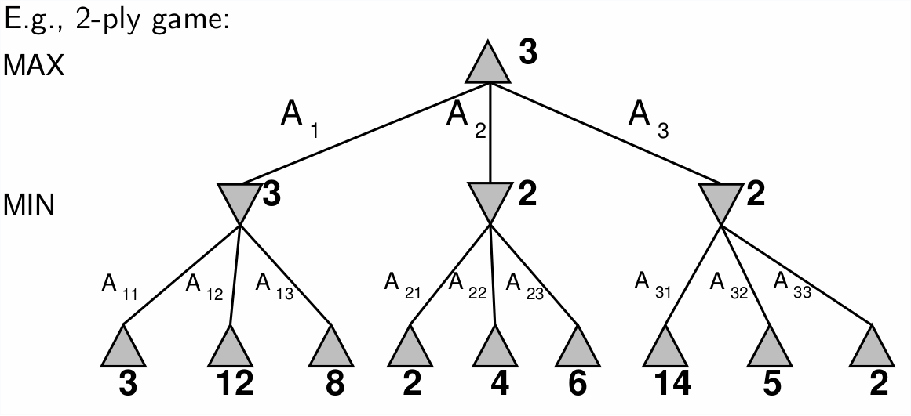

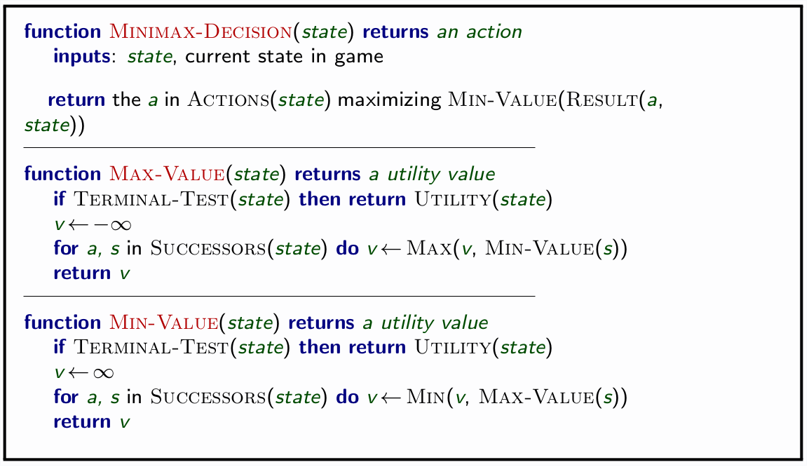

### Properties

- complete: yes if tree is finite
- optimal: yes, against an optimal opponent
- Time complexity: $O(B^m)$
- Space Complexity: $O(bm)$  depth-first exploration

This makes a game of chess with a branch factor of 35 and estimated moves around 100 totally infeasible: 35^100!

## α-β pruning

Idea: prune paths which will not yield a better solution that one already found.
The pruning does not affect the final result.
Good move exploration ordering will improve the effectiveness of pruning.
With perfect ordering, time complexity is: $O^{\frac{m}{2}}$.
This doubles our solvable depth, but, still infeasible for chess.

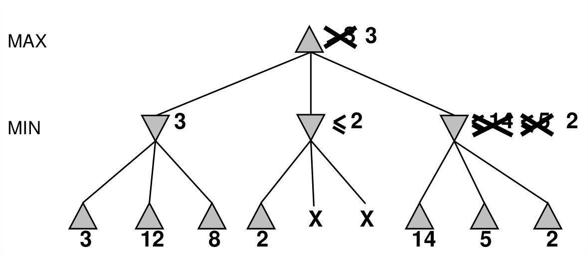

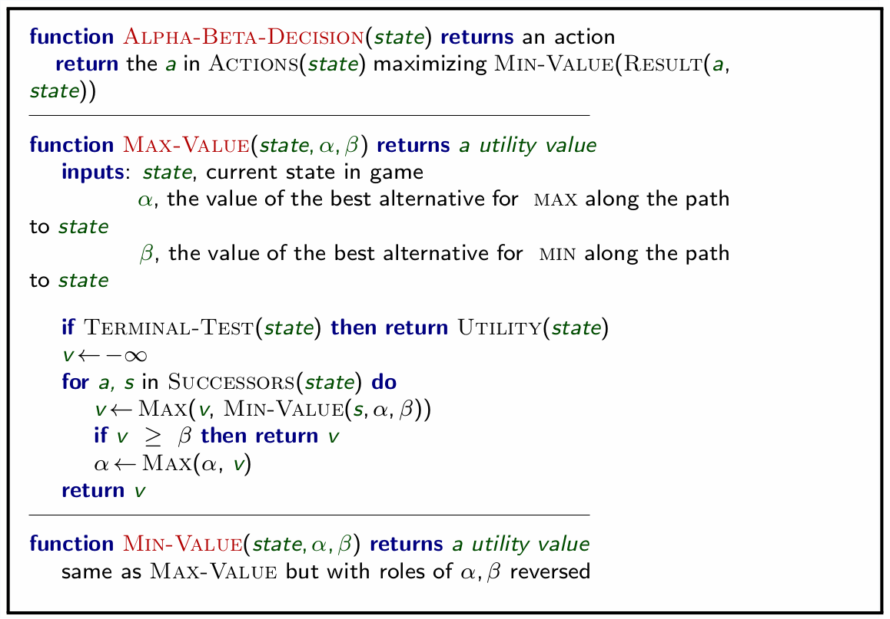

## Resource limits

Due to constraint, we typically use the **Cutoff-test** rather than the **terminal-test**.
The terminal test requires us to explore all nodes in the mini-max search.
The cutoff test branches out to a certain depth and then applies a evaluation function to determine the desirability of a position.

## Randomness/ Nondeterministic games

Often times games involve chance such as a coin flip or a dice roll.
You can modify the mini-max tree to branch with each probability and take the average of evaluating each branch.

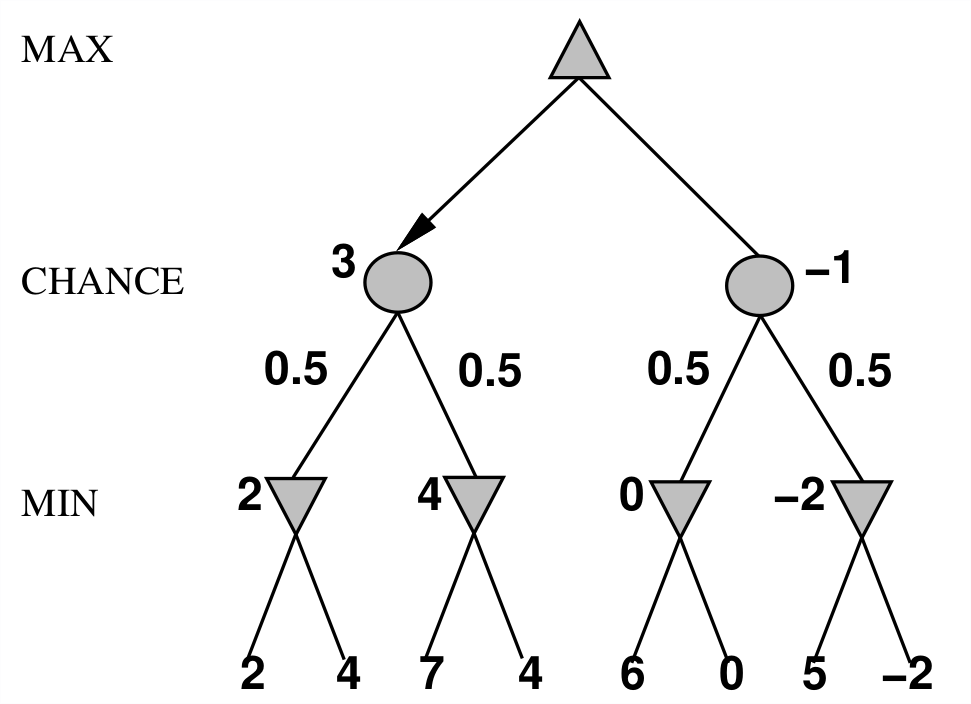
