# Ch 4: Iterative improvement

## Simulated annealing

Idea: escape local maxima by allowing some bad moves but gradually decrease their size and frequency.
This is similar to gradient descent.
Idea comes from making glass where you start very hot and then slowly cool down the temperature.


## Beam search

Idea: keep k states instead of 1; choose top k of their successors.

Problem: quite often all k states end up on same local hill. This can somewhat be overcome by randomly choosing k states but, favoring the good ones. 


## Genetic algorithms

Inspired by Charles Darwin's theory of evolution.
The algorithm is an extension of local beam search with successors generated from pairs of individuals rather than a successor function.


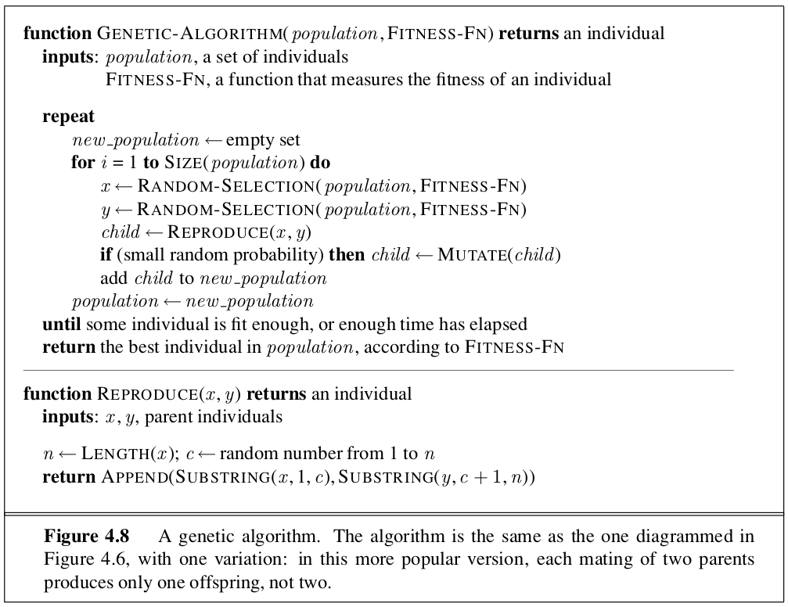


# Ch 6: Constraint satisfaction problems

Ex CSP problems:

- assignment
- timetabling
- hardware configuration
- spreadsheets
- factory scheduling
- Floor-planning

## Problem formulation

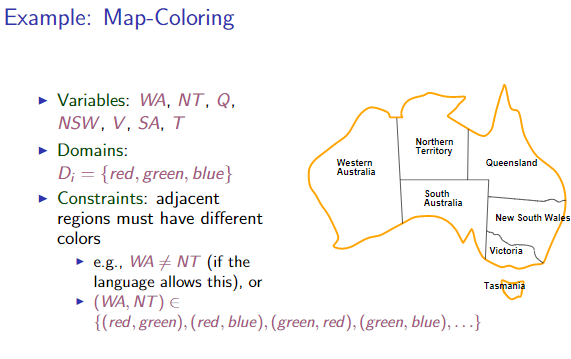

### Variables

Elements in the problem.

### Domains

Possible values from domain $D_i$, try to be mathematical when formulating.

### Constraints

Constraints on the variables specifying what values from the domain they may have.

Types of constraints:

- Unary: Constraints involving single variable
- Binary: Constraints involving pairs of variables
- Higher-order: Constraints involving 3 or more variables
- Preferences: Where you favor one value in the domain more than another. This is mostly used for constrained optimization problems.

## Constraint graphs

Nodes in graph are variables, arcs show constraints

## Backtracking

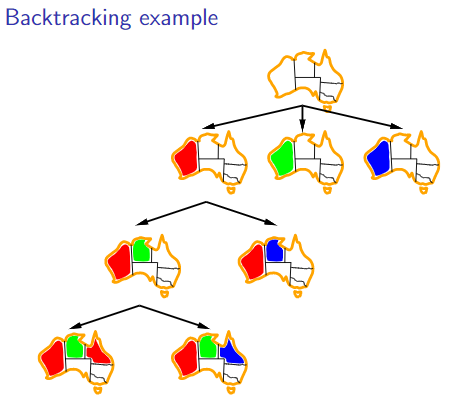

### Minimum remaining value

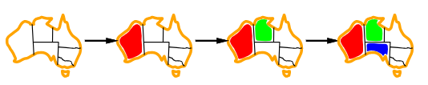

Choose the variable wit the fewest legal values left.

### Degree heuristic

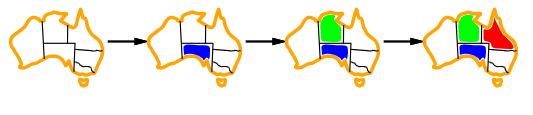

Tie-breaker for minimum remaining value heuristic.
Choose the variable with the most constraints on remaining variables. 

### Least constraining value

Choose the least constraining value: one that rules out fewest values in remaining variables.

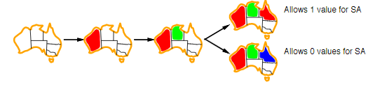

### Forward checking

Keep track of remaining legal values for unassigned variables and terminate search when any variable has no legal values left.
This will help reduce how many nodes in the tree you have to expand. 

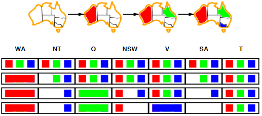

### Constraint propagation

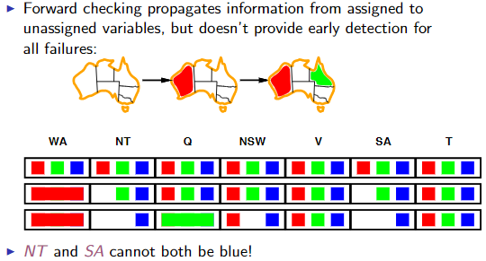

### Arc consistency

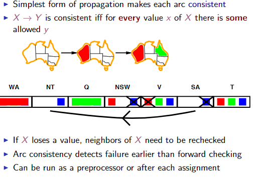

### Tree structured CSPs

Theorem: if constraint graph has no loops, the CSP ca be solved in $O(n*d^2)$ time.
General CSP is $O(d^n)$

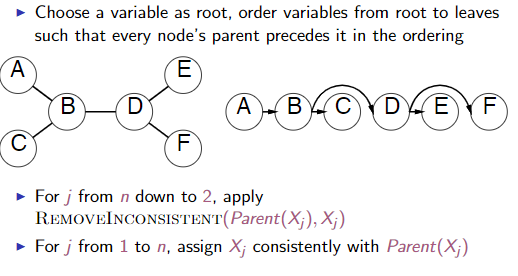

## Connections to tree search, iterative improvement

To apply this to hill-climbing, you select any conflicted variable and then use a min-conflicts heuristic
to choose a value that violates the fewest constraints.

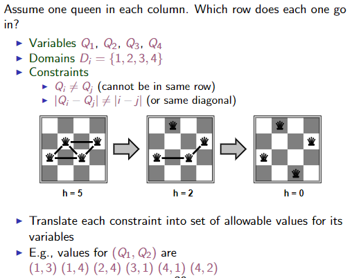


# CH 13: Uncertainty

## Basic theory and terminology

### Probability space

The probability space $\Omega$ is all possible outcomes.
A dice roll has 6 possible outcomes.

### Atomic Event

An atomic event w is a single element from the probability space.
$w \in \Omega$
Ex: rolling a dice of 4
The probability of w is between [0,1].


### Event

An event A is any subset of the probability space $\Omega$
The probability of an event is the sum of the probabilities of the atom events in the event.

Ex: probability of rolling a even number dice is 1/2.

```
P(die roll odd) = P(1)+P(2)+3P(5) = 1/6+1/6+1/6 = 1/2
```

### Random variable

Is a function from some sample points to some range. eg reals or booleans.
eg: P(Even = true)

## Prior probability

Probabilities based given one or more events.
Ex: probability cloudy and fall = 0.72.

Given two variables with two possible assignments, we could represent all the information in a 2x2 matrix.

## Conditional Probability

Probabilities based within a event.
Eg: P(tired | monday) = .9. 

## Bayes rule

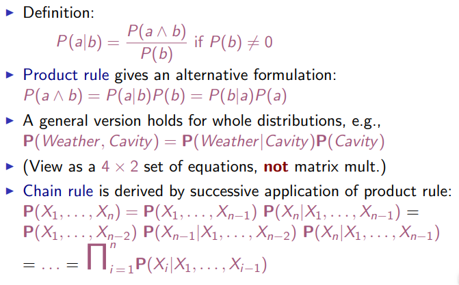

## Independence

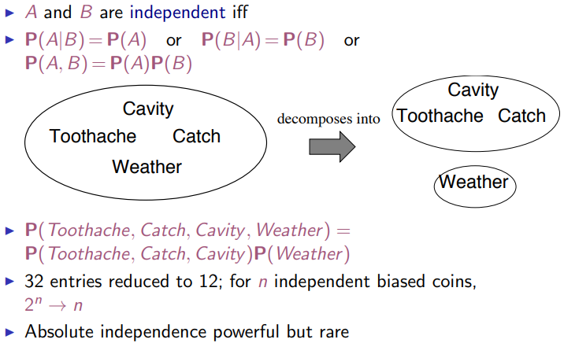
