Let's do a deep dive and start visualizing my life using Fitbit and
Matplotlib.  

# What is Fitbit

[Fitbit](https://www.fitbit.com) is a fitness watch that tracks your sleep, heart rate, and activity.
Fitbit is able to track your steps, however, it is also able to detect multiple types of activity
like running, walking, "sport" and biking.

# What is Matplotlib

[Matplotlib](https://matplotlib.org/) is a python visualization library that enables you to create bar graphs, line graphs, distributions and many more things.
Being able to visualize your results is essential to any person working with data at any scale.
Although I like [GGplot](https://ggplot2.tidyverse.org/) in R more than Matplotlib, Matplotlib is still my go to graphing library for Python. 

# Getting Your Fitbit Data

There are two main ways that you can get your Fitbit data: 

- Fitbit API
- Data Archival Export


Since connecting to the API and setting up all the web hooks can be a
pain, I'm just going to use the data export option because this is
only for one person. You can export your data here:
[https://www.fitbit.com/settings/data/export](https://www.fitbit.com/settings/data/export).

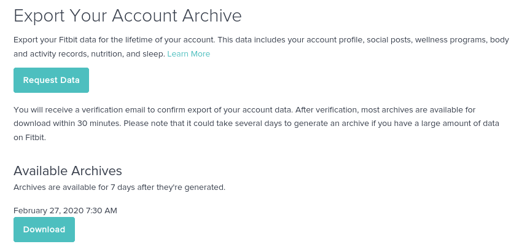

The Fitbit data archive was very organized and kept meticulous records
of everything.  All of the data was organized in separate JSON files
labeled by date. Fitbit keeps around 1MB of data on you per day; most
of this data is from the heart rate sensors. Although 1MB of data may
sound like a ton of data, it is probably a lot less if you store it in
formats other than JSON.  When I downloaded the compressed file it was
20MB, but when I extracted it, it was 380MB! I've only been using
Fitbit for 11 months at this point.  

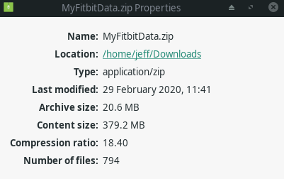

## Sleep

Sleep is something fun to visualize. No matter how much of it you get
you still feel tired as a college student. In the "sleep_score" folder
of the exported data you will find a single CSV file with your resting
heart rate and Fitbit's computed sleep scores. Interesting enough,
this is the only file that comes in the CSV format, everything else is
JSON file.  

We can read in all the data using a single liner with the
[Pandas](https://pandas.pydata.org/) python library. 


```python
import matplotlib.pyplot as plt
import pandas as pd

sleep_score_df = pd.read_csv('data/sleep/sleep_score.csv')
```


```python
print(sleep_score_df)
```

         sleep_log_entry_id             timestamp  overall_score  \
    0           26093459526  2020-02-27T06:04:30Z             80   
    1           26081303207  2020-02-26T06:13:30Z             83   
    2           26062481322  2020-02-25T06:00:30Z             82   
    3           26045941555  2020-02-24T05:49:30Z             79   
    4           26034268762  2020-02-23T08:35:30Z             75   
    ..                  ...                   ...            ...   
    176         23696231032  2019-09-02T07:38:30Z             79   
    177         23684345925  2019-09-01T07:15:30Z             84   
    178         23673204871  2019-08-31T07:11:00Z             74   
    179         23661278483  2019-08-30T06:34:00Z             73   
    180         23646265400  2019-08-29T05:55:00Z             80   

         composition_score  revitalization_score  duration_score  \
    0                   20                    19              41   
    1                   22                    21              40   
    2                   22                    21              39   
    3                   17                    20              42   
    4                   20                    16              39   
    ..                 ...                   ...             ...   
    176                 20                    20              39   
    177                 22                    21              41   
    178                 18                    21              35   
    179                 17                    19              37   
    180                 21                    21              38   

         deep_sleep_in_minutes  resting_heart_rate  restlessness  
    0                       65                  60      0.117330  
    1                       85                  60      0.113188  
    2                       95                  60      0.120635  
    3                       52                  61      0.111224  
    4                       43                  59      0.154774  
    ..                     ...                 ...           ...  
    176                     88                  56      0.170923  
    177                     95                  56      0.133268  
    178                     73                  56      0.102703  
    179                     50                  55      0.121086  
    180                     61                  57      0.112961  

    [181 rows x 9 columns]


With the Pandas library you can generate Matplotlib graphs. Although
you can directly use Matplotlib, the wrapper functions using Pandas
makes it easier to use. 

## Sleep Score Histogram


```python
sleep_score_df.hist(column='overall_score')
```


    array([[<matplotlib.axes._subplots.AxesSubplot object at 0x7fc2c0a270d0>]],
          dtype=object)


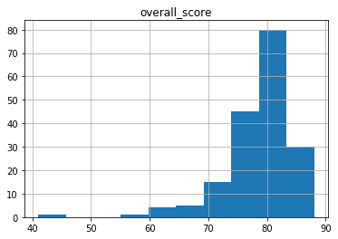


## Heart Rate

Fitbit keeps their calculated heart rates in the sleep scores file
rather than heart. Knowing your resting heart rate is useful because
it is a good indicator of your overall health. 

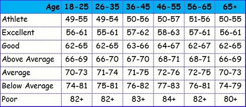


```python
sleep_score_df.hist(column='resting_heart_rate')
```


    array([[<matplotlib.axes._subplots.AxesSubplot object at 0x7fc2917a6090>]],
          dtype=object)


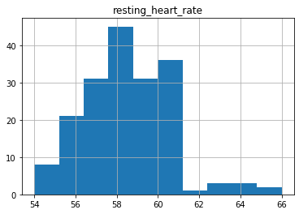


## Resting Heart Rate Time Graph

Using the pandas wrapper we can quickly create a heart rate graph over
time. 


```python
sleep_score_df.plot(kind='line', y='resting_heart_rate', x ='timestamp', legend=False, title="Resting Heart Rate(BPM)")
```


    <matplotlib.axes._subplots.AxesSubplot at 0x7fc28f609b50>


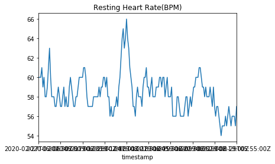


However, as we notice with the graph above, the time axis is wack. In
the pandas data frame everything was stored as a string timestamp. We
can convert this into a datetime object by telling pandas to parse the
date as it reads it. 


```python
sleep_score_df = pd.read_csv('data/sleep/sleep_score.csv', parse_dates=[1])
sleep_score_df.plot(kind='line', y='resting_heart_rate', x ='timestamp', legend=False, title="Resting Heart Rate(BPM)")
```


    <matplotlib.axes._subplots.AxesSubplot at 0x7fc28f533510>


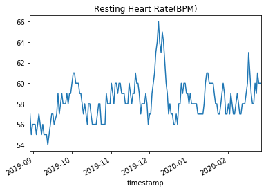


To fully manipulate the graphs, we need to use some matplotlib code to
do things like setting the axis labels or make multiple plots right
next to each other. We can create grab the current axis being used by
matplotlib by using plt.gca(). 


```python
ax = plt.gca()
sleep_score_df.plot(kind='line', y='resting_heart_rate', x ='timestamp', legend=False, title="Resting Heart Rate Graph", ax=ax, figsize=(10, 5))
plt.xlabel("Date")
plt.ylabel("Resting Heart Rate (BPM)")
plt.show()

#plt.savefig('restingHeartRate.svg')
```


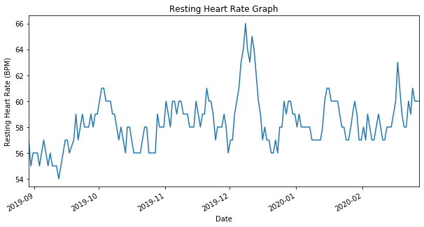


The same thing can be done with sleep scores. It is interesting to
note that  the sleep scores rarely vary anything between 75 and 85. 


```python
ax = plt.gca()
sleep_score_df.plot(kind='line', y='overall_score', x ='timestamp', legend=False, title="Sleep Score Time Series Graph", ax=ax)
plt.xlabel("Date")
plt.ylabel("Fitbit's Sleep Score")
plt.show()
```


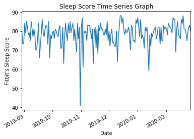


Using Pandas we can generate a new column with a specific date
attribute like year, day, month, or weekday. If we add a new column
for weekday, we can then group by weekday and collapse them all into a
single column by summing or averaging the value. 


```python
temp = pd.DatetimeIndex(sleep_score_df['timestamp'])
sleep_score_df['weekday'] = temp.weekday

print(sleep_score_df)
```

         sleep_log_entry_id                 timestamp  overall_score  \
    0           26093459526 2020-02-27 06:04:30+00:00             80   
    1           26081303207 2020-02-26 06:13:30+00:00             83   
    2           26062481322 2020-02-25 06:00:30+00:00             82   
    3           26045941555 2020-02-24 05:49:30+00:00             79   
    4           26034268762 2020-02-23 08:35:30+00:00             75   
    ..                  ...                       ...            ...   
    176         23696231032 2019-09-02 07:38:30+00:00             79   
    177         23684345925 2019-09-01 07:15:30+00:00             84   
    178         23673204871 2019-08-31 07:11:00+00:00             74   
    179         23661278483 2019-08-30 06:34:00+00:00             73   
    180         23646265400 2019-08-29 05:55:00+00:00             80   

         composition_score  revitalization_score  duration_score  \
    0                   20                    19              41   
    1                   22                    21              40   
    2                   22                    21              39   
    3                   17                    20              42   
    4                   20                    16              39   
    ..                 ...                   ...             ...   
    176                 20                    20              39   
    177                 22                    21              41   
    178                 18                    21              35   
    179                 17                    19              37   
    180                 21                    21              38   

         deep_sleep_in_minutes  resting_heart_rate  restlessness  weekday  
    0                       65                  60      0.117330        3  
    1                       85                  60      0.113188        2  
    2                       95                  60      0.120635        1  
    3                       52                  61      0.111224        0  
    4                       43                  59      0.154774        6  
    ..                     ...                 ...           ...      ...  
    176                     88                  56      0.170923        0  
    177                     95                  56      0.133268        6  
    178                     73                  56      0.102703        5  
    179                     50                  55      0.121086        4  
    180                     61                  57      0.112961        3  

    [181 rows x 10 columns]


```python
print(sleep_score_df.groupby('weekday').mean())
```

             sleep_log_entry_id  overall_score  composition_score  \
    weekday                                                         
    0              2.483733e+10      79.576923          20.269231   
    1              2.485200e+10      77.423077          20.423077   
    2              2.490383e+10      80.880000          21.120000   
    3              2.483418e+10      76.814815          20.370370   
    4              2.480085e+10      79.769231          20.961538   
    5              2.477002e+10      78.840000          20.520000   
    6              2.482581e+10      77.230769          20.269231   

             revitalization_score  duration_score  deep_sleep_in_minutes  \
    weekday                                                                
    0                   19.153846       40.153846              88.000000   
    1                   19.000000       38.000000              83.846154   
    2                   19.400000       40.360000              93.760000   
    3                   19.037037       37.407407              82.592593   
    4                   19.346154       39.461538              94.461538   
    5                   19.080000       39.240000              93.720000   
    6                   18.269231       38.692308              89.423077   

             resting_heart_rate  restlessness  
    weekday                                    
    0                 58.576923      0.139440  
    1                 58.538462      0.142984  
    2                 58.560000      0.138661  
    3                 58.333333      0.135819  
    4                 58.269231      0.129791  
    5                 58.080000      0.138315  
    6                 58.153846      0.147171  


## Sleep Score Based on Day


```python
ax = plt.gca()
sleep_score_df.groupby('weekday').mean().plot(kind='line', y='overall_score', ax = ax)
plt.ylabel("Sleep Score")
plt.title("Sleep Scores on Varying Days of Week")
plt.show()
```


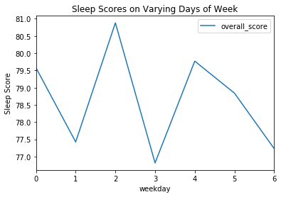


## Sleep Score Based on Days of Week


```python
ax = plt.gca()
sleep_score_df.groupby('weekday').mean().plot(kind='line', y='resting_heart_rate', ax = ax)
plt.ylabel("Resting heart rate (BPM)")
plt.title("Resting Heart Rate Varying Days of Week")
plt.show()
```


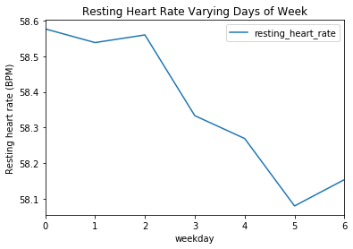


# Calories

Fitbit keeps all of their calorie data in JSON files representing
sequence data at 1 minute increments. To extrapolate calorie data we
need to group by day and then sum the days to get the total calories
burned per day. 


```python
calories_df = pd.read_json("data/calories/calories-2019-07-01.json",  convert_dates=True)
```


```python
print(calories_df)
```

                     dateTime  value
    0     2019-07-01 00:00:00   1.07
    1     2019-07-01 00:01:00   1.07
    2     2019-07-01 00:02:00   1.07
    3     2019-07-01 00:03:00   1.07
    4     2019-07-01 00:04:00   1.07
    ...                   ...    ...
    43195 2019-07-30 23:55:00   1.07
    43196 2019-07-30 23:56:00   1.07
    43197 2019-07-30 23:57:00   1.07
    43198 2019-07-30 23:58:00   1.07
    43199 2019-07-30 23:59:00   1.07

    [43200 rows x 2 columns]


```python
import datetime
calories_df['date_minus_time'] = calories_df["dateTime"].apply( lambda calories_df : 
    datetime.datetime(year=calories_df.year, month=calories_df.month, day=calories_df.day))	

calories_df.set_index(calories_df["date_minus_time"],inplace=True)

print(calories_df)
```

                               dateTime  value date_minus_time
    date_minus_time                                           
    2019-07-01      2019-07-01 00:00:00   1.07      2019-07-01
    2019-07-01      2019-07-01 00:01:00   1.07      2019-07-01
    2019-07-01      2019-07-01 00:02:00   1.07      2019-07-01
    2019-07-01      2019-07-01 00:03:00   1.07      2019-07-01
    2019-07-01      2019-07-01 00:04:00   1.07      2019-07-01
    ...                             ...    ...             ...
    2019-07-30      2019-07-30 23:55:00   1.07      2019-07-30
    2019-07-30      2019-07-30 23:56:00   1.07      2019-07-30
    2019-07-30      2019-07-30 23:57:00   1.07      2019-07-30
    2019-07-30      2019-07-30 23:58:00   1.07      2019-07-30
    2019-07-30      2019-07-30 23:59:00   1.07      2019-07-30

    [43200 rows x 3 columns]


```python
calories_per_day = calories_df.resample('D').sum()
print(calories_per_day)
```

                       value
    date_minus_time         
    2019-07-01       3422.68
    2019-07-02       2705.85
    2019-07-03       2871.73
    2019-07-04       4089.93
    2019-07-05       3917.91
    2019-07-06       2762.55
    2019-07-07       2929.58
    2019-07-08       2698.99
    2019-07-09       2833.27
    2019-07-10       2529.21
    2019-07-11       2634.25
    2019-07-12       2953.91
    2019-07-13       4247.45
    2019-07-14       2998.35
    2019-07-15       2846.18
    2019-07-16       3084.39
    2019-07-17       2331.06
    2019-07-18       2849.20
    2019-07-19       2071.63
    2019-07-20       2746.25
    2019-07-21       2562.11
    2019-07-22       1892.99
    2019-07-23       2372.89
    2019-07-24       2320.42
    2019-07-25       2140.87
    2019-07-26       2430.38
    2019-07-27       3769.04
    2019-07-28       2036.24
    2019-07-29       2814.87
    2019-07-30       2077.82


```python
ax = plt.gca()
calories_per_day.plot(kind='hist', title="Calorie Distribution", legend=False, ax=ax)
plt.show()
```


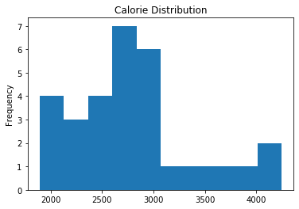


```python
ax = plt.gca()
calories_per_day.plot(kind='line', y='value', legend=False, title="Calories Per Day", ax=ax)
plt.xlabel("Date")
plt.ylabel("Calories")
plt.show()
```


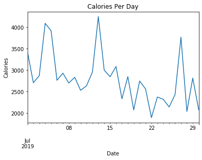


## Calories Per Day Box Plot

Using this data we can turn this into a boxplot to make it easier to
visualize the distribution of calories burned during the month of
July. 


```python
ax = plt.gca()
ax.set_title('Calorie Distribution for July')
ax.boxplot(calories_per_day['value'], vert=False,manage_ticks=False, notch=True)
plt.xlabel("Calories Burned")
ax.set_yticks([])
plt.show()
```


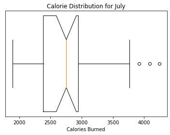


# Steps

Fitbit is known for taking the amount of steps someone takes per day.
Similar to calories burned, steps taken is stored in time series data
at 1 minute increments. Since we are interested at the day level data,
we need to first remove the time component of the dataframe so that we
can group all the data by date. Once we have everything grouped by
date, we can sum and produce steps per day.  


```python
steps_df = pd.read_json("data/steps-2019-07-01.json",  convert_dates=True)

steps_df['date_minus_time'] = steps_df["dateTime"].apply( lambda steps_df : 
    datetime.datetime(year=steps_df.year, month=steps_df.month, day=steps_df.day))	

steps_df.set_index(steps_df["date_minus_time"],inplace=True)
print(steps_df)
```

                               dateTime  value date_minus_time
    date_minus_time                                           
    2019-07-01      2019-07-01 04:00:00      0      2019-07-01
    2019-07-01      2019-07-01 04:01:00      0      2019-07-01
    2019-07-01      2019-07-01 04:02:00      0      2019-07-01
    2019-07-01      2019-07-01 04:03:00      0      2019-07-01
    2019-07-01      2019-07-01 04:04:00      0      2019-07-01
    ...                             ...    ...             ...
    2019-07-31      2019-07-31 03:55:00      0      2019-07-31
    2019-07-31      2019-07-31 03:56:00      0      2019-07-31
    2019-07-31      2019-07-31 03:57:00      0      2019-07-31
    2019-07-31      2019-07-31 03:58:00      0      2019-07-31
    2019-07-31      2019-07-31 03:59:00      0      2019-07-31

    [41116 rows x 3 columns]


```python
steps_per_day = steps_df.resample('D').sum()
print(steps_per_day)
```

                     value
    date_minus_time       
    2019-07-01       11285
    2019-07-02        4957
    2019-07-03       13119
    2019-07-04       16034
    2019-07-05       11634
    2019-07-06        6860
    2019-07-07        3758
    2019-07-08        9130
    2019-07-09       10960
    2019-07-10        7012
    2019-07-11        5420
    2019-07-12        4051
    2019-07-13       15980
    2019-07-14       23109
    2019-07-15       11247
    2019-07-16       10170
    2019-07-17        4905
    2019-07-18       10769
    2019-07-19        4504
    2019-07-20        5032
    2019-07-21        8953
    2019-07-22        2200
    2019-07-23        9392
    2019-07-24        5666
    2019-07-25        5016
    2019-07-26        5879
    2019-07-27       19492
    2019-07-28        4987
    2019-07-29        9943
    2019-07-30        3897
    2019-07-31         166


## Steps Per Day Histogram

After the data is in the form that we want, graphing the data is
straight forward. Two added things I like to do for normal box plots
is to set the displays to horizontal add the notches.  


```python
ax = plt.gca()
ax.set_title('Steps Distribution for July')
ax.boxplot(steps_per_day['value'], vert=False,manage_ticks=False, notch=True)
plt.xlabel("Steps Per Day")
ax.set_yticks([])
plt.show()
```


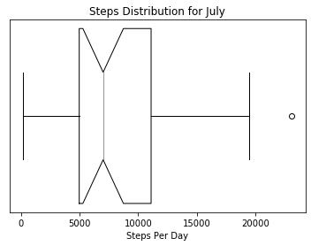


Wrapping that all into a single function we get something like this: 


```python
def readFileIntoDataFrame(fName):
    steps_df = pd.read_json(fName,  convert_dates=True)

    steps_df['date_minus_time'] = steps_df["dateTime"].apply( lambda steps_df : 
        datetime.datetime(year=steps_df.year, month=steps_df.month, day=steps_df.day))	

    steps_df.set_index(steps_df["date_minus_time"],inplace=True)
    return steps_df.resample('D').sum()

def graphBoxAndWhiskers(data, title, xlab):
    ax = plt.gca()
    ax.set_title(title)
    ax.boxplot(data['value'], vert=False, manage_ticks=False, notch=True)
    plt.xlabel(xlab)
    ax.set_yticks([])
    plt.show()
```


```python
graphBoxAndWhiskers(readFileIntoDataFrame("data/steps-2020-01-27.json"), "Steps In January", "Steps Per Day")
```


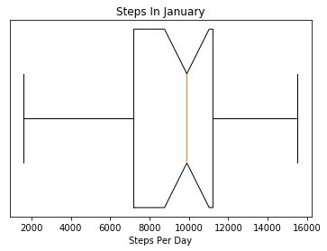


That is cool, but, what if we could view the distribution for each
month in the same graph? Based on the two previous graphs, my step
distribution during July looked distinctly different from my step
distribution in January.  The first difficultly would be to read in
all the files since Fitbit creates a new file for every month. The
next thing would be to group them by month and then graph it. 


```python
import os
files = os.listdir("data")
print(files)
```

    ['steps-2019-04-02.json', 'steps-2019-08-30.json', 'steps-2020-02-26.json', 'steps-2019-10-29.json', 'steps-2019-07-01.json', 'steps-2020-01-27.json', 'steps-2019-07-31.json', 'steps-2019-06-01.json', 'steps-2019-09-29.json', '.ipynb_checkpoints', 'steps-2019-12-28.json', 'steps-2019-05-02.json', 'calories', 'steps-2019-11-28.json', 'sleep']


```python
dfs = []
for file in files: # this can take 15 seconds
    if "steps" in file: # finds the steps files
        dfs.append(readFileIntoDataFrame("data/" + file))
```


```python
stepsPerDay = pd.concat(dfs)
graphBoxAndWhiskers(stepsPerDay, "Steps Per Day Last 11 Months", "Steps per Day")
```


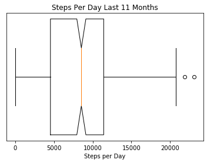


```python
print(type(stepsPerDay['value'].to_numpy()))
print(stepsPerDay['value'].keys())

stepsPerDay['month'] = pd.DatetimeIndex(stepsPerDay['value'].keys()).month 
stepsPerDay['week_day'] = pd.DatetimeIndex(stepsPerDay['value'].keys()).weekday

print(stepsPerDay)
```

    <class 'numpy.ndarray'>
    DatetimeIndex(['2019-04-03', '2019-04-04', '2019-04-05', '2019-04-06',
                   '2019-04-07', '2019-04-08', '2019-04-09', '2019-04-10',
                   '2019-04-11', '2019-04-12',
                   ...
                   '2019-12-19', '2019-12-20', '2019-12-21', '2019-12-22',
                   '2019-12-23', '2019-12-24', '2019-12-25', '2019-12-26',
                   '2019-12-27', '2019-12-28'],
                  dtype='datetime64[ns]', name='date_minus_time', length=342, freq=None)
                     value  month  week_day
    date_minus_time                        
    2019-04-03         510      4         2
    2019-04-04       11453      4         3
    2019-04-05       12684      4         4
    2019-04-06       12910      4         5
    2019-04-07        3368      4         6
    ...                ...    ...       ...
    2019-12-24        5779     12         1
    2019-12-25        4264     12         2
    2019-12-26        4843     12         3
    2019-12-27        9609     12         4
    2019-12-28        2218     12         5

    [342 rows x 3 columns]


## Graphing Steps by Month

Now that we have columns for the total amount of steps per day and the
months, we can plot all the data on a single plot using the group by
operator in the plotting library. 


```python
ax = plt.gca()
ax.set_title('Steps Distribution for July\n')
stepsPerDay.boxplot(column=['value'], by='month',ax=ax, notch=True)
plt.xlabel("Month")
plt.ylabel("Steps Per Day")
plt.show()
```


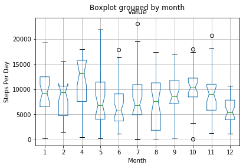


```python
ax = plt.gca()
ax.set_title('Steps Distribution By Week Day\n')
stepsPerDay.boxplot(column=['value'], by='week_day',ax=ax, notch=True)
plt.xlabel("Week Day")
plt.ylabel("Steps Per Day")
plt.show()
```


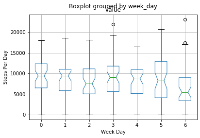


## Future Work

Moving forward with this I would like to do more visualizations with
sleep data and heart rate. 
