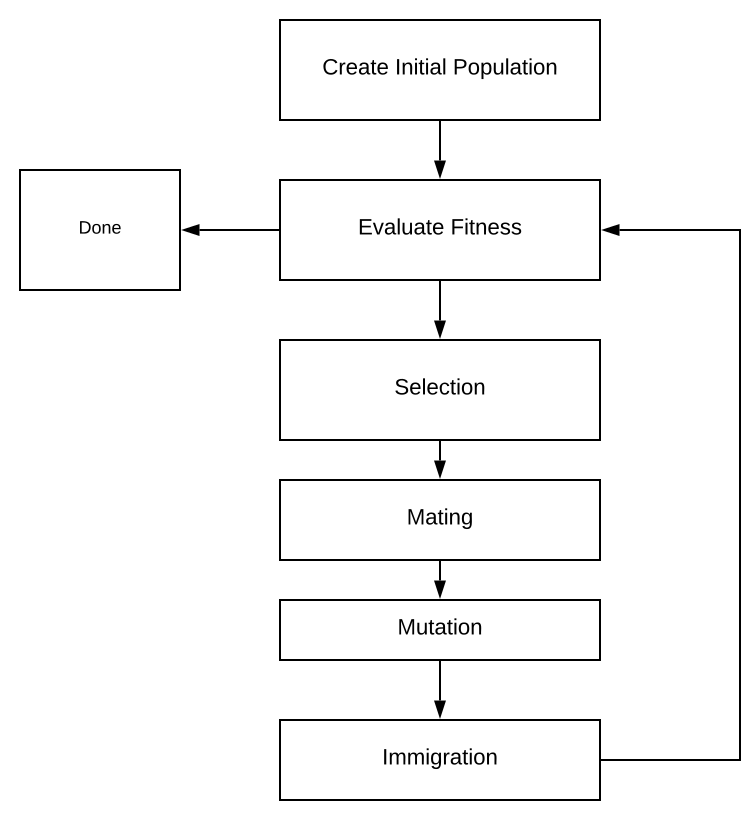

# Live Simulation

```{=html}
<script type="text/javascript" src="https://www.gstatic.com/charts/loader.js"></script>
<script
        src="https://code.jquery.com/jquery-3.3.1.slim.min.js"
        integrity="sha256-3edrmyuQ0w65f8gfBsqowzjJe2iM6n0nKciPUp8y+7E="
        crossorigin="anonymous">
</script>
<script>
    class Gene
    {
        /**
         * Constructs a new Gene to store in a chromosome.
         * @param min minimum value that this gene can store
         * @param max value this gene can possibly be
         * @param value normalized value
         */
        constructor(min, max, value)
        {
            this.min = min;
            this.max = max;
            this.value = value;
        }
        /**
         * De-normalizes the value of the gene
         * @returns {*}
         */
        getRealValue()
        {
            return (this.max - this.min) * this.value + this.min;
        }
        getValue()
        {
            return this.value;
        }
        setValue(val)
        {
            this.value = val;
        }
        makeClone()
        {
            return new Gene(this.min, this.max, this.value);
        }
        makeRandomGene()
        {
            return new Gene(this.min, this.max, Math.random());
        }
    }
    class Chromosome
    {
        /**
         * Constructs a chromosome by making a copy of
         * a list of genes.
         * @param geneArray
         */
        constructor(geneArray)
        {
            this.genes = [];
            for(let i = 0; i < geneArray.length; i++)
            {
                this.genes.push(geneArray[i].makeClone());
            }
        }
        getGenes()
        {
            return this.genes;
        }
        /**
         * Mutates a random gene.
         */
        mutate()
        {
            this.genes[Math.round(Math.random() * (this.genes.length-1))].setValue(Math.random());
        }
        /**
         * Creates a totally new chromosome with same
         * genetic structure as this chromosome but different
         * values.
         * @returns {Chromosome}
         */
        createRandomChromosome()
        {
            let geneAr = [];
            for(let i = 0; i < this.genes.length; i++)
            {
                geneAr.push(this.genes[i].makeRandomGene());
            }
            return new Chromosome(geneAr);
        }
    }
    /**
     * Mates two chromosomes using the blending method
     * and returns a list of 2 offspring.
     * @param father
     * @param mother
     * @returns {Chromosome[]}
     */
    const breed = function(father, mother)
    {
        let son = new Chromosome(father.getGenes());
        let daughter = new Chromosome(mother.getGenes());
        for(let i = 0;i < son.getGenes().length; i++)
        {
            let blendCoef = Math.random();
            blendGene(son.getGenes()[i], daughter.getGenes()[i], blendCoef);
        }
        return [son, daughter];
    };
    /**
     * Blends two genes together based on a random blend
     * coefficient.
     **/
    const blendGene = function(gene1, gene2, blendCoef)
    {
        let value1 = (blendCoef * gene1.getValue()) +
            (gene2.getValue() * (1- blendCoef));
        let value2 = ((1-blendCoef) * gene1.getValue()) +
            (gene2.getValue() * blendCoef);
        gene1.setValue(value1);
        gene2.setValue(value2);
    };
    /**
     * Helper function to sort an array
     *
     * @param prop name of JSON property to sort by
     * @returns {function(*, *): number}
     */
    function predicateBy(prop)
    {
        return function(a,b)
        {
            var result;
            if(a[prop] > b[prop])
            {
                result =  1;
            }
            else if(a[prop] < b[prop])
            {
                result = -1;
            }
            return result;
        }
    }
    /**
     * Function which computes the fitness of everyone in the
     * population and returns the most fit survivors. Method
     * known as elitism.
     *
     * @param population
     * @param keepNumber
     * @param fitnessFunction
     * @returns {{average: number,
     * survivors: Array, bestFit: Chromosome }}
     */
    const naturalSelection = function(population, keepNumber, fitnessFunction)
    {
        let fitnessArray = [];
        let total = 0;
        for(let i = 0; i < population.length; i++)
        {
            const fitness = fitnessFunction(population[i]);
            fitnessArray.push({fit:fitness, chrom: population[i]});
            total+= fitness;
        }
        fitnessArray.sort(predicateBy("fit"));
        let survivors = [];
        let bestFitness = fitnessArray[0].fit;
        let bestChromosome = fitnessArray[0].chrom;
        for(let i = 0; i < keepNumber; i++)
        {
            survivors.push(fitnessArray[i].chrom);
        }
        return {average: total/population.length, survivors: survivors, bestFit: bestFitness, bestChrom: bestChromosome};
    };
    /**
     * Randomly  everyone in the population
     *
     * @param population
     * @param desiredPopulationSize
     */
    const matePopulation = function(population, desiredPopulationSize)
    {
        const originalLength = population.length;
        while(population.length < desiredPopulationSize)
        {
            let index1 = Math.round(Math.random() * (originalLength-1));
            let index2 = Math.round(Math.random() * (originalLength-1));
            if(index1 !== index2)
            {
                const babies = breed(population[index1], population[index2]);
                population.push(babies[0]);
                population.push(babies[1]);
            }
        }
    };
    /**
     * Randomly mutates the population
     **/
    const mutatePopulation = function(population, mutatePercentage)
    {
        if(population.length >= 2)
        {
            let mutations = mutatePercentage *
                population.length *
                population[0].getGenes().length;
            for(let i = 0; i < mutations; i++)
            {
                population[i].mutate();
            }
        }
        else
        {
            console.log("Error, population too small to mutate");
        }
    };
    /**
     * Introduces x random chromosomes to the population.
     * @param population
     * @param immigrationSize
     */
    const newBlood = function(population, immigrationSize)
    {
        for(let i = 0; i < immigrationSize; i++)
        {
            let geneticChromosome = population[0];
            population.push(geneticChromosome.createRandomChromosome());
        }
    };
    let costx = Math.random() * 10;
    let costy = Math.random() * 10;
    /** Defines the cost as the "distance" to a 2-d point.
     * @param chromosome
     * @returns {number}
     */
    const basicCostFunction = function(chromosome)
    {
        return Math.abs(chromosome.getGenes()[0].getRealValue() - costx) +
            Math.abs(chromosome.getGenes()[1].getRealValue() - costy);
    };
    /**
     * Creates a totally random population based  on a desired size
     * and a prototypical chromosome.
     *
     * @param geneticChromosome
     * @param populationSize
     * @returns {Array}
     */
    const createRandomPopulation = function(geneticChromosome, populationSize)
    {
        let population = [];
        for(let i = 0; i < populationSize; i++)
        {
            population.push(geneticChromosome.createRandomChromosome());
        }
        return population;
    };
    /**
     * Runs the genetic algorithm by going through the processes of
     * natural selection, mutation, mating, and immigrations. This
     * process will continue until an adequately performing chromosome
     * is found or a generation threshold is passed.
     *
     * @param geneticChromosome Prototypical chromosome: used so algo knows
     *                            what the dna of the population looks like.
     * @param costFunction Function which defines how bad a Chromosome is
     * @param populationSize Desired population size for population
     * @param maxGenerations Cut off level for number of generations to run
     * @param desiredCost Sufficient cost to terminate program at
     * @param mutationRate Number between [0,1] representing proportion of genes
     * to mutate each generation
     * @param keepNumber Number of Organisms which survive each generation
     * @param newBloodNumber Number of random immigrants to introduce into
     * the population each generation.
     * @returns {*}
     */
    const runGeneticOptimization = function(geneticChromosome, costFunction,
                                            populationSize, maxGenerations,
                                            desiredCost, mutationRate, keepNumber,
                                            newBloodNumber)
    {
        let population = createRandomPopulation(geneticChromosome, populationSize);
        let generation = 0;
        let bestCost = Number.MAX_VALUE;
        let bestChromosome = geneticChromosome;
        do
        {
            matePopulation(population, populationSize);
            newBlood(population, newBloodNumber);
            mutatePopulation(population, mutationRate);
            let generationResult = naturalSelection(population, keepNumber, costFunction);
            if(bestCost > generationResult.bestFit)
            {
                bestChromosome = generationResult.bestChrom;
                bestCost = generationResult.bestFit;
            }
            population = generationResult.survivors;
            generation++;
            console.log("Generation " + generation + " Best Cost: " + bestCost);
        }while(generation < maxGenerations && bestCost > desiredCost);
        return bestChromosome;
    };
    /**
     * Ugly globals used to keep track of population state for the graph.
     */
    let genericChromosomeG, costFunctionG,
        populationSizeG, maxGenerationsG,
        desiredCostG, mutationRateG, keepNumberG,
        newBloodNumberG, populationG, generationG,
        bestCostG = Number.MAX_VALUE, bestChromosomeG = genericChromosomeG;
    const runGeneticOptimizationForGraph = function()
    {
        let generationResult = naturalSelection(populationG, keepNumberG, costFunctionG);
        stats.push([generationG, generationResult.bestFit, generationResult.average]);
        if(bestCostG > generationResult.bestFit)
        {
            bestChromosomeG = generationResult.bestChrom;
            bestCostG = generationResult.bestFit;
        }
        populationG = generationResult.survivors;
        generationG++;
        console.log("Generation " + generationG + " Best Cost: " + bestCostG);
        console.log(generationResult);
        matePopulation(populationG, populationSizeG);
        newBlood(populationG, newBloodNumberG);
        mutatePopulation(populationG, mutationRateG);
        createGraph();
    };
    let stats = [];
    const createGraph = function()
    {
        var dataPoints = [];
        console.log(dataPoints);
        var data = new google.visualization.DataTable();
        data.addColumn('number', 'Gene 1');
        data.addColumn('number', 'Gene 2');
        for(let i = 0; i < populationG.length; i++)
        {
            data.addRow([populationG[i].getGenes()[0].getRealValue(),
                populationG[i].getGenes()[1].getRealValue()]);
        }
        var options = {
            title: 'Genetic Evolution On Two Genes Generation: ' + generationG,
            hAxis: {title: 'Gene 1', minValue: 0, maxValue: 10},
            vAxis: {title: 'Gene 2', minValue: 0, maxValue: 10},
        };
        var chart = new google.visualization.ScatterChart(document.getElementById('chart_div'));
        chart.draw(data, options);
        //line chart stuff
        var line_data = new google.visualization.DataTable();
        line_data.addColumn('number', 'Generation');
        line_data.addColumn('number', 'Best');
        line_data.addColumn('number', 'Average');
        line_data.addRows(stats);
        console.log(stats);
        var lineChartOptions = {
            hAxis: {
                title: 'Generation'
            },
            vAxis: {
                title: 'Cost'
            },
            colors: ['#AB0D06', '#007329']
        };
        var chart = new google.visualization.LineChart(document.getElementById('line_chart'));
        chart.draw(line_data, lineChartOptions);
    };
    let gene1 = new Gene(1,10,10);
    let gene2 = new Gene(1,10,0.4);
    let geneList = [gene1, gene2];
    let exampleOrganism = new Chromosome(geneList);
    genericChromosomeG = exampleOrganism;
    costFunctionG = basicCostFunction;
    populationSizeG = 100;
    maxGenerationsG = 30;
    desiredCostG = 0.00001;
    mutationRateG = 0.3;
    keepNumberG = 30;
    newBloodNumberG = 10;
    generationG = 0;
    function verifyForm()
    {
        if(Number($("#populationSize").val()) <= 1)
        {
            alert("Population size must be greater than one.");
            return false;
        }
        if(Number($("#mutationRate").val()) > 1 ||
            Number($("#mutationRate").val()) < 0)
        {
            alert("Mutation rate must be between zero and one.");
            return false;
        }
        if(Number($("#survivalSize").val()) < 0)
        {
            alert("Survival size can't be less than one.");
            return false;
        }
        if(Number($("#newBlood").val()) < 0)
        {
            alert("New organisms can't be a negative number.");
            return false;
        }
        return true;
    }
    function resetPopulation()
    {
        if(verifyForm())
        {
            stats = [];
            autoRunning = false;
            $("#runAutoOptimizer").val("Auto Run");
            populationSizeG = $("#populationSize").val();
            mutationRateG = $("#mutationRate").val();
            keepNumberG = $("#survivalSize").val();
            newBloodNumberG = $("#newBlood").val();
            generationG = 0;
            populationG = createRandomPopulation(genericChromosomeG, populationSizeG);
            createGraph();
        }
    }
    populationG = createRandomPopulation(genericChromosomeG, populationSizeG);
    window.onload = function (){
        google.charts.load('current', {packages: ['corechart', 'line']});
        google.charts.load('current', {'packages':['corechart']}).then(function()
        {
            createGraph();
        })
    };
    let autoRunning = false;
    function runAutoOptimizer()
    {
        if(autoRunning === true)
        {
            runGeneticOptimizationForGraph();
            setTimeout(runAutoOptimizer, 1000);
        }
    }
    function startStopAutoRun()
    {
        autoRunning = !autoRunning;
        if(autoRunning)
        {
            $("#runAutoOptimizer").val("Stop Auto Run");
        }
        else
        {
            $("#runAutoOptimizer").val("Resume Auto Run");
        }
        runAutoOptimizer();
    }
</script>
<div id="chart_div"></div>
<div id="line_chart"></div>
<input class='btn btn-primary' id="runOptimizer" onclick='runGeneticOptimizationForGraph()' type="button" value="Next Generation">
<input class='btn btn-primary' id="runAutoOptimizer" onclick='startStopAutoRun()' type="button" value="Auto Run">
<br>
<br>
<div class="card">
    <div class="card-header">
        <h2>Population Variables</h2>
    </div>
    <form class="card-body">
        <div class="row p-2">
            <div class="col">
                <label for="populationSize">Population Size</label>
                <input type="text" class="form-control" value="100" id="populationSize" placeholder="Population Size" required>
            </div>
            <div class="col">
                <label for="populationSize">Survival Size</label>
                <input type="text" class="form-control" value="20" id="survivalSize" placeholder="Survival Size" required>
            </div>
        </div>
        <div class="row p-2">
            <div class="col">
                <label for="populationSize">Mutation Rate</label>
                <input type="text" class="form-control" value="0.03" id="mutationRate" placeholder="Mutation Rate" required>
            </div>
            <div class="col">
                <label for="populationSize">New Organisms Per Generation</label>
                <input type="text" class="form-control" value="5" id="newBlood" placeholder="New Organisms" required>
            </div>
        </div>
        <br>
        <input class='btn btn-primary' id="reset" onclick='resetPopulation()' type="button" value="Reset Population">
    </form>
</div>
```

# Background and Theory

Since you stumbled upon this article, you might be wondering what the
heck genetic algorithms are. To put it simply: genetic algorithms
employ the same tactics used in natural selection to find an optimal
solution to an optimization problem. Genetic algorithms are often used
in high dimensional problems where the optimal solutions are not
apparent. Genetic algorithms are commonly used to tune the
[hyper-parameters](https://en.wikipedia.org/wiki/Hyperparameter) of a
program. However, this algorithm can be used in any scenario where you
have a function which defines how well a solution is. Many people have
used genetic algorithms in video games to auto learn the weaknesses of
players.  

The beautiful part about Genetic Algorithms are their simplicity; you
need absolutely no knowledge of linear algebra or calculus. To
implement a genetic algorithm from scratch you only need **very
basic** algebra and a general grasp of evolution.  

# Genetic Algorithm

All genetic algorithms typically have a single cycle where you
continuously mutate, breed, and select the most optimal solutions. I
will dive into each section of this algorithm using simple JavaScript
code snippets. The algorithm which I present is very generic and
modular so it should be easy to port into other programming languages
and applications.   




## Population Creation

The very first thing we need to do is specify a data-structure for
storing our genetic information. In biology, chromosomes are composed
of sequences of genes. Many people run genetic algorithms on binary
arrays since they more closely represent DNA. However, as computer
scientists, it is often easier to model problems using continuous
numbers. In this approach, every gene will be a single floating point
number ranging between zero and one. Every type of gene will have a
max and min value which represents the absolute extremes of that gene.
This works well for optimization because it allows us to easily limit
our search space.  For example, we can specify that "height" gene can
only vary between 0 and 90. To get the actual value of the gene from
its \[0-1] value we simple de-normalize it.  

$$
g_{real value} = (g_{high}- g_{low})g_{norm} + g_{low}
$$

```javascript
class Gene
{
    /**
     * Constructs a new Gene to store in a chromosome.
     * @param min minimum value that this gene can store
     * @param max value this gene can possibly be
     * @param value normalized value
     */
    constructor(min, max, value)
    {
        this.min = min;
        this.max = max;
        this.value = value;
    }

    /**
     * De-normalizes the value of the gene
     * @returns {*}
     */
    getRealValue()
    {
        return (this.max - this.min) * this.value + this.min;
    }

    getValue()
    {
        return this.value;
    }

    setValue(val)
    {
        this.value = val;
    }

    makeClone()
    {
        return new Gene(this.min, this.max, this.value);
    }

    makeRandomGene()
    {
        return new Gene(this.min, this.max, Math.random());
    }
}
```


Now that we have genes, we can create chromosomes.  Chromosomes are
simply collections of genes. Whatever language you make this in, make
sure that when you create a new chromosome it  is has a [deep
copy](https://en.wikipedia.org/wiki/Object_copying) of the original
genetic information rather than a shallow copy. A shallow copy is when
you simple copy the object pointer where a deep copy is actually
creating a new object. If you fail to do a deep copy, you will have
weird issues where multiple chromosomes will share the same DNA.  

In this class I added helper functions to clone the chromosome as a
random copy.  You can only create a new chromosome by cloning because
I wanted to keep the program generic and make no assumptions about the
domain. Since you only provide the min/max information for the genes
once, cloning an existing chromosome is the easiest way of  ensuring
that all corresponding chromosomes contain genes with identical
extrema.   


```javascript
class Chromosome
{
    /**
     * Constructs a chromosome by making a copy of
     * a list of genes.
     * @param geneArray
     */
    constructor(geneArray)
    {
        this.genes = [];
        for(let i = 0; i < geneArray.length; i++)
        {
            this.genes.push(geneArray[i].makeClone());
        }
    }

    getGenes()
    {
        return this.genes;
    }

    /**
     * Mutates a random gene.
     */
    mutate()
    {
        this.genes[Math.round(Math.random() * (this.genes.length-1))].setValue(Math.random());
    }

    /**
     * Creates a totally new chromosome with same
     * genetic structure as this chromosome but different
     * values.
     * @returns {Chromosome}
     */
    createRandomChromosome()
    {
        let geneAr = [];
        for(let i = 0; i < this.genes.length; i++)
        {
            geneAr.push(this.genes[i].makeRandomGene());
        }
        return new Chromosome(geneAr);
    }
}
```

Creating a random population is pretty straight forward if implemented
a method to create a random clone of a chromosome.   

```javascript
/**
 * Creates a totally random population based  on a desired size
 * and a prototypical chromosome.
 *
 * @param geneticChromosome
 * @param populationSize
 * @returns {Array}
 */
const createRandomPopulation = function(geneticChromosome, populationSize)
{
    let population = [];
    for(let i = 0; i < populationSize; i++)
    {
        population.push(geneticChromosome.createRandomChromosome());
    }
    return population;
};
```

This is where nearly all the domain information is introduced.  After
you define what types of genes are found on each chromosome, you can
create an entire population. In this example all genes contain values
ranging between one and ten.   

```javascript
let gene1 = new Gene(1,10,10);
let gene2 = new Gene(1,10,0.4);
let geneList = [gene1, gene2];

let exampleOrganism = new Chromosome(geneList);  

let population = createRandomPopulation(genericChromosome, 100);
```


## Evaluate Fitness

Like all optimization problems, you need a way to evaluate the
performance of a particular solution. The cost function takes in a
chromosome and evaluates how close it got to the ideal solution.  This
particular example it is just computing the [Manhattan
Distance](https://en.wiktionary.org/wiki/Manhattan_distance) to a
random 2D point. I chose two dimensions because it is easy to graph,
however, real applications may have dozens of genes on each
chromosome.   

```javascript
let costx = Math.random() * 10;
let costy = Math.random() * 10;

/** Defines the cost as the "distance" to a 2-d point.
 * @param chromosome
 * @returns {number}
 */
const basicCostFunction = function(chromosome)
{
    return Math.abs(chromosome.getGenes()[0].getRealValue() - costx) +
        Math.abs(chromosome.getGenes()[1].getRealValue() - costy);
};
```

## Selection

Selecting the best performing chromosomes is straightforward after you
have a function for evaluating the performance. This code snippet also
computes the average and best chromosome of the population to make it
easier to graph and define the stopping point for the algorithm's main
loop.   

```javascript
/**
 * Function which computes the fitness of everyone in the
 * population and returns the most fit survivors. Method
 * known as elitism.
 *
 * @param population
 * @param keepNumber
 * @param fitnessFunction
 * @returns {{average: number,
 * survivors: Array, bestFit: Chromosome }}
 */
const naturalSelection = function(population, keepNumber, fitnessFunction)
{
    let fitnessArray = [];
    let total = 0;
    for(let i = 0; i < population.length; i++)
    {
        const fitness = fitnessFunction(population[i]);
        fitnessArray.push({fit:fitness, chrom: population[i]});
        total+= fitness;
    }

    fitnessArray.sort(predicateBy("fit"));

    let survivors = [];
    let bestFitness = fitnessArray[0].fit;
    let bestChromosome = fitnessArray[0].chrom;
    for(let i = 0; i < keepNumber; i++)
    {
        survivors.push(fitnessArray[i].chrom);
    }
    return {average: total/population.length, survivors: survivors, bestFit: bestFitness, bestChrom: bestChromosome};
};
```

You might be wondering how I sorted the list of JSON objects - not a
numerical array. I used the following function as a comparator for
JavaScript's built in sort function. This comparator will compare
objects based on a specific attribute that you give it. This is a very
handy function to include in all of your JavaScript projects for easy
sorting.   

```javascript
/**
 * Helper function to sort an array
 *
 * @param prop name of JSON property to sort by
 * @returns {function(*, *): number}
 */
function predicateBy(prop)
{
    return function(a,b)
    {
        var result;
        if(a[prop] > b[prop])
        {
            result =  1;
        }
        else if(a[prop] < b[prop])
        {
            result = -1;
        }
        return result;
    }
}
```

## Reproduction

The process of reproduction can be broken down into Pairing and
Mating.   

### Pairing

Pairing is the process of selecting mates to produce offspring. A
typical approach will separate the population into two segments of
mothers and fathers. You then randomly pick pairs of mothers and
fathers to produce offspring. It is ok if one chromosome mates more
than once. It is just important that you keep this process random.   

```javascript
/**
 * Randomly  everyone in the population
 *
 * @param population
 * @param desiredPopulationSize
 */
const matePopulation = function(population, desiredPopulationSize)
{
    const originalLength = population.length;
    while(population.length < desiredPopulationSize)
    {
        let index1 = Math.round(Math.random() * (originalLength-1));
        let index2 = Math.round(Math.random() * (originalLength-1));
        if(index1 !== index2)
        {
            const babies = breed(population[index1], population[index2]);
            population.push(babies[0]);
            population.push(babies[1]);
        }
    }
};
```

### Mating

Mating is the actual act of forming new chromosomes/organisms based on
your previously selected pairs. From my research, there are two major
forms of mating: blending, crossover.  

Blending is typically the most preferred approach to mating when
dealing with continuous variables. In this approach you combine the
genes of both parents based on a random factor.  

$$
c_{new} = r * c_{mother} + (1-r) * c_{father}
$$

The second offspring simply uses (1-r) for their random factor to
adjust the chromosomes.   

Crossover is the simplest approach to mating. In this process you
clone the parents and then you randomly swap *n* of their genes. This
works fine in some scenarios; however, this severely lacks the genetic
diversity of the genes because you now have to solely rely on
mutations for changes.   

```javascript
/**
 * Mates two chromosomes using the blending method
 * and returns a list of 2 offspring.
 * @param father
 * @param mother
 * @returns {Chromosome[]}
 */
const breed = function(father, mother)
{
    let son = new Chromosome(father.getGenes());
    let daughter = new Chromosome(mother.getGenes());

    for(let i = 0;i < son.getGenes().length; i++)
    {
        let blendCoef = Math.random();
        blendGene(son.getGenes()[i], daughter.getGenes()[i], blendCoef);
    }
    return [son, daughter];
};

/**
 * Blends two genes together based on a random blend
 * coefficient.
 **/
const blendGene = function(gene1, gene2, blendCoef)
{
    let value1 = (blendCoef * gene1.getValue()) +
        (gene2.getValue() * (1- blendCoef));
    let value2 = ((1-blendCoef) * gene1.getValue()) +
        (gene2.getValue() * blendCoef);

    gene1.setValue(value1);
    gene2.setValue(value2);
};
```

## Mutation

Mutations are random changes to an organisms DNA. In the scope of
genetic algorithms, it helps our population converge on the correct
solution.  

You can either adjust genes by a factor resulting in a smaller change
or, you can change the value of the gene to be something completely
random. Since we are using the blending technique for reproduction, we
already have small incremental changes. I prefer to use mutations to
randomly change the entire gene since it helps prevent the algorithm 
from settling on a local minimum rather than the global minimum.   


```javascript
/**
 * Randomly mutates the population
 **/
const mutatePopulation = function(population, mutatePercentage)
{
    if(population.length >= 2)
    {
        let mutations = mutatePercentage *
                        population.length *
                        population[0].getGenes().length;
        for(let i = 0; i < mutations; i++)
        {
            population[i].mutate();
        }
    }
    else
    {
        console.log("Error, population too small to mutate");
    }
};
```

## Immigration

Immigration or "new blood" is the process of dumping random organisms
into your population at each generation. This prevents us from getting
stuck in a local minimum rather than the global minimum. There are
more advanced techniques to accomplish this same concept. My favorite
approach (not implemented here) is raising **x** populations
simultaneously and every **y** generations you take **z** organisms
from each population and move them to another population.   

```javascript
/**
 * Introduces x random chromosomes to the population.
 * @param population
 * @param immigrationSize
 */
const newBlood = function(population, immigrationSize)
{
    for(let i = 0; i < immigrationSize; i++)
    {
        let geneticChromosome = population[0];
        population.push(geneticChromosome.createRandomChromosome());
    }
};
```

## Putting It All Together

Now that we have all the ingredients for a genetic algorithm we can
piece it together in a simple loop.  

```javascript
/**
 * Runs the genetic algorithm by going through the processes of
 * natural selection, mutation, mating, and immigrations. This
 * process will continue until an adequately performing chromosome
 * is found or a generation threshold is passed.
 *
 * @param geneticChromosome Prototypical chromosome: used so algo knows
 *                            what the dna of the population looks like.
 * @param costFunction Function which defines how bad a Chromosome is
 * @param populationSize Desired population size for population
 * @param maxGenerations Cut off level for number of generations to run
 * @param desiredCost Sufficient cost to terminate program at
 * @param mutationRate Number between [0,1] representing proportion of genes
 * to mutate each generation
 * @param keepNumber Number of Organisms which survive each generation
 * @param newBloodNumber Number of random immigrants to introduce into
 * the population each generation.
 * @returns {*}
 */
const runGeneticOptimization = function(geneticChromosome, costFunction,
                                        populationSize, maxGenerations,
                                        desiredCost, mutationRate, keepNumber,
                                        newBloodNumber)
{
    let population = createRandomPopulation(geneticChromosome, populationSize);
    let generation = 0;
    let bestCost = Number.MAX_VALUE;
    let bestChromosome = geneticChromosome;
    do
    {
        matePopulation(population, populationSize);
        newBlood(population, newBloodNumber);
        mutatePopulation(population, mutationRate);
        let generationResult = naturalSelection(population, keepNumber, costFunction);

        if(bestCost > generationResult.bestFit)
        {
            bestChromosome = generationResult.bestChrom;
            bestCost = generationResult.bestFit;
        }
        population = generationResult.survivors;

        generation++;
        console.log("Generation " + generation + " Best Cost: " + bestCost);
    }while(generation < maxGenerations && bestCost > desiredCost);
    return bestChromosome;
};
```


## Running

Running the program is pretty straight forward after you have your
genes and cost function defined. You might be wondering if there is an
optimal configuration of parameters to use with this algorithm. The
answer is that it varies based on the particular problem. Problems
like the one graphed by this website perform very well with a low
mutation rate and a high population. However, some higher dimensional
problems won't even converge on a local answer if you set your
mutation rate too low.   

```javascript
let gene1 = new Gene(1,10,10);
...
let geneN = new Gene(1,10,0.4);
let geneList = [gene1,..., geneN];

let exampleOrganism = new Chromosome(geneList);  

costFunction = function(chromosome) {     var d =...;     //compute
cost     return d; }  

runGeneticOptimization(exampleOrganism, costFunction, 100, 50, 0.01, 0.3, 20, 10);
```

The complete code for the genetic algorithm and the fancy JavaScript
graphs can be found in my [Random Scripts GitHub
Repository](https://github.com/jrtechs/RandomScripts). In the future I
may package this into an [npm](https://www.npmjs.com/) package.