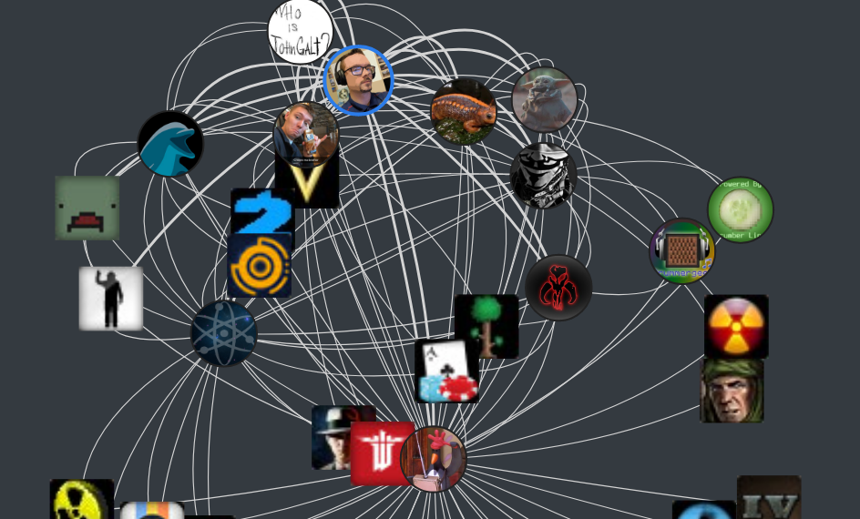

Graph algorithms!!!
Working with graphs can be a great deal of fun, but sometimes we just want some cold hard vectors to do some good old-fashioned machine learning.
This post looks at the famous [node2vec](https://cs.stanford.edu/~jure/pubs/node2vec-kdd16.pdf) algorithm used to quantize graph data.
The example I'm giving in this blog post uses data from my recently resurrected [steam graph project](https://jrtechs.net/projects/steam-friends-graph). 

If you live under a rock, [Steam](https://store.steampowered.com/) is a platform where users can purchase, manage, and play games with friends.
Although there is a ton of data within the Steam network, I am only interested in the graphs formed connecting users, friends, and games.
My updated visualization to show a friendship network looks like this:


I'm also working on visualizations to show both friends and their games.



The issue that I'm currently running into is that these graphs quickly become egregiously large. Players on Steam frequently have 100+ friends and own over 50 games-- one person I indexed somehow had over 400 games!
The size of this graph balloons exponentially with traversal depth.
The sheer scale of the graph data makes it challenging to visualize concisely.
Visualization of graph data brings us to our topic today:


# Node2Vec

Node2Vec is an embedding algorithm inspired by [word2vec](https://jrtechs.net/data-science/word-embeddings).
This algorithm aims to covert every node in a graph into a vectorized output where points close in the latent space correspond to related nodes.
Simplifying a few things: node2vec uses the notion of a biased random walk through the graph.
Two hyperparameters(P and Q) defines whether we want to favor a BFS vs. a DFS traversal. A BFS search will give us a better local view of the network, where a DFS traversal will provide us with a more global view of the graph. After applying some maths to the random walker outputs, distance in this embedding space is correlated to the probability that two nodes co-occur on the same random walk over the network. 

If you have the time, I urge you to watch [Jure Leskovec's](https://scholar.google.com/citations?user=Q_kKkIUAAAAJ&hl=en) Stanford lectures on graph learning on Youtube:

<youtube src="YrhBZUtgG4E" />

Additionally, if you want to dive deeper into graph learning, I suggest that you dig through the Stanford [CS-224 course page on Github](https://github.com/jrtechs/cs224w-notes).

# Python Node2Vec Code

I'm using a simple implementation of Node2Vec that I found on GitHub: [aditya-grover/node2vec](https://github.com/aditya-grover/node2vec).
I'm using this package because it is a faithful implementation of the original paper and doesn't require you to install too many dependencies. This project was written in Python 2, so to get Python 3 support, you will need to merge in changes from someone's fork because the maintainer is not reviewing any of the pull requests.

```
git clone https://github.com/aditya-grover/node2vec
git remote add python3 https://github.com/mcwehner/node2vec
git pull python3 master
git pull python3 updated_requirements
```

Pip makes installing the dependencies easy using a requirements file.


```python
!pip install -r node2vec/requirements.txt
```

Before we run this algorithm, we need to generate some data.
An example edge list is in the [git repo](https://github.com/aditya-grover/node2vec/blob/master/graph/karate.edgelist). 

Using the JanusGraph database I'm using for the [Steam graphs project](https://github.com/jrtechs/SteamFriendsGraph), I generated an edge list of a single player's network.
The code is straightforward; first, I pull the steam ids of the people we want in our embedding graph.
Second, I pull all the friend connections for the people we want in the graph and filter out any players that are not already in the network.
Finally, I take all the friend relationships and generate the edge pairs and save them to a file. If you are not familiar with Java's data streaming, I suggest that you check out my [last blog post on functional programming in Java](https://jrtechs.net/java/fun-with-functional-java).

```java
Set<String> importantEdges = graph
        .getPlayer(baseID)
        .getFriends()
        .parallelStream()
        .map(Player::getId)
        .collect(Collectors.toSet());

Map<String, Set<String>> edgeList = new HashMap<String, Set<String>>()
{{
    importantEdges.forEach(f ->
        put(f,
            graph.getPlayer(f)
                .getFriends()
                .parallelStream()
                .map(Player::getId)
                .filter(importantEdges::contains)
                .collect(Collectors.toSet()))
    );
}};

List<String> edges = edgeList.keySet()
    .parallelStream().map(k ->
        edgeList.get(k)
            .stream()
            .map(k2 -> k + " " + k2)
            .collect(Collectors.toList()))
    .flatMap(Collection::stream)
    .collect(Collectors.toList());

WrappedFileWriter.writeToFileFromList(edges, outFile);
```

Using the edge list generated in the prior script, I feed it into the node2vec program.


```python
!python node2vec/src/main.py --input jrtechs.edgelist --output output/jrtechs2.emd --num-walks=40 --dimensions=50

output:

    Walk iteration:
    1 / 40
...
    40 / 40
```

Once we have our embedding file, we can load it into Python to do machine learning or visualization.
The node2vec algorithm's output is a sequence of lines where each line starts with the node label, and the rest of the line is the embedding vector.

```python
labels=[]
vectors=[]

with open("output/jrtechs2.emd") as fp:
    for line in fp:
        l_list = list(map(float, line.split()))
        vectors.append(l_list[1::])
        labels.append(line.split()[0])        
```

Right now, I am interested in visualizing the output. However, that is impractical since it has 50 dimensions! Using the TSNE method, we can reduce the dimensionality so that we can visualize it. Alternatively, we could use another algorithm like Principal Component Analysis (PCA).

```python
from sklearn.decomposition import IncrementalPCA    # inital reduction
from sklearn.manifold import TSNE                   # final reduction
import numpy as np                      

def reduce_dimensions(labels, vectors, num_dimensions=2):
    
    # convert both lists into numpy vectors for reduction
    vectors = np.asarray(vectors)
    labels = np.asarray(labels)

    # reduce using t-SNE
    vectors = np.asarray(vectors)
    tsne = TSNE(n_components=num_dimensions, random_state=0)
    vectors = tsne.fit_transform(vectors)

    x_vals = [v[0] for v in vectors]
    y_vals = [v[1] for v in vectors]
    return x_vals, y_vals, labels

x_vals, y_vals, labels = reduce_dimensions(labels, vectors)
```

Before we visualize our data, we will want to grab the steam users' name because right now, all we have is their steam id, which is just a unique number.
Back in our JanusGraph, we can quickly export the steam ids mapped to the players' names.

```java
Player player = graph.getPlayer(id);
List<String> names = new ArrayList<String>()
{{
    add(id + " " + player.getName());
    addAll(
        player.getFriends()
            .stream()
            .map(p -> p.getId() + " " + p.getName())
            .collect(Collectors.toList())
    );
}};
WrappedFileWriter.writeToFileFromList(names, "friendsMap.map");
```

We then just create a map in Python linking the steam id to the player ID.

```python
name_map = {}
with open("friendsMap.map") as fp:
    for line in fp:
        name_map[line.split()[0]] = line.split()[1]
```

```Python
name_map

    {'76561198188400721': 'jrtechs',
     '76561198049526995': 'Noosh',
...
     '76561198065642391': 'Therefore',
     '76561198121369685': 'DataFrogman'}
```

Using the TSNE dimensionality reduction output, we can view all the nodes on a single plot. To make the graph look more delightful, we only label a fraction of the nodes.

```python
import matplotlib.pyplot as plt
import random

def plot_with_matplotlib(x_vals, y_vals, labels, num_to_label):
    plt.figure(figsize=(5, 5))
    plt.scatter(x_vals, y_vals)
    plt.title("Embedding Space")
    indices = list(range(len(labels)))
    selected_indices = random.sample(indices, num_to_label)
    for i in selected_indices:
        plt.annotate(name_map[labels[i]], (x_vals[i], y_vals[i]))
    plt.savefig('ex.png')
        
plot_with_matplotlib(x_vals, y_vals, labels, 12)
```


This graph may not look exciting, but I assure you that it is.
I can notice that my high school friends and college friends are in different graphical regions, just from eyeballing it.

Moving forward with this, I plan on incorporating game data.
With the graph data vectorized in this fashion, it becomes possible to start employing classification and link prediction algorithms.
Some steam network examples could be a friend or game recommendation system, or even a community detection algorithm.
Although this post only went over a shallow encoder, future work may use a Graph Convolutional Neural Network (GCN) to incorporate user features.  
