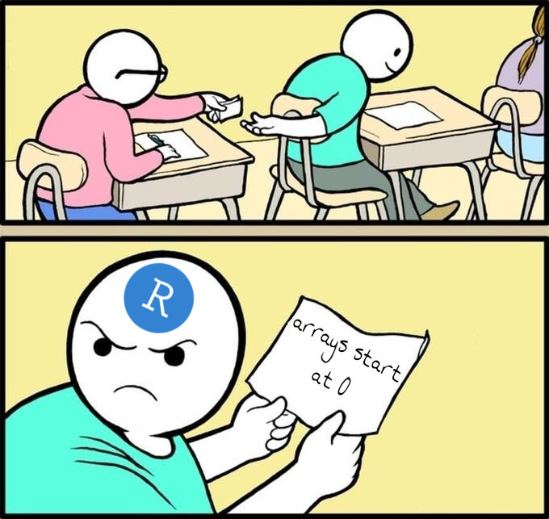

R is a programming language designed for statistical analysis and
graphics. Since R has been around since 1992, it has developed a large
community and has over [13 thousand
packages](https://cran.r-project.org/web/packages/) publicly
available. What is really cool about R is that it is an open source
[GNU](http://www.gnu.org/) project. 

# R Syntax and Paradigms

The syntax of R is C esk with its use of curly braces.  The type
system of R is similar to Python where it can infer what type you are
using. This "lazy" type system allows for "faster" development since
you don't have to worry about declaring types -- this laziness makes
it harder to debug and read your code. The type system of R is rather
strange and distinctly different from most other languages. For
starters, integers are represented as vectors of length 1. These
things may feel weird at first, but, R's type system is one of the
things that make it a great tool for manipulating data. 

Did I mention that arrays start at 1? Technically, the thing which we
refer to as an array in Java are really vectors in R. Arrays in R are
data objects which can store data in more than two dimensions. Since R
tries to follow mathematical notation, indexing starts at 1 -- just
like in linear algebra. Using zero based indexing makes sense for
languages like C because the index is used to get at a particular
memory location from a pointer. 

<youtube src="s3FozVfd7q4" />

I don't have the time to go over the basic syntax of R in a single
blog post; however, I feel that this youtube video does a pretty good
job. 

# R Markdown

One of my favorite aspects of R is its markdown language called Rmd.
Rmd is essentially markdown which has can have embedded R scripts run
in it. The Rmd file is compiled down to a markdown file which is
converted to either a PDF, HTML file, or a slide show using pandoc.
You can provide options for the pandoc render using a YAMAL header in
the Rmd file. This is an amazing tool for creating reports and writing
research papers. The documents which you create are reproducible since
you can share the source code to it. If the data which you are using
changes, you simply have to recompile to document to get an updated
view. You no longer have to re-generate a dozen graphs and update
figures and statistics across your document. 

# Resources

- [R for Data Science (Online Book)](https://r4ds.had.co.nz/)
- [R Studio](https://www.rstudio.com/)
- [R Official Website](https://www.r-project.org/)
