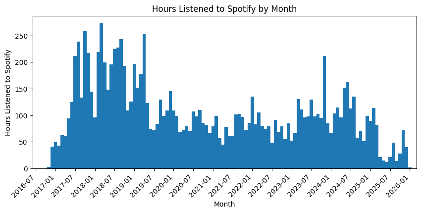
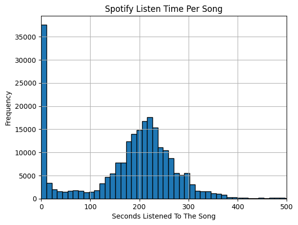
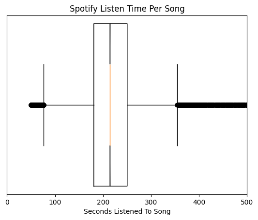
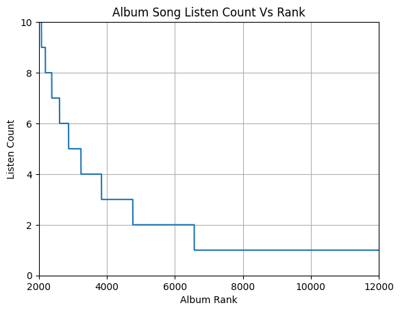
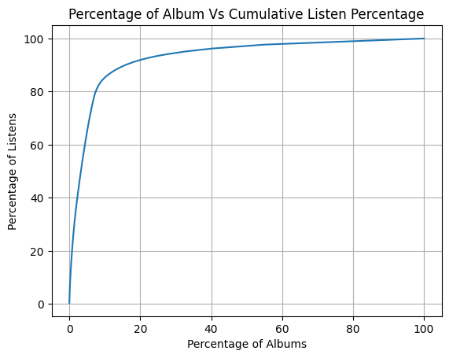
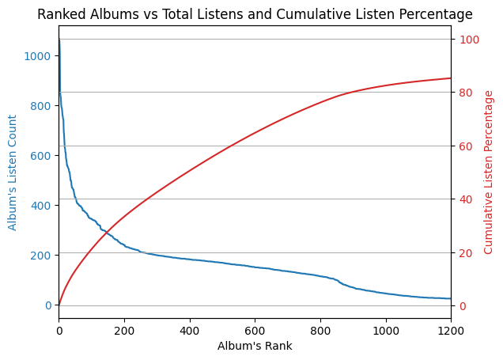
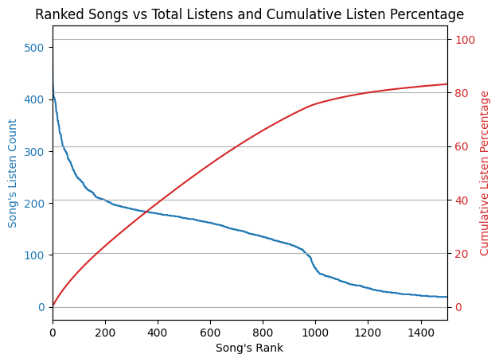
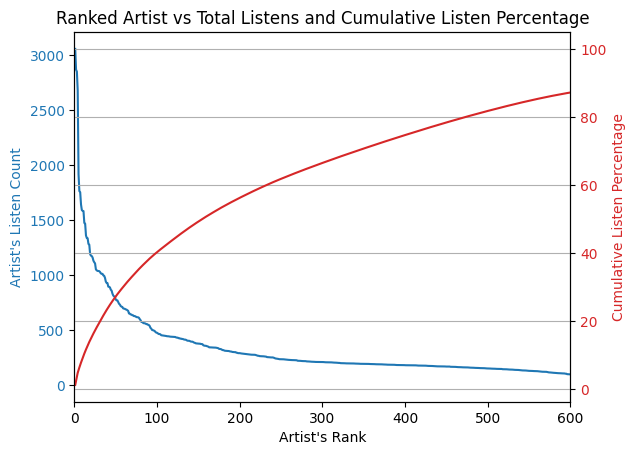
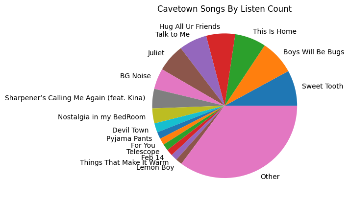
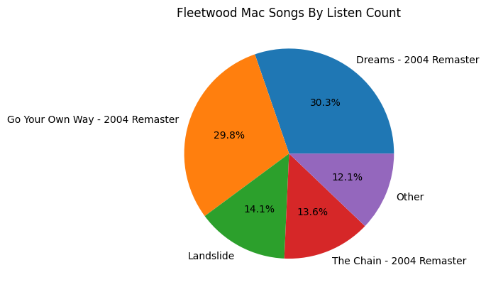

After using spotify for ten years, I decided to make a GDPR request and retrieve all the data that Spotify had collected on me.
I intended to make a light hearted blog post that just visualized some data like a: "Spotify Wrapped but for 10 years"...
After looking at the extensive amount of data that Spotify collected on me, I was a bit taken aback and decided to ditch Spotify.
Recently it has become a trend to criticize Spotify for their usage of AI music and the low dividends they pay to creators-- despite being the most expensive music streaming service on the market.
This post is not going to add to those loud noises that are already criticizing Spotify's business practices.
This post, is going to look at Spotify's extensive data collection and analyze my music listening habits to make an objective cost base analysis on if I would have been better off purchasing music instead of streaming from Spotify.

# Downloading the Data

Under [GDPR](https://gdpr-info.eu/) law, Spotify is legally obligated to provide you with all the personal data that they have stored on you. When you request your Spotify data, they offer the data export in three segments:

- Account Data
- Technical Log
- Extended Streaming History

Requesting the data was fairly easy to do from Spotify, and their documentation surrounding this was excellent.
The website claimed that the data export could take up to 30 days, but I got my *Extended Streaming History* the very next day, and I got my *Account Data* and *Technical Data* exports about a week later.
When I did the same thing for [FitBit](https://jrtechs.net/data-science/a-closer-look-at-fitbit-data), the process took me under a day.
Considering I had ten years of account data with Spotify, I was fairly pleased with the export.


## Technical Log Data


Let me start with the Spotify Technical log data. The export contained 157 files and was 105 MB uncompressed.

```python
list_files("./spotify_technical_log")
```


```json
['AccessoryAutoPull.json',
 'AccessoryStateEvent.json',
 'AccountMutated.json',
 'AccountPagesActivity.json',
 'AdLogicARSClient.json',
 'AdRequestEvent.json',
 'AdRequestServiceEvent.json',
 'AddedToCollection.json',
 'AddedToPlaylist.json',
 'AgnosticApiAuthRequests.json',
 'AndroidAppExitReason.json',
 'AndroidBluetoothPermissionStatus.json',
 'AndroidDeviceReport.json',
 'ApAuthenticationSuccess.json',
 'AudioDriverInfo.json',
 'AudioFileSelection.json',
 'AudioIndexRepairReport.json',
 'AudioOffliningSettingsReport.json',
 'AudioResolve.json',
 'AudioRouteSegmentEnd.json',
 'AudioSettingsReport.json',
 'AudioStreamingSettingsReport.json',
 'AuthHTTPReqWebapi.json',
 'BasslineRequests.json',
 'BasslineRequests_1.json',
 'BoomboxPlaybackSession.json',
 'BrokenObject.json',
 'CacheError.json',
 'CachePruningReport.json',
 'CacheRealmPruningReport.json',
 'CacheReport.json',
 'CanPlayContentPermissionsMissingMetadataEvent.json',
 'CanvasLoad.json',
 'CanvasState.json',
 'CarDetectionEvent.json',
 'ClientConnectEnvironment.json',
 'ClientCoreConnectCommand.json',
 'ClientCoreConnectPlayCommand.json',
 'ClientCoreConnectPullOperation.json',
 'ClientLanguageRaw.json',
 'ClientMessagingPlatformDismissEvent.json',
 'ClientMessagingPlatformDisplayStatus.json',
 'ClientMessagingPlatformInteractionEvent.json',
 'ClientMessagingPlatformRequestErrorEvent.json',
 'ClientMessagingPlatformRequestEvent.json',
 'ClientRespondedToConnectStateCommand.json',
 'ClientSentConnectStateCommand.json',
 'ClientSentSetVolumeCommand.json',
 'ConfigurationApplied.json',
 'ConnectActiveDeviceChanged.json',
 'ConnectConnectivityError.json',
 'ConnectDeviceDiscovered.json',
 'ConnectDevicePickerClosed.json',
 'ConnectPossibleVolumeSpike.json',
 'ConnectStateClientPingResponse.json',
 'ConnectTransferResult.json',
 'ConnectionInfo.json',
 'ContinuumPageResponseV1.json',
 'ContinuumSectionResponseV1.json',
 'CoreAutoplayLoadingResults.json',
 'DJNarrationServed.json',
 'DJNarrationServedTesting.json',
 'DJTrackServed.json',
 'DaylistGenerated.json',
 'DeeplinkOpen.json',
 'DeviceCapabilitiesRequest.json',
 'DeviceIdentifier.json',
 'DevicePredictabilityIntentEngineError.json',
 'Download.json',
 'EmailVerificationActivity.json',
 'EnhanceTrackAction.json',
 'EsdkCapabilities.json',
 'EsdkPlaybackStats.json',
 'ExternalAccessoryRemoteInteraction.json',
 'FulfilmentRequestStop.json',
 'HeadFileDownload.json',
 'HomeConfigResolutionEvent.json',
 'HomeFeedLoadingErrorEvent.json',
 'HomeFeedLoadingEvent.json',
 'HomePodcastCardCandidates.json',
 'HomeSectionResponse.json',
 'ImageDownload.json',
 'JamNearbyBroadcastStarted.json',
 'JamNearbyBroadcastStopped.json',
 'JumpstartError.json',
 'JumpstartTrigger.json',
 'KmPageView.json',
 'LocalFilesReport.json',
 'LyricsSnippetViewEvent.json',
 'MarqueeViewServiceResponseEvent.json',
 'MerchandisingCatalogGetPropositionsEvent.json',
 'MetricMeasurement.json',
 'MinimumLyricsCharactersSeen.json',
 'NPVScrollSectionResponse.json',
 'OAuthTokenRefresh.json',
 'OfflineDeviceEvent.json',
 'OfflineError.json',
 'OfflinePlayableCacheReport.json',
 'OfflinePruneReport.json',
 'OfflineReport.json',
 'OnRepeatContents.json',
 'ParadoxCampaignOptimizerEvent.json',
 'PartnerBannerSessionEvent.json',
 'PaymentRoutingDecision.json',
 'PlaybackFromDeeplink.json',
 'PlaybackGrabbingResult.json',
 'PlaybackSettingsCoreOperation.json',
 'PlaybackSettingsPersistedSetting.json',
 'Prefetch.json',
 'ProgressiveDownload.json',
 'PushAndroidDeviceSettingsV1.json',
 'PushkaTokensRegistrationEventV1.json',
 'QuickstartPivotClientPlaybackResult.json',
 'QuickstartPivotRecommendationProvided.json',
 'RawCoreStream.json',
 'ReleaseRadarServedRecs.json',
 'RemoteSessionStartEvent.json',
 'RemovedFromCollection.json',
 'RemovedFromPlaylist.json',
 'RequestFailure.json',
 'SearchViewResponse.json',
 'SegmentedDownload.json',
 'SemanticMetricClient.json',
 'SemanticMetricClient_1.json',
 'SessionCreation.json',
 'SessionValidation.json',
 'SettingsMutated.json',
 'Share.json',
 'ShortlinkOpenAttempt.json',
 'ShortlinkOpenResult.json',
 'ShuffleSequenceEvent.json',
 'SmartShuffleOperationResultAction.json',
 'SocialConnectBroadcastUpdate.json',
 'SocialConnectClientResolveTokenResult.json',
 'SocialConnectInviteNotificationNotSentV2.json',
 'SocialConnectInviteNotificationSentToParticipantV1.json',
 'SocialConnectInviteNotificationSentV2.json',
 'SocialConnectResolveTokenResult.json',
 'SocialConnectResolveValidationResult.json',
 'SocialConnectSessionCreated.json',
 'SocialConnectSessionEnded.json',
 'SocialConnectTokenCreated.json',
 'SocialConnectUserActiveDeviceChanged.json',
 'SocialListeningClientSessionCreated.json',
 'StutterPrediction.json',
 'SystemVolumeControl.json',
 'TrackNotPlayed.json',
 'TrackPlaybackGenericRequest.json',
 'TransactionalEmailerEmailEvent.json',
 'TvappPageView.json',
 'UserAuthenticationSuccess.json',
 'WhereToPlayClientRecommendationAutoDismissed.json',
 'WhereToPlayClientRecommendationNotDisplayed.json',
 'WindowSize.json',
 'WwwExperiments.json',
 'ReadMeFirst_TechnicalLogInformation.pdf',
 'recipients.json']
```


Going through this data, most of this data appears to be purged periodically which is a good thing. The AdRequestEvent.json file was interesting, since it contained a list of advertisement events which I didn't think I would have since I was a premium Spotify member paying to experience the platform without advertisements.

```json
  {
    "context_time": 1756816739181,
    "context_receiver_service_timestamp": 1756816752989,
    "context_device_manufacturer": "Google",
    "context_device_model": "Pixel 7a",
    "context_device_type": "mobile",
    "context_os_name": "android",
    "context_os_version": "14",
    "context_application_version": "9.0.74.####",
    "context_conn_country": "US",
    "message_feature_identifier": "esperanto_slots",
    "message_latency_ms": 159,
    "message_requested_ad_types": [
      "marquee"
    ],
    "message_http_error_code": 0,
    "message_content_uri": null,
    "message_connection_type": "wlan",
    "timestamp_utc": "2025-09-02T12:39:33.200Z"
  },
```

Since the file is sorted by date it's pretty easy to pull some simple metrics from this.

```python
with open(f"{technical_log_dir}/AdRequestEvent.json") as file:
    add_requests = json.load(file)
    add_requests = sorted(add_requests, key=lambda x: x['context_time'])
    print(add_requests[0]["timestamp_utc"])
    print(add_requests[-1]["timestamp_utc"])
    print(len(add_requests))
```

```txt
2025-08-03T14:02:11.682Z
2026-01-10T00:52:57.836Z
200
```

Over the course of five months, I was shown 200 [marquee](https://artists.spotify.com/marquee) ads.
After a quick google search, I discovered that these were all the popups I was receiving by Spotify for "new music discovery".
Honestly, it shouldn't shock me that music discovery on Spotify is just a disguised form of advertisement.

Most of the other technical log files were just Spotify keeping a log of EVERYTHING that happened on their system from album cover previews to login attempts.
This is commonplace for large companies to do for traceability and internal monitoring.
If a user has a crash, you have to know what API calls they made.
If you are looking at scaling a microservice, you need to know how many and how users are hitting that service.

The one log type file that stood out to me was a file called "CarDetectionEvent.json".
This file contained data over 5 months and 395 events. 

```
  {
    "context_time": 1766601074444,
    "context_receiver_service_timestamp": 1766601104444,
    "context_device_manufacturer": "Google",
    "context_device_model": "Pixel 7a",
    "context_device_type": "mobile",
    "context_os_name": "android",
    "context_os_version": "16",
    "context_application_version": "9.1.6.####",
    "context_conn_country": "US",
    "message_is_car_connected": true,
    "message_reason": "car",
    "timestamp_utc": "2025-12-24T18:31:15.001Z"
  },
```

Running a bit of python code, I extracted all the times where Spotify has logged as being in my car.
In the code, I filtered out "Detection" events that ended up detecting that I was not in a car, I also filtered out multiple detection events for the same day since I was in a car driving, there appears to be multiple positive "detections". 


```python
with open(f"{technical_log_dir}/CarDetectionEvent.json") as file:
    car_detections = json.load(file)
    car_detections = [car for car in car_detections if car['message_is_car_connected']]
    car_detections = sorted(car_detections, key=lambda x: x['context_time'])
    print(add_requests[0]["timestamp_utc"])
    print(add_requests[-1]["timestamp_utc"])
    print(len(car_detections))

    df = pd.DataFrame(car_detections)
    df['date'] = pd.to_datetime(df['timestamp_utc'], format='ISO8601')
    grouped_data = df.groupby(pd.Grouper(key='date', freq='D')).first()
    grouped_data = grouped_data[grouped_data['context_time'] > 0]
    
    grouped_data['timestamp_utc'].to_json('car_data_dates.json', indent=4) 
```

I won't share this data for personal concerns.
I was quite shocked when I compared the car detections against my personal schedule notebook/calendar.
Spotify was able to perfectly detect every instance where I was in my car, even in instances where I was not listening to Spotify.
I'm still old school and still primarily listen to FM radio in my car except on longer trips where I need to use GPS.
My car also doesn't have working android_auto, so whenever I did listen to Spotify in my car it's over Bluetooth.


Looking at the app permissions, it's pretty clear what is happening.
Spotify is using the "Nearby Devices" to detect my car's Bluetooth and is recognizing it as a car and is storing that knowledge in the Spotify database.
How exactly this data is used, I can only speculate since I don't see how Spotify scraping this data when I'm not using the app could in any way improves my user experience.
Maybe it's used to detect if a user is in their car but not listening to Spotify, or, maybe the data is sold to a third party that can monetize car usage data.
I understand that Spotify needs to detect devices that Spotify can play music on so when you open the app, you can select a device to play music on.
Spotify appears to do something similar with the "ConnectDeviceDiscovered" log, however, this type of device discovery feels like it should just be kept in the memory of the App and not persisted to a central database. 

## Account Data


The Spotify user account data is only 20 files and 3.3 MB, but for non-technical people this section contains the most useful information.

```python
list_files("/home/jeff/Documents/spotify_account_data")
```

```json
['DuoNewFamily.json',
 'Follow.json',
 'Identifiers.json',
 'Identity.json',
 'Marquee.json',
 'Payments.json',
 'Playlist1.json',
 'SearchQueries.json',
 'StreamingHistory_audiobook_0.json',
 'StreamingHistory_music_0.json',
 'StreamingHistory_music_1.json',
 'StreamingHistory_podcast_0.json',
 'UserAddress.json',
 'Userdata.json',
 'UserFestivalsDataForSAR.json',
 'UserPrompts.json',
 'Wrapped2024.json',
 'YourLibrary.json',
 'YourSoundCapsule.json',
 'Read_Me_First.pdf',
 'Userdata.json']
```


The Playlist.json file is particularly handy if you plan on exporting your Spotify data and moving to a new platform.

```json
{
  "playlists" : [ {
    "name" : "RR",
    "lastModifiedDate" : "2025-07-31",
    "collaborators" : [ ],
    "items" : [ {
      "track" : {
        "trackName" : "Neon Pill",
        "artistName" : "Cage The Elephant",
        "albumName" : "Neon Pill",
        "trackUri" : "spotify:track:0cgyeBU54kjmI54TflMANg"
      },
      "episode" : null,
      "audiobook" : null,
      "localTrack" : null,
      "addedDate" : "2024-08-17"
    }, {
      "track" : {
        "trackName" : "Kids with Guns",
        "artistName" : "Gorillaz",
        "albumName" : "Demon Days",
        "trackUri" : "spotify:track:0eEgMbSzOHmkOeVuNC3E0k"
      },
      "episode" : null,
      "audiobook" : null,
      "localTrack" : null,
      "addedDate" : "2024-08-17"
    }
```

The YourLibrary.json file contains a list of all your liked songs, artist, and podcasts.
This would be very handy to again, import your music library and preferences into another platform.

```json
{
  "tracks" : [ {
    "artist" : "The Cranberries",
    "album" : "No Need To Argue",
    "track" : "Zombie",
    "uri" : "spotify:track:2IZZqH4K02UIYg5EohpNHF"
  }, {
```

With this liked music data, you can also run some simple analytics.


```python
with open(f"{account_data_dir}/YourLibrary.json") as file:
    liked_songs = json.load(file)["tracks"]

    df = pd.DataFrame(liked_songs)
    artist_by_liked_songs = df.groupby(['artist']).size().sort_values(ascending=False)

artist_by_liked_songs
```

```txt
artist
Red Hot Chili Peppers    17
Panic! At The Disco      13
Billy Joel               10
                         ..
Asia                      1
Austin Mahone             1
Length: 522, dtype: int64
```

Of my 937 liked songs on Spotify, I have music from 522 distinct artists, and my most liked group was the "Red Hot Chili Peppers" -- although I wouldn't need an algorithm to tell me that!


Another file in the data export I found interesting was SearchQueries.json.
This file shows you all the searches that you make with Spotify.
It was interesting that Spotify logged all the partial searches as you type out your search query.
In this instance I was looking for "Grease the musical" and it logged as I was typing it out.
This file also logs what you ended up clicking on as a result of that search query -- probably to help optimize search.

```json
{
  "platform" : "",
  "searchTime" : "2025-10-17T15:20:38.916Z[UTC]",
  "searchQuery" : "g",
  "searchInteractionURIs" : [ ]
}, {
  "platform" : "",
  "searchTime" : "2025-10-17T15:20:39.622Z[UTC]",
  "searchQuery" : "gre",
  "searchInteractionURIs" : [ ]
}, {
  "platform" : "ANDROID_ARM",
  "searchTime" : "2025-10-17T15:20:42.041Z[UTC]",
  "searchQuery" : "greece ",
  "searchInteractionURIs" : [ ]
}, {
  "platform" : "",
  "searchTime" : "2025-10-17T15:21:02.013Z[UTC]",
  "searchQuery" : "ge",
  "searchInteractionURIs" : [ ]
}, {
  "platform" : "",
  "searchTime" : "2025-10-17T15:21:02.705Z[UTC]",
  "searchQuery" : "geec",
  "searchInteractionURIs" : [ ]
}, {
  "platform" : "",
  "searchTime" : "2025-10-17T15:21:03.001Z[UTC]",
  "searchQuery" : "geece",
  "searchInteractionURIs" : [ ]
}, {
  "platform" : "ANDROID",
  "searchTime" : "2025-10-17T15:21:06.432Z[UTC]",
  "searchQuery" : "geece",
  "searchInteractionURIs" : [ "spotify:artist:0WCo84qtCKfbyIf1lqQWB4" ]
},
```

The rest of that data in the *User account data* section was pretty standard and what you would think of in terms of payments, email, name, address, etc.


# Extended Streaming History

The extended history was a collection of zipped JSON files that contained every single listen "event" associated with my account.
It was kinda freaky looking through this data and recognizing the home IP address that I had back in High School 10 years ago-- and yes, I was the kid that ran a Minecraft server so I still recognize my old IP addresses.
Regardless, this data is most versatile in what you can do with it.


```json
[
    {
        'ts': '2016-03-27T02:15:36Z',
         'platform': 'WebPlayer (websocket RFC6455)',
         'ms_played': 36979,
         'conn_country': 'US',
         'ip_addr': '111.222.333.444',
         'master_metadata_track_name': 'Money On My Mind',
         'master_metadata_album_artist_name': 'Sam Smith',
         'master_metadata_album_album_name': 'Nirvana',
         'spotify_track_uri': 'spotify:track:0N6Bxsif1tT4vHz8tnkjzP',
         'episode_name': None,
         'episode_show_name': None,
         'spotify_episode_uri': None,
         'audiobook_title': None,
         'audiobook_uri': None,
         'audiobook_chapter_uri': None,
         'audiobook_chapter_title': None,
         'reason_start': 'playbtn',
         'reason_end': 'playbtn',
         'shuffle': False,
         'skipped': False,
         'offline': False,
         'offline_timestamp': None,
         'incognito_mode': False
    }
    ...
]
```

First, let's write a simple python method to grab all the files from our extracted zip file containing our extended Spotify history. 

```python
def list_files(dir_path):
    try:
        return [f for f in os.listdir(dir_path) if os.path.isfile(os.path.join(dir_path, f))]
    except OSError:
        return []
folder = "./spotify_extended_streaming_history"

list_files(folder)
```

```json
['Streaming_History_Audio_2016-2017_0.json',
 'Streaming_History_Audio_2017-2018_2.json',
 'Streaming_History_Audio_2017_1.json',
 'Streaming_History_Audio_2018-2019_5.json',
 'Streaming_History_Audio_2018_3.json',
 'Streaming_History_Audio_2018_4.json',
 'Streaming_History_Audio_2019-2020_7.json',
 'Streaming_History_Audio_2019_6.json',
 'Streaming_History_Audio_2020-2021_8.json',
 'Streaming_History_Audio_2021-2022_9.json',
 'Streaming_History_Audio_2022-2023_11.json',
 'Streaming_History_Audio_2022_10.json',
 'Streaming_History_Audio_2023-2024_12.json',
 'Streaming_History_Audio_2024-2025_14.json',
 'Streaming_History_Audio_2024_13.json',
 'Streaming_History_Audio_2025-2026_15.json',
 'Streaming_History_Video_2017-2026.json',
 'ReadMeFirst_ExtendedStreamingHistory.pdf']
```

Next, we can load all our stream histories into a single python list.

```python
listen_history = []

for file_name in list_files(folder):
    if "Audio" in file_name:
        with open(f"{folder}/{file_name}", "r", encoding="utf-8") as history_list:
            l = json.load(history_list)
            print(f"Loading {file_name} with {len(l)} records")
            listen_history.extend(l)
```


```txt
Loading Streaming_History_Audio_2016-2017_0.json with 15660 records
Loading Streaming_History_Audio_2017-2018_2.json with 15754 records
Loading Streaming_History_Audio_2017_1.json with 15410 records
Loading Streaming_History_Audio_2018-2019_5.json with 15613 records
Loading Streaming_History_Audio_2018_3.json with 15730 records
Loading Streaming_History_Audio_2018_4.json with 15782 records
Loading Streaming_History_Audio_2019-2020_7.json with 15169 records
Loading Streaming_History_Audio_2019_6.json with 15649 records
Loading Streaming_History_Audio_2020-2021_8.json with 15130 records
Loading Streaming_History_Audio_2021-2022_9.json with 15184 records
Loading Streaming_History_Audio_2022-2023_11.json with 15864 records
Loading Streaming_History_Audio_2022_10.json with 15156 records
Loading Streaming_History_Audio_2023-2024_12.json with 15778 records
Loading Streaming_History_Audio_2024-2025_14.json with 15759 records
Loading Streaming_History_Audio_2024_13.json with 15794 records
Loading Streaming_History_Audio_2025-2026_15.json with 2413 records
```

Spotify appears to partition the data export data in JSON documents with roughly 15,700 listen events recorded in each. 

Most the attributes in the JSON document are not very useful to me so I will only be pulling the attributes that I'm interested in.

```python
cleaned_history = []

for event in listen_history:
    cleaned_history.append({
        "time": event["ts"],
        "song": event["master_metadata_track_name"],
        "artist": event["master_metadata_album_artist_name"],
        "album": event["master_metadata_album_album_name"],
        "listen_time_seconds": event["ms_played"]/1000
    })

cleaned_history[0]
```

```json
{
    'time': '2016-03-27T02:15:36Z',
     'song': 'Money On My Mind',
     'artist': 'Sam Smith',
     'album': 'Nirvana',
     'listen_time_seconds': 36.989
}
```


Next I will dump this data into a single JSON document to make it easier to use later without having to load all the JSON files from disk. 
I will also load the data into a [Pandas](https://pandas.pydata.org/) dataframe.

```python
with open("spotify_history.json", "w", encoding="utf-8") as f:
    json.dump(cleaned_history, f, indent=4)
spotify_df = pd.read_json("spotify_history.json", convert_dates=True)
```


Right off the bat, we can do a quick visualization of how much I listen to spotify.
To do this, I will first group the data by month and sum all the listen times in each group.

```python
spotify_df['date'] = pd.to_datetime(spotify_df['time'], format='ISO8601')

monthly_listen_time = spotify_df.groupby(pd.Grouper(key='date', freq='M'))['listen_time_seconds'].sum()/(60*60)
```

With the data in a Pandas series, we can do a Matplotlib right off of that series with the plt function, but to make the graph better looking, I will manually build the X-axis tick marks to better show the date. 

```python
# simple index against our grouped sequence
x = range(0, len(monthly_listen_time.to_list()))

# pull hours listened to out of pandas sequence
y = monthly_listen_time.to_list() 

fig, ax = plt.subplots(figsize=(10, 4))
ax.bar(x, y, width=1.0) # width=1 removes any gaps in the bars

x_ticks = [] # which x plot indexes to add a label to
x_tick_labels = []

# add a label every 6 months to avoid cluttering the x-axisfigsize=(10, 4)
for i in range(4, len(monthly_listen_time.to_list()), 6):
    key = monthly_listen_time.keys()[i].strftime("%Y-%m")
    x_ticks.append(i)
    x_tick_labels.append(key)

plt.xticks(x_ticks, x_tick_labels, rotation=45, ha='right')

plt.xlabel('Month')
plt.ylabel('Hours Listened to Spotify')
plt.title("Hours Listened to Spotify by Month")
plt.show()
```



As I already knew before plotting this, I listen to music A LOT.
I almost always have music playing in the background as I work on stuff.


The next thing I was interested in was looking at the amount of time that I listen to a song. I often skip around songs till I get to a track that I want to listen to.
I always wondered if Spotify logged this, or if they just discarded it before saving it permanently.
For this graph, we don't have any special grouping or aggregation to do so we will just use the histogram function right on our Dataframe.


```python
spotify_df.hist(column='listen_time_seconds', bins=300, edgecolor='black')

plt.xlabel('Seconds Listened To The Song')
plt.ylabel('Frequency')
plt.title('Spotify Listen Time Per Song')
#cap bar graph at 8 minutes
plt.xlim(0, 500)

plt.show()
```




The data obviously contains events where I don't actually listen to the song but skip over it, so I will clean the Dataframe by discarding any events where I don't listen to the song for at least 50 seconds.
The idea behind this is that going forward I will primarily be using times listened to a song as a metric, so I don't want to skew the results by including events where I just skip the song and don't listen to it.
IE: if I visualize my favorite songs using stream count as the indicator, I don't want to consider songs that I always skip.
Visualizing the data as a box and whiskers, we can verify the new distribution.


```python
threshold_value = 50
spotify_df = spotify_df[spotify_df['listen_time_seconds'] >= threshold_value]

ax = plt.gca()
ax.set_title('Spotify Listen Time Per Song')
ax.boxplot(spotify_df['listen_time_seconds'], vert=False,manage_ticks=False, notch=True)
plt.xlabel("Seconds Listened To Song")
ax.set_yticks([])
plt.xlim(0, 500)
plt.show()
```




## Album Statistics

Now that the data is cleaned, we can start visualizing listen counts by album, song, and artist.
Several artists have a "greatest hits" album, or contain the songs with the same name so when I did groupings, I always included the artist in the group key.
I started with visualizing the number of times I listened to a song from a particular album.
My theory is that there are certain albums that I listen to so much, it would be worth it to purchase the entire album.


```python
grouped_album_data = spotify_df.groupby(['album', 'artist']).size().sort_values(ascending=False)
print(grouped_album_data)
```


```txt
album                     artist                 Count
Rumours                   Fleetwood Mac          1056
Death of a Bachelor       Panic! At The Disco    1018
Blurryface                Twenty One Pilots       854
Full Moon Fever           Tom Petty               838
                                                 ... 
Sad Piano Songs           Piano Peace               1
Rules                     Doja Cat                  1
Rueda                     Chimbala                  1
Royalty (Deluxe Version)  Chris Brown               1
Length: 12056, dtype: int64
```

My god, Rumors by Fleetwood Mac is an amazing album that everyone should listen to!
With the data grouped in a Pandas series, we can visualize it using Matplotlib. 
For this graph, the "Rank" is the popularity derived from the sorted listen count.
The album with Rank 1 was Rumors since I listened to it the most, the album with Rank 2 was Death of a Bachelor, etc. 
I limited the graph to the top 2,000 albums since there were over 12,000 albums which had under 10 listens.

```python
plt.title("Album Song Listen Count Vs Rank")
album_plot = plt.plot(list(range(1, len(grouped_album_data.to_list()) + 1)), grouped_album_data.to_list())
plt.xlabel("Album Rank")
plt.ylabel('Listen Count')
plt.xlim(0, 2000)
plt.grid(True)
plt.show()
```


It's interesting that the graph follows an "S" pattern with two points of inflection at around album 250 and 800. 

Sliding the graph over, we can better visualize the albums that were listened to less.

```python
plt.title("Album Song Listen Count Vs Rank")
album_plot = plt.plot(list(range(1, len(grouped_album_data.to_list()) + 1)), grouped_album_data.to_list())
plt.xlabel("Album Rank")
plt.ylabel('Listen Count')
plt.ylim(0, 10)
plt.xlim(2000, 12000)
plt.grid(True)
plt.show()
```




It is clear to see that some albums had songs that were listened to a lot, but the vast majority were only listened to a few times.
The next question on my mind was how much music do I actively listen to?
I have listened to songs from 12,000 albums, but that doesn't necessarily mean that I would even recognize them or want to listen to them again.
With Spotify you often listen to a random playlist, or listen to songs on smart shuffle and you either don't like the song enough to add it to your list, or you just don't hear it enough to fall in love with it.
Music is interesting since it's almost magnetic in popularity.
The more you hear it, the more you like the song; as a result, I often listen to the same playlists on repeat.
I want to take the graph above to the next step and ask: what percentage of albums comprizes the majority of my listening?
Rumors is my most popular album at around one thousand listens, but in total, I have a quarter million music streams on Spotify, Rumors alone is a fraction of a percent.
But,if you take the top 20% of my albums, would that encompass most of the music streams that I have?


```python
# Cumulative Listen % VS Album %

x_vals = [] # % of albums
y_vals = [] # % of cumulative listens

albums_total = len(grouped_album_data.to_list())
total_listens = sum(grouped_album_data.to_list())

cumulative_listens = 0
album_rank = 0
for count in grouped_album_data.to_list():
    cumulative_listens += count
    album_rank += 1
    x_vals.append(album_rank/albums_total * 100)
    y_vals.append(cumulative_listens/total_listens * 100)

plt.title("Percentage of Album Vs Cumulative Listen Percentage")
album_plot = plt.plot(x_vals, y_vals)
plt.xlabel("Percentage of Albums")
plt.ylabel('Percentage of Listens')
plt.grid(True)
plt.show()
```




What's interesting is that my spotify listening follows the [Pareto principal](https://en.wikipedia.org/wiki/Pareto_principle). In layman's terms, this principal states that 20% of something causes 80% of the net effect. One example is that 20% of employees do 80% of the work, or that with 20% effort you can learn 80% of a language, but to master the last 20%, you need to spend 80% of your effort. In my instance 20% of the albums I listened to were responsible for 90% of my total listens.

Percentages can be a bit too abstract, so I combined the two graphs above into a single graph that shows both the Album's rank, listen count, and the cumulative percentage that album's rank and above encompass in terms of listening percentage. 

```python
fig, ax1 = plt.subplots()

ax2 = ax1.twinx()

# Axis 1 (left)
color1 = 'tab:blue'
ax1.set_xlabel("Album's Rank")
ax1.set_ylabel("Album's Listen Count", color=color1)
ax1.plot(list(range(1, len(grouped_album_data.to_list()) + 1)), grouped_album_data.to_list(), color=color1)
ax1.tick_params(axis='y', labelcolor=color1)

# Axis 2 (right)
color2 = 'tab:red'
ax2.set_ylabel('Cumulative Listen Percentage', color=color2)
ax2.plot(list(range(1, len(grouped_album_data.to_list()) + 1)), y_vals, color=color2)
ax2.tick_params(axis='y', labelcolor=color2)
ax2.grid(True)

plt.title("Ranked Albums vs Total Listens and Cumulative Listen Percentage")
plt.xlim(0, 1200)
plt.grid(True)

# 6. Display the plot
plt.show()
```





Reading the plot above, we can say that 80% of my listening is comprised by my top 1000 albums-- which is a lot of albums!! Next, I created the same display grouping by artist and song to see if the pattern remains.


## Song Statistics


```python
grouped_song_data = spotify_df.groupby(['song', 'artist']).size().sort_values(ascending=False)
print(grouped_song_data)
```


```txt
song                       artist                
American Pie               Don McLean                516
Dream On                   Aerosmith                 430
La Bamba - Single Version  Ritchie Valens            425
                                                     ... 
.suede                     junyii.                     1
003                        digitalluc                  1
05.wav                     slr                         1
Length: 17687, dtype: int64
```



Around 1000 songs encompassed 80% of my music streaming, which is similar to the 1200 albums.
It is safe to say that on Spotify I don't have many albums that I listen to, but instead the individual song is the driving factor of what I listen to.


## Artist Statistics


```python
grouped_artist_data = spotify_df.groupby(['artist']).size().sort_values(ascending=False)
print(grouped_artist_data)
```

```txt
Red Hot Chili Peppers         3057
Cavetown                      2868
Billy Joel                    2851
Panic! At The Disco           2678
Gorillaz                      1917
                              ... 
Montell Jordan                   1
Monty Reiss                      1
Monty Sunshine's Jazz Band       1
Moon Walker                      1
Moose Dawa                       1
Length: 5750, dtype: int64
```



The artist visualization is interesting because the drop-off is more gradual than it was for the song listen count.
With artists, we can see that 500 artists make up 80% of my music streaming.
That is a lot of bands!
But, if we compare it against the above song distribution, that means that on average for this group, I only have two heavily listened to songs per artist.

Another side-tangent we can do with Artists is that we can visualize what song we listened to per artist using a pi graph.

```python
artist = 'Cavetown'

artist_df = spotify_df[spotify_df['artist'] == artist]

grouped_single_artist_data = artist_df.groupby(['song']).size().sort_values(ascending=False)

songs = []
listen_counts = []

other_count = 0
for i in range(0, len(grouped_single_artist_data.to_list())):
    # if view count less than 40, display in other category
    if grouped_single_artist_data[i] > 40:
        songs.append(grouped_single_artist_data.keys()[i])
        listen_counts.append(grouped_single_artist_data[i])
    else:
        other_count += grouped_single_artist_data[i]


songs.append("Other")
listen_counts.append(other_count)

grouped_single_artist_data


fig, ax = plt.subplots()
ax.pie(listen_counts, labels=songs)
plt.title(f"{artist} Songs By Listen Count")
```







Some of my most listened to Artists like Cavetown and Fleetwood Mac have a lot of songs I listen to.
A large chunk of artists, I only have one song that I frequently listen to.


# Is Spotify Worth It?

I knew I listened to a lot of of different music, but I never imagined that it was 17,687 unique songs and a quarter million streams!
That is on average listening to 65 songs a day.
Crude math, but I've had Spotify for 10 years and the current price is $12 a month. 
So, I've spent $1,440 in total-- the actual value is lower since Spotify has slowly raised their prices.
To buy 80% of the albums I listen to, I would need to purchase 1,000 albums which would cost roughly $9,000-- assuming a $9 average album cost.
However, the album comparison is not fair since I primarily listened to playlists which usually don't contain more than two songs from the same album on Spotify.
If I listened to albums on Spotify more, it would have shifted this plot drastically.

To acquire 80% of the songs that I listen to on Spotify, I would need to purchase 1,200 songs on a website like [Band Camp](https://bandcamp.com/) or [iTunes](https://www.apple.com/itunes/).
With an average cost of $0.99, I would only be spending $1,200.
Or, let's say that I kept my music listening habits to solely listening to albums.
If I still had 1,200 songs in the mix of songs that I listen to, that would only amount to 120 albums-- 10 tracks per album on average.
Purchasing 120 albums would only cost around $1080.
This entire nerdy post just to say: **after using Spotify for 10 years, I hit even between paying the subscription for Spotify vs just buying the music I listen to**.

Purchasing music actually would support the artist much more than what [Spotify is currently giving artists](https://www.newschoolfreepress.com/2025/12/08/spotify-isnt-your-friend-how-the-platform-takes-your-money-while-artists-pay-the-price/).
Plus, I can't fail to mention all the AI slop that is starting to show up on the platform driving down traffic to actual artists.
What about data privacy?
I'm a geek, so it was cool that I am able to sift through and process a large dataset on my own data, but Spotify is definitely doing the same thing on a much larger scale.
I can understand storing some summarized metrics on a user over the long periods of time, but **it was kinda freaky looking through the data and recognizing the home IP address that I had back in High School 10 years ago, or seeing that Spotify is logging when I get in my Car**.

Growing up, my family had a relatively large CD collection.
When I was in 6th grade, I remember the excitement of making a copy of my Dad's Gun's N' Roses CD so that I could listen to the album in my bedroom at night.
I started buying music on iTunes and ripping more CDs after I was given a used MP3 player.
There was a magical excitement in the process of collecting music and discovering artists through their albums.

Spotify and music streaming changed music for almost everyone.
In late high school, I stopped collecting albums, and instead started liking individual songs and adding them to my Spotify playlist.
I went from someone who listened to artists, to someone who listened to hit songs.

Music tastes don't drastically change overnight.
The other week, I loaded my old iTunes collection on my [JellyFin](https://jellyfin.org/) server and I was pleasantly happy listening to the songs I purchased back when I was in middle school.
The Red Hot Chili Peppers, Guns And Roses, and Billy Joel sounded great in 2013, and they will sound just as good 15 years from now.
The music I add to my library, I will be enjoying for the rest of my life.
Maybe the comparison between what I listened to on Spotify vs what I would have to purchase to have the same experience is a moot point.
When you have a rack of CDs or a limited selection on your own media server, the decision of what to listen to is cognitively simple: you listen to what you got, simple as that.
Spotify presents infinite options and that makes the decision of what to make mentally taxing.

Maybe it's just nostalgia talking and music streaming is actually the superior way to experience music, but, I still feel like we traded something when going from owning a music library to renting access to an unlimited amount of music.
Based on this data, I'm going to take the plunge and try to re-discover what music ownership feels like in 2026.
