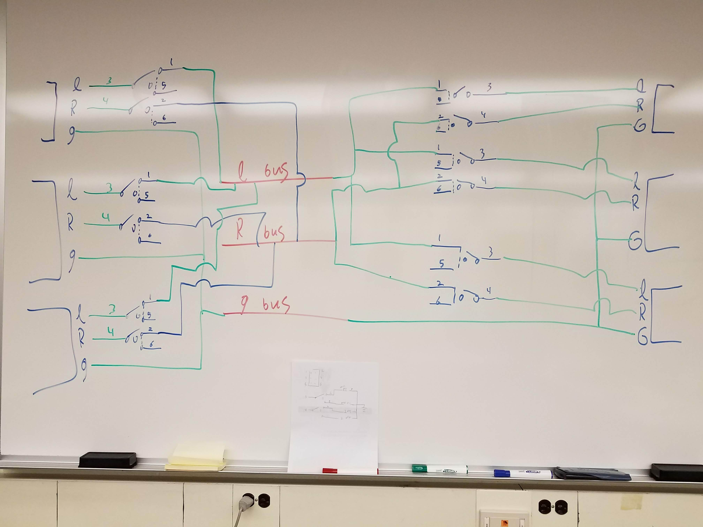
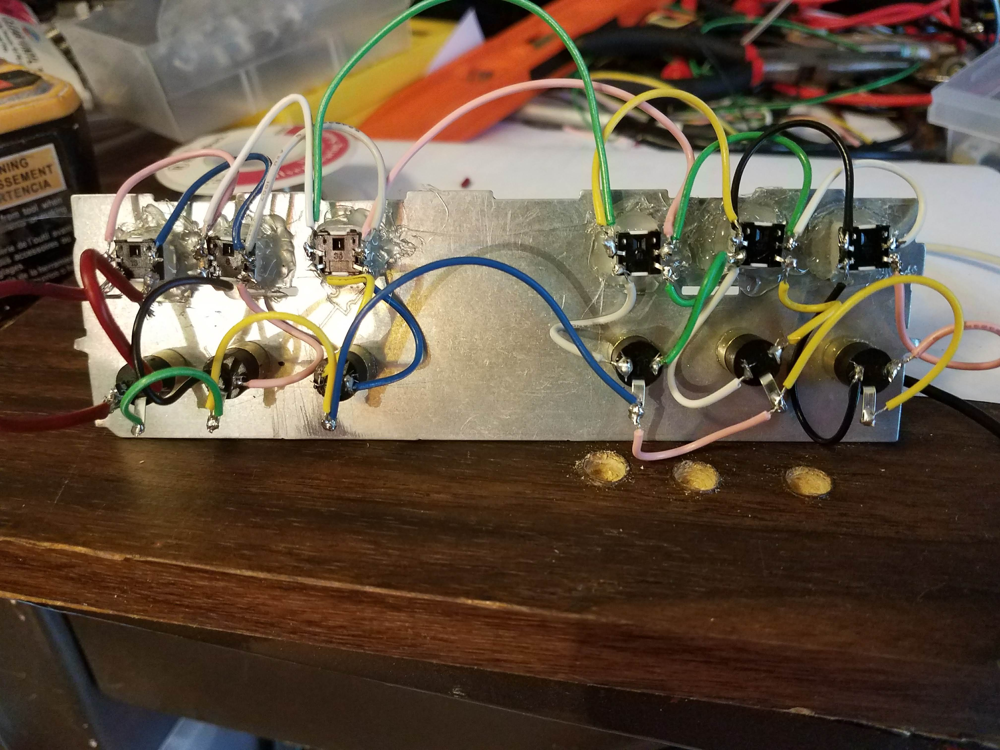
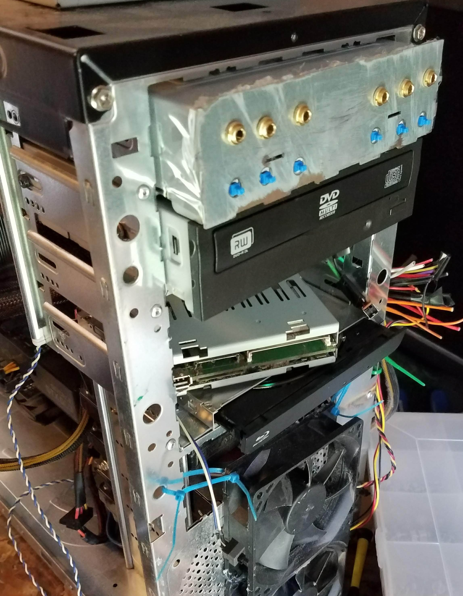
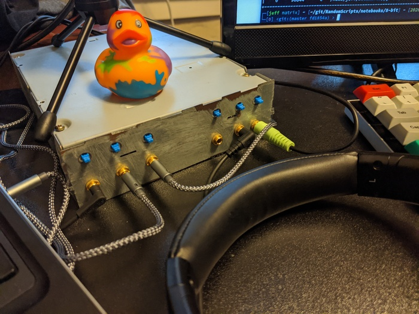

This post covers a bit of an old project, but I wanted to write about how I made my 3.5mm audio switch.
The goal of this project was to make an audio switch that had multiple inputs and multiple outputs.
At the time, I could not find a commercial product that did this, and similar DIY projects only had multiple inputs and a single output rather than numerous inputs and outputs.

I started this project by making a wiring schematic.

The goal is to toggle 3.5 mm ports on or off and have their left, right, and ground lines accessible via a bus that is available to all the other 3.5 mm ports.
To toggle sources on/off, I used a latching push button.

If I were to do this project again, I would 3D print a case to house all the elements; however, I didn't have that luxury back in high school.
To create a sturdy container for the wiring, I drilled 12 holes into a thin metal piece.
The 3.5 mm jacks got screwed into place with a provided bolt, and the toggle buttons were hot glued to the piece of metal.

After soldering, I attached the metal piece to the front of a gutted CD drive.
The CD case enabled me to mount this the front of my computer, making it easier to transport and put it close to all my audio equipment.

Recently, I have used this on top of my desk rather than inside my computer. 
I have my laptop, desktop, record player, headphones, and speakers hooked up to it.

Since all the wires are not totally insulated, the audio isn't studio quality.
However, the audio doesn't have any noticeable interference and sound great with my headphones. 