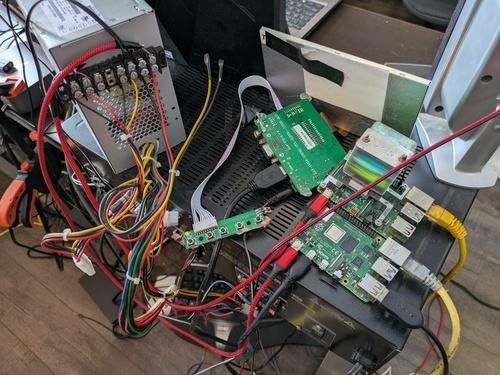
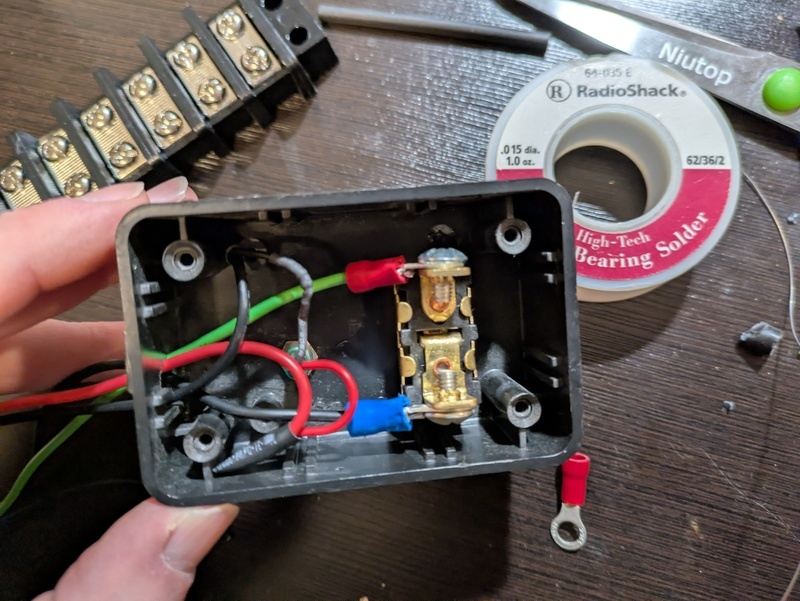
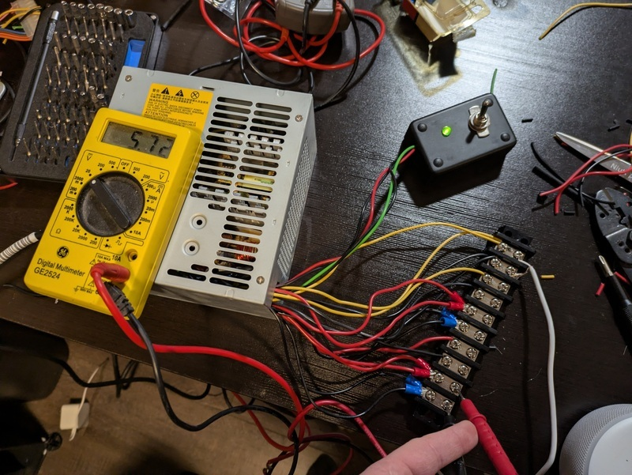
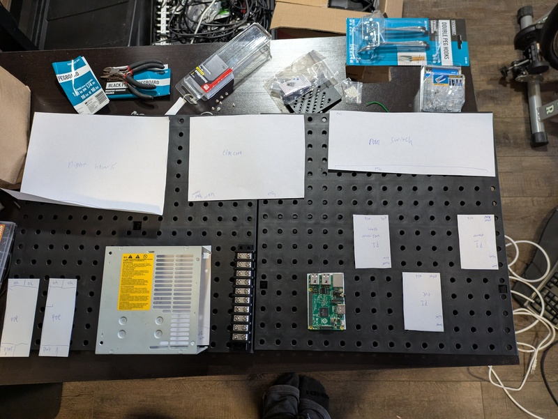
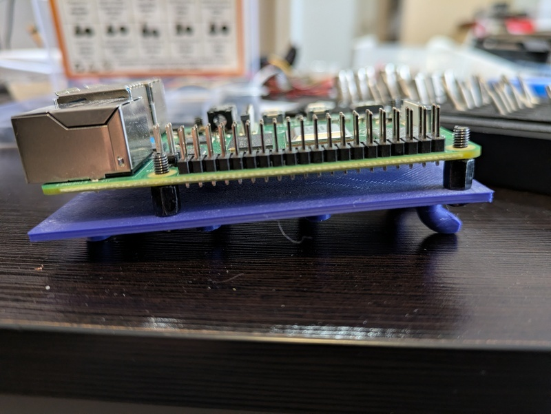
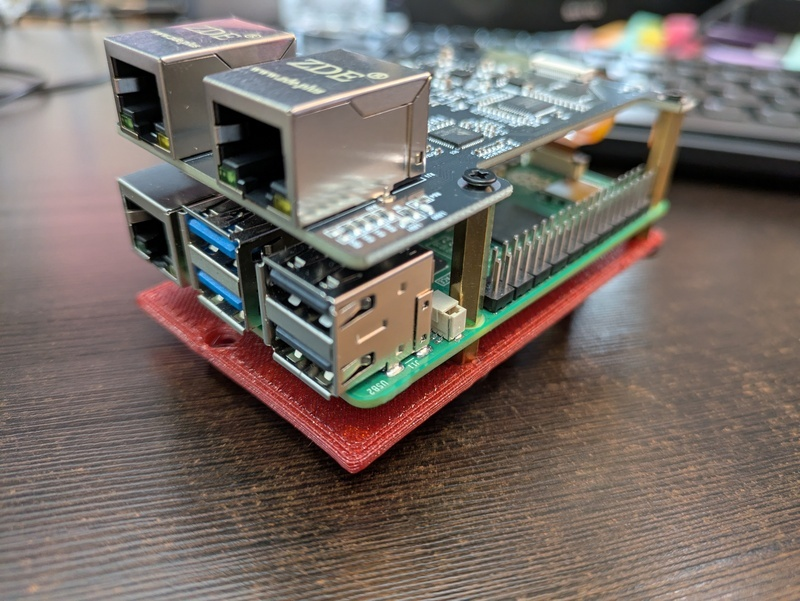
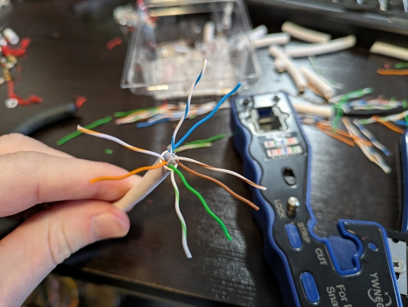
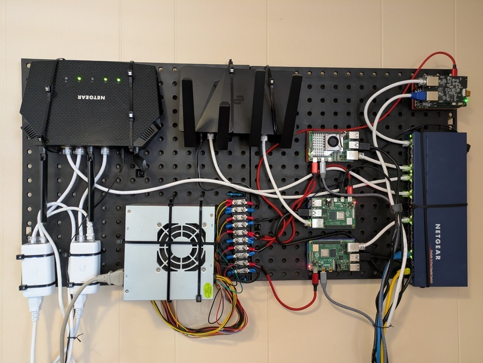
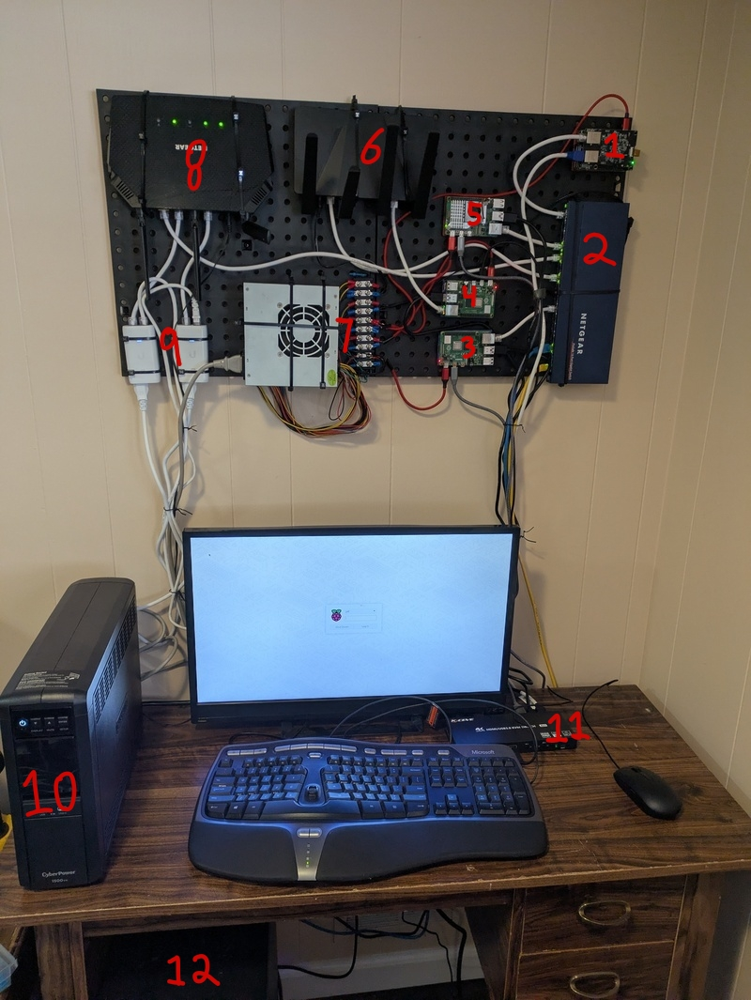

Welcome to my descent into homelabbing.
With the rising cost of cloud hosting, and my DigitalOcean droplets crashing more frequently due to increased load, I decided to start self hosting more of my public facing personal projects.
Most posts that I see on Reddit or Youtube regarding homelabbing tend to show off server racks filled with beefy and expensive enterprise grade equipment.
This post aims to share my low-cost approach to homelabbing which uses inexpensive [Raspberry PIs](https://www.raspberrypi.com/).
I want to show that you can do really cool stuff while 'saving' money in the long run.

Before I started this project, I had two Raspberry PIs haphazardly perched on-top of my stereo.
One of the PIs ran [Pi-hole](https://pi-hole.net/) and [Caddy](https://caddyserver.com/), the other PI ran several python websites written using [FastAPI](https://github.com/fastapi/fastapi).
To run more stuff locally, I wanted to get another Raspberry Pi to run a firewall on [OpenWRT](https://openwrt.org/) and another Raspberry Pi to run some of my websites in Docker containers.
My current arrangement of PIs wasn't very "elegant", so I decided to mount everything on a pegboard.

The most common question I get is: wait a second, is that a computer PSU?
Yes, yes it is.
I have a literal box full of old computer power supplies and they are very good at providing DC power.
I've had bad luck with USB power bricks being flaky, expensive, and under delivering on amps.
So, instead of buying a bunch of individual USB power adapters, I just use a single computer PSU that I don't have to worry about overheating or not supplying enough power.

I've seen people use Power Over Ethernet (POE) to power Raspberry PI clusters, but that doesn't make sense to me unless you are running the PI in a remote location where you don't want to run a separate cable for power.
The Raspberry PI POE Hat costs $24.
A POE switch costs $40-80.
To power 4 PIs using this method would cost $140 ish.
Or, if you used individual USB power bricks, it would cost around $40.
Counter point: we just use an old PSU that most people have just laying around collecting dust, all you would need are some USB-C cables to slice onto it.

The wiring of a computer PSU is very simple:

- Green: when connected to ground (Black) turns the PSU on
- Red: provides 5v DC
- Yellow: provides 12v DC

To start this project, I grabbed an old PSU and wired a switch to turn on the PSU and a LED indicator to show when the PSU was on.

I then wired some of the 5v and 12v cables to a bus bar.
When you open up a PSU, you will see that all the cables are soldered to the same place on the board-- each line isn't isolated.
The reason that PSUs contain so many output cables is largely to ensure that any single cable doesn't carry too much load and start to melt the wires.
The 18-gauge wires of a PSU can handle roughly 14 amps-- meaning that each wire can handle multiple Raspberry PIs safely.
The exact number would vary based on use-case and your Raspberry PI version.
Theoretically, a PI 5 with peripherals can pull 5 amps, but in practice I've only recorded my PI 5 pulling 1 amp idle and 2 amps under load.
To be safe and conservative, I would only run two PIs on a single 18 gauge wire from a PSU.

To my folly, the PSU that I initially chose was sub-par and provided too much voltage.
It's important to note that you can't accurately measure the PSU's voltage when its not under load.
But even after connecting several things to the 12V and 5v lines, the voltage on the 5v line was 5.72v and the 12v line had 12.6v.
The max recommended voltage of a Raspberry PI is 5.25V, exceeding that you can risk damaging the board.
So, I scrapped the PSU that was manufactured in 2008 and went with a 'newer' PSU manufactured in 2013; this PSU produced a perfect 5.01 volts.
I could have alternatively used voltage diodes or a buck converter to regulate the voltage at 5V.

After I figured out the power situation, I went through several iterations of re-arranging my components on a pegboard.
To avoid taking my network down for days, I used paper cutouts to test different arrangements.
The biggest design consideration was reducing the length that cables needed to be ran, and the turn radius of certain cables -- kinking an ethernet cables can damage/degrade its performance.

I settled on a design where I had my four Raspberry PIs sandwiched between the PSU and my Netgear unmanaged switch.
This kept most the Ethernet and power runs short.

To mount the Raspberry PIs to the pegboard, I had my friends 3D print a [PI pegboard mount](https://www.printables.com/model/1167388-raspberry-pi-345-pegboard-mount/files).
If you don't have access to a 3D printer, many local libraries are starting to offer 3D printing services where you can request something to be printed and they charge you a very low fee based on filament usage.

Next, I mounted everything to the pegboard and started crimping cables to length.
Crimping ethernet is annoying at first but quickly becomes enjoyable.

In the end, everything turned out very tidy.
I used zip ties to mount everything except for the raspberry PIs to the pegboard.
I used a few twist ties for cable management.
If I didn't run USB/HDMI to three of the PIs, the cables running out of the board would have been very minimal.
I got a four computer KVM since they have gotten shockingly cheap, and debugging issues is sometimes a pain to do remotely.

Zooming out, we can see everything involved in my home network, excluding the fiber modem which is in a different room and my two UniFi wireless access points.

1. Open WRT router running on a Raspberry Pi with an ethernet hat
2. Netgear ethernet switch
3. Raspberry Pi running Caddy, Pi-Hole
4. Raspberry Pi running FastAPI services
5. Raspberry Pi running websites on docker
6. VPN Router
7. PSU with bus bar to power devices
8. Netgear router with wifi disabled
9. PEO injectors for UniFi APs
10. UPS to provide backup power to everything except my wifi network
11. KVM Switch
12. TrueNAS Scale running on my old Ryzen desktop

**AI disclosure**: This post was **NOT** written nor edited with AI. 
Any mistakes are mine alone.