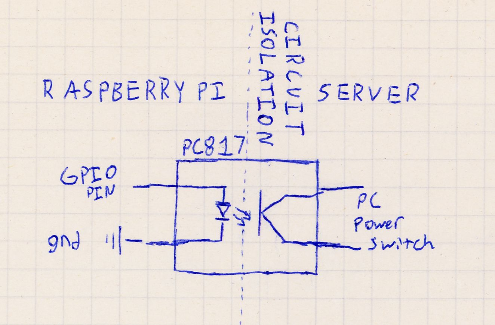
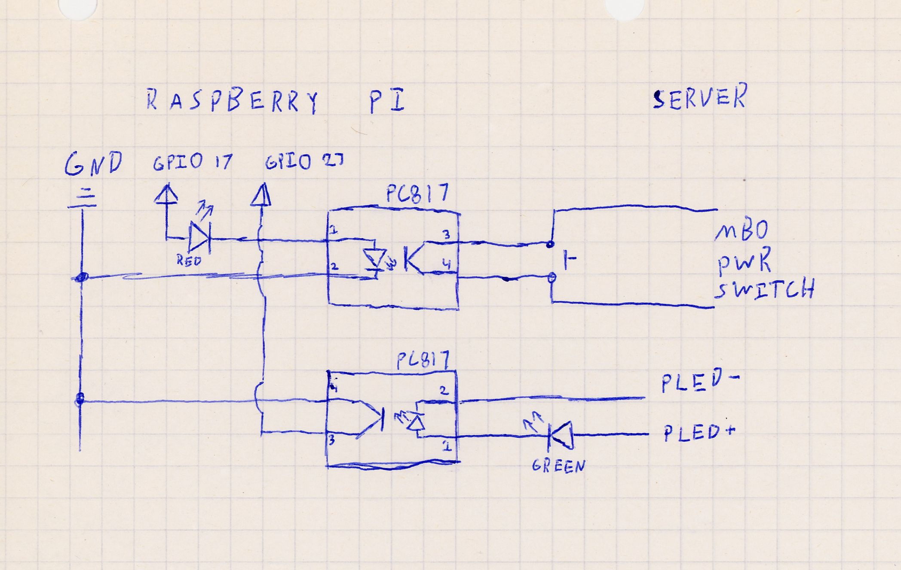
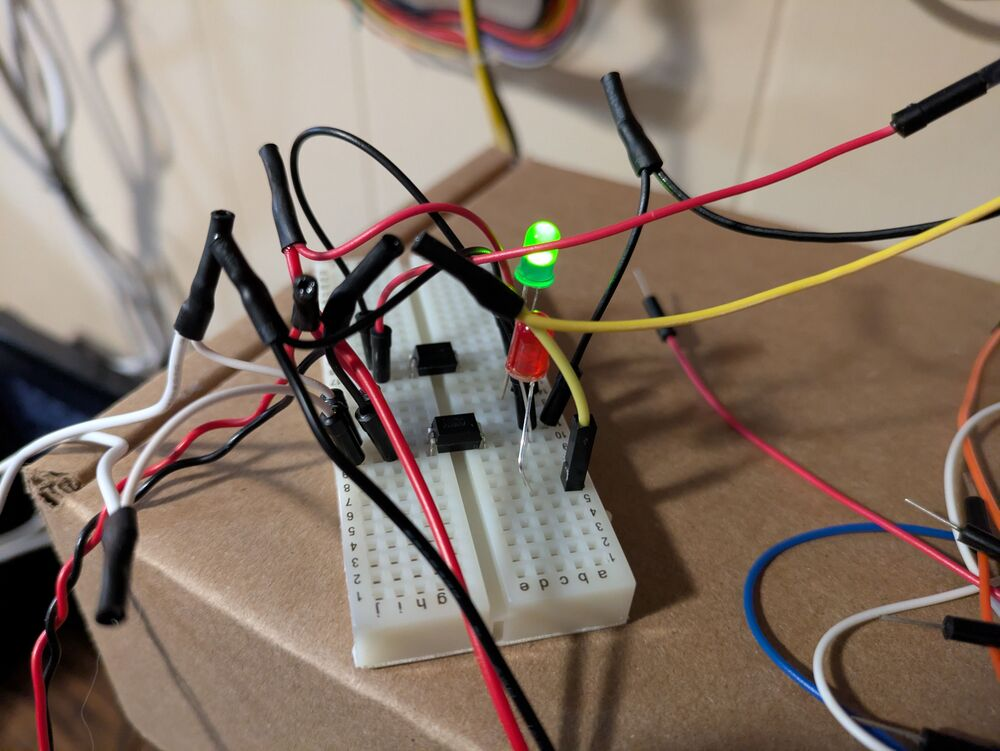
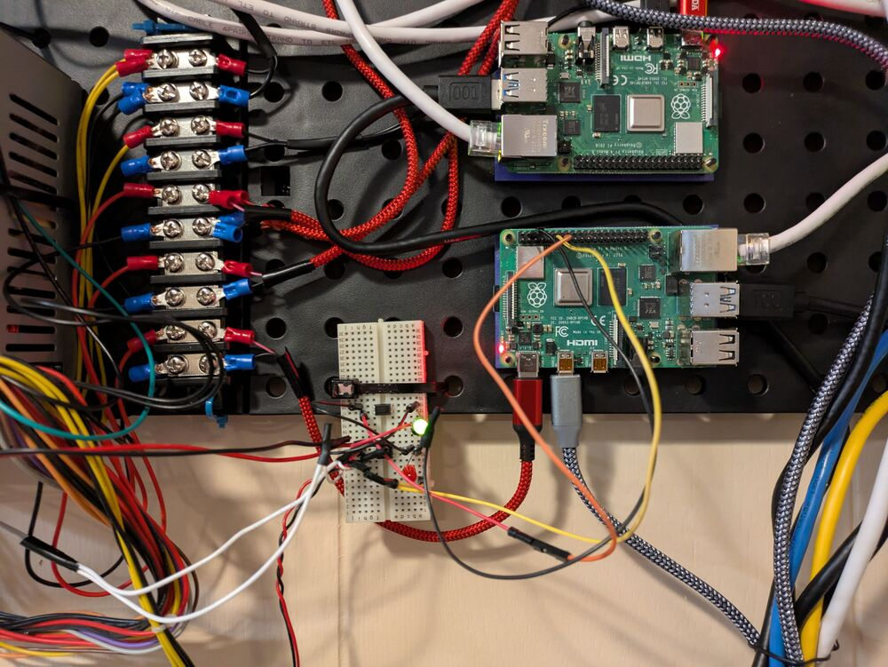

Sometimes you have a pesky server that occasionally crashes.
Sometimes it's a kernel panic, sometimes it's a dataset just randomly disconnects.
In an enterprise environment, you have the budget to setup redundant applications with Kubernetes, Ceph, multiple datacenters, etc.
In a homelab, it's not worth having anything redundant with the exception of data storage on HDDs. 
In other words: server crashes however infrequent, are a headache and are often impossible to deal with remotely.

The premise of this project is that we will be using an optocoupler and a Raspberry Pi to turn on and off my server remotely.
We are doing this as opposed to wake on lan or remote ssh calls since when a server crashes, it won't respond to wake on land or be accessible via SSH.
An optocoupler is simply a transistor where the flow of electricity is controlled by an external circuit using an LED rather than your own power.
This keeps the two circuits isolated and allows us to prevent one circuit from damaging the other.
Optocouplers are very small and you can purchase 50 for around $5.

Our basic wiring will look like this:




In this diagram, when we power on the GPIO pin of the Raspberry Pi, it activates the optocoupler and creates continuity on the PC power switch, causing the server to turn on. i.e., we are using the optocoupler to act as our computer's power button.

The python script for this logic is very simple since all owe need to do is toggle the GPIO Pin on for a few seconds.


```python
from gpiozero import OutputDevice
from time import sleep

# Change 17 to whatever Broadcom (BCM) pin number you are using
PIN_NUMBER = 17 

# Initialize the pin
pin = OutputDevice(PIN_NUMBER)

print("Triggering pin HIGH...")
pin.on()        # Turn the pin ON (3.3V)
sleep(4)        # Keep it on for 2 seconds

print("Turning pin LOW...")
pin.off()       # Turn the pin OFF (0V)
```


Turning on/off a server is great, but when using this in an automated script, how will we know if the server is on or off?
What if the server just turned off and we need to turn the server back on? Or, what if the server is on and we need to turn it off, wait for it to turn off and then turn it back on?

For this, we need to detect whether the server is on.
By hooking another optocoupler to the power LED pins on the motherboard we can detect if the server is on. 





I also added LEDs on both optocouplers so we can monitor both when the server's power is on using a Green LED and view when we are pressing the power button using a red LED.
The LEDs should be run in series because when components are connected in parallel, the path of least resistance (the optocoupler) will draw most of the current/voltage, leaving little for the LEDs.
If you want the LEDs to shine brighter, you could run another optocoupler in parallel and use that as a switch to power an LED from a 5V line.




When the POWER LED is powered on, the Raspberry PI's side of the circuit is conducting electricity like a pressed button.
For the detection code to view if the server is on, we can treat it like a simple button press detection.


```python
from gpiozero import Button
from time import sleep

sensor_pin = Button(27, pull_up=True)

# If the external power is ON, the opto-transistor conducts,
# pulling the GPIO pin to LOW (0V). Therefore, is_pressed will be True.
if sensor_pin.is_pressed:
    print("External Power: ON")
else:
    print("External Power: OFF")
```


Here is a quick demo video of running these two scripts.

<customHTML />

The only thing that's left to do is connect a basic script that will run as a cronjob to detect if the server crashes and then reboot it.

We can also add whatever custom logic we need!
In my scenario I am monitoring the power of a TrueNas Scale Server and whenever it is restarted, I also need to decrypt one of the datasets.

```python
def main():
    if is_website_running_normally(WEB_HOST):
        logger.info("All systems running")
        return;

    if is_web_server_down():
        logger.error("Need to check on web-server status")
        # TODO Future feature to power cycle RPI web server
        return;

    # In this scenario the web-server is running properly
    # but website failure is likely due to the NAS
    if not is_nas_power_on():
        logger.info("Scenario 1: NAS is off, turning back on...")
        toggle_nas_power()
        wait_for_nas_to_boot()
        decrypt_disks()
        reboot_web_server()
    elif not is_nas_responsive():
        logger.info("Scenario 2: NAS is unresponsive, restarting...")
        toggle_nas_power()
        wait_for_power_off()
        toggle_nas_power()
        wait_for_nas_to_boot()
        decrypt_disks()
        reboot_web_server()
    elif not is_server_disk_available():
        logger.info("Scenario 3: Server disk is locked, unlocking...")
        decrypt_disks()
        reboot_web_server()
    else:
        logger.info("Unknown issue")


if __name__ == '__main__':
    try:
        main()

    except KeyboardInterrupt:
        sys.exit(0)
```

A very basic while loop can be used to wait for the server to turn off.
This is a necessary check since we only pressed the power button for two seconds, so the server might attempt to gracefully shutdown which can take up to 10 seconds.
If we didn't add the second optocoupler to detect the power we would just be forced to guess and wait an arbitrary amount of time.
Worst case scenario, the server fails to shutdown and then your restart sequence will fail.

```python
def wait_for_power_off():
    count = 0
    while is_nas_power_on():
        count += 1
        sleep(5)
        if count >= 10:
            logger.info("Server still on after max timeout")
            sys.exit(0)
```

When waiting for the server to power on, I check for power, ability to ping the server, and the ability to access the administration portal. 

```python
def wait_for_nas_to_boot():
    """
    Waits for server to become up and fully responsive
    """
    count = 0
    while not (check_ping(NAS_HOST) and is_nas_power_on() and is_website_running_normally("http://" + NAS_HOST)):
        count += 1
        logger.info("Waiting for NAS to become reachable")
        sleep(5)
        if count > 60:
            logger.info("Server has not become responsive booted after timeout")
            sys.exit(0)
``` 

The only non-trivial task was decrypting the ZFS dataset.
However, [True Nas Scale API](https://www.truenas.com/docs/scale/api/) is incredible and made this very easy to do and has given me ideas for future projects. 


```python
def decrypt_disks():

    logger.info("Unlocking disk")

    url = f"https://{NAS_HOST}/api/v2.0/pool/dataset/unlock"
    
    payload = {
        "id": DATASET_NAME,
        "unlock_options": {
            "datasets": [
                {
                    "force": False,
                    "name": DATASET_NAME,
                    "passphrase": DATASET_PASSPHRASE
                }
            ]
        }
    }
    
    headers = {
        "Authorization": f"Bearer {API_TOKEN}",
        "Content-Type": "application/json"
    }
    
    try:
        response = requests.post(url, headers=headers, json=payload, timeout=30)
        
        if response.status_code == 200:
            logger.info("Disk decryption successful")
            return True
        else:
            logger.info(f"Failed to decrypt disks. Status code: {response.status_code}")
            logger.info(f"Response: {response.text}")
            return False
            
    except requests.exceptions.RequestException as e:
        logger.info(f"Request failed: {e}")
        return False
```

With this script running as a cron-job every 10 minutes, I am golden.
What used to take me 3 minutes of fumbling to cycle the power, wait, and then decrypt the dataset and then reboot the webserver, is now all taken care for me automatically.
Anything that causes you friction like this deserves to be automated-- even if it only happens once or twice a month.



Next steps would be to solder this to a PCB board. I'm holding off on soldering since I'm considering expanding this to also reboot my other Raspberry Pi boards.

**AI disclosure**: This post was **NOT** written nor edited with AI. 
Any mistakes are mine alone.