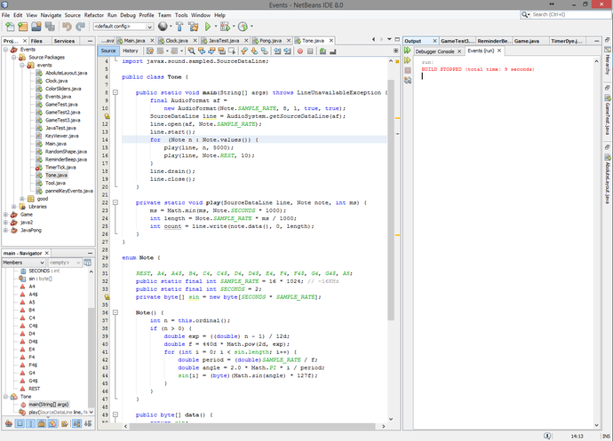
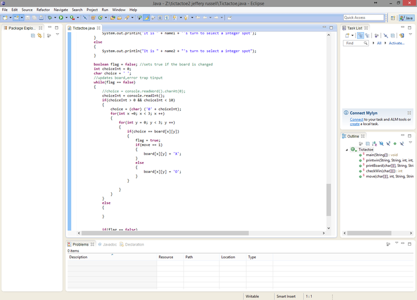
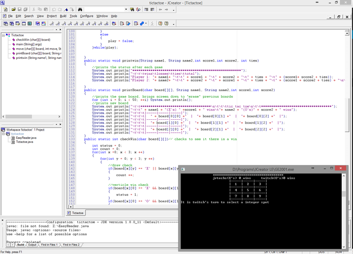
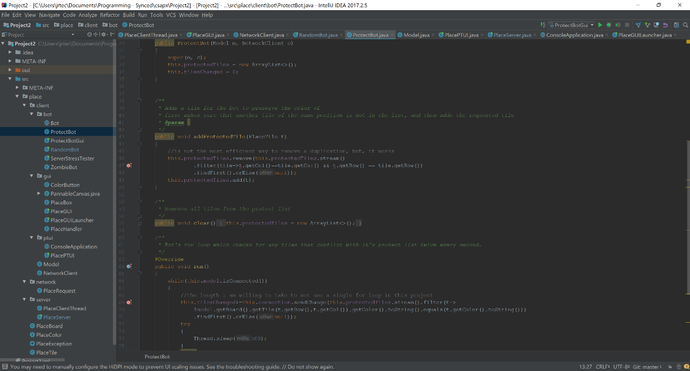

An IDE (Integrated Development Environment) is a single program that
wraps everything you need to program with. An IDE usually consists of
a code editor, debugger, and a compiler. A good IDE can make you more
productive. Without a IDE you would be stuck writing all of your apps
in notepad and compiling via command line – which is not bad for
learning how to program. A good IDE has syntax highlighting which
makes the code easier to read and error highlighting which makes
finding that missing semi colon easier. Here is a list of three IDEs
that work well for me. 

# NetBeans

NetBeans is the most productive IDE for large java projects. NetBeans
is great at detecting errors in your code. You can also have multiple
projects open in the same window which is great for anyone who is
constantly flipping between projects – even if they are in different
coding languages. This is a must have program for everyone looking to
develop Java. This program also supports PHP, JavaScript and C/C++. 

# Eclipse

Eclipse is a very popular programming IDE; however, it is harder to
use than NetBeans. The largest benefit of Eclipse is that it has tons
of templates for you to use. Eclipse also has a better GUI creation
tool than NetBeans has. 

# JCreator

I want to warn you that this is a old IDE. You hate yourself if you
decide to use this program. The only reason I am putting this on my
list is because I think it is great for teaching people how to program
– it’s what my high school used. Unlike Eclipse and NetBeans, it gives
you very little help when writing your code. There is no autocompletes
or dropdowns when you are accessing members of an object. This does
not even give you red highlights when you have a syntax error. What it
instead shows you is the errors that you would receive in the command
line when you compile this project. This is great for AP Computer
Science students who have to memorize/learn what certain errors mean. 

# Intellij

\*Update 2018

I have converted to a full time Intellij user since writing this
article in 2015. This program is simply fantastic in every aspect –
expect ram usage. If you have never heard of Intellij or any of the
other JetBrains products I would highly recommend you check them out.
The main reason I switched was because Intellij could scale nicely to
4k and NetBeans did not. The user experience overall feels nice. 

