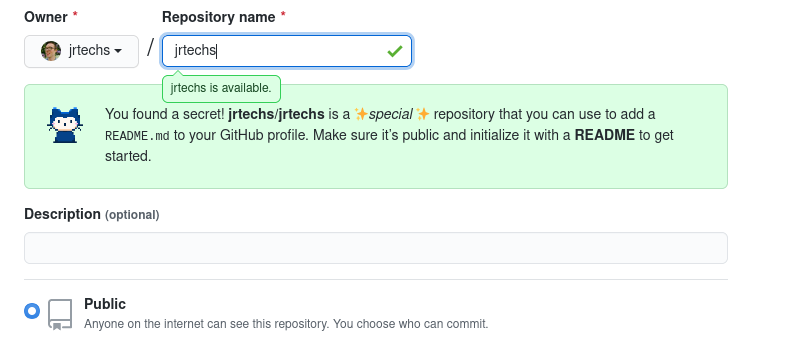
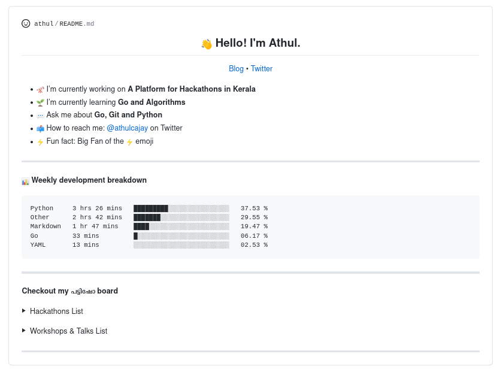

Over the last few weeks, Github has been making changes to its UI. I'm the most excited about the feature that enables you to "design" your profile using a readme file. This reminds me of Myspace, where everyone had creative freedom to customize their profiles. Github being a platform for developers, people are already finding innovative ways to utilize this feature. 



To create one of these readme profiles, you just need to create a repository with the same name as your account, and the content you put in the base readme file will appear over your pinned repositories on your account.


There is a curated list of example Readmes in the repository [awesome github profile readme](https://github.com/abhisheknaiidu/awesome-github-profile-readme).
I was a big fan of [Athul's](https://github.com/athul/athul).
The TLDR is that most developers use this space as an extended bio where they can showcase their skills and interests.




On my profile, I just included some lists of pertinent links for people to click on.
The exciting part of my readme is the dynamic list of recent blog posts. 


# Creating a Dynamic Profile

The only secret to creating a dynamic component on your readme is to include an image that gets modified by some external service.
It wasn't an arduous task to create an endpoint in NodeJS that generated an SVG image containing my most current blog posts.

```js
routes.get('/recentSVG', (request, result) =>
{
    sql.getRecentPosts(4).then((sqlData)=>
    {  
        result.writeHead(200, {'Content-Type': 'image/svg+xml',
            'Cache-Control': 'no-cache',
            'Vary': 'Accept-Encoding'});
        var res = `
        <svg width="400" height="200" xmlns="http://www.w3.org/2000/svg" xmlns:xlink="http://www.w3.org/1999/xlink">
            <g>
                <title>background</title>
                <rect x="-1" y="-1" width="808" height="202" id="canvas_background" fill="#fff"/>
                    <g id="canvasGrid" display="none">
                <rect id="svg_1" width="100%" height="100%" x="0" y="0" stroke-width="0" fill="url(#gridpattern)"/>
                </g>
            </g>
            <g>
                <title>Jrtechs</title>
                <a xlink:href="https://jrtechs.net">
                    <text fill="#498FBE" stroke="#000" stroke-width="0" stroke-opacity="null" x="36.5" y="40.5" id="svg_6" font-size="24" font-family="Oswald, sans-serif" text-anchor="start" xml:space="preserve" font-weight="bold">Recent Blog Posts</text>
                </a>
                <a xlink:href="${getURL(sqlData[0])}">
                    <text fill="#000000" stroke="#000" stroke-width="0" stroke-opacity="null" x="65.5" y="73.5" id="svg_7" font-size="20" font-family="Oswald, sans-serif" text-anchor="start" xml:space="preserve" font-weight="normal">- ${sqlData[0].name}</text>
                </a>
                <a xlink:href="${getURL(sqlData[1])}">  
                    <text fill="#000000" stroke="#000" stroke-width="0" stroke-opacity="null" x="65.5" y="106.5" id="svg_7" font-size="20" font-family="Oswald, sans-serif" text-anchor="start" xml:space="preserve" font-weight="normal">- ${sqlData[1].name}</text>
                </a>
                <a xlink:href="${getURL(sqlData[2])}">
                    <text fill="#000000" stroke="#000" stroke-width="0" stroke-opacity="null" x="65.5" y="139.5" id="svg_7" font-size="20" font-family="Oswald, sans-serif" text-anchor="start" xml:space="preserve" font-weight="normal">- ${sqlData[2].name}</text>
                </a>
                <a xlink:href="${getURL(sqlData[3])}">   
                    <text fill="#000000" stroke="#000" stroke-width="0" stroke-opacity="null" x="65.5" y="172.5" id="svg_7" font-size="20" font-family="Oswald, sans-serif" text-anchor="start" xml:space="preserve" font-weight="normal">- ${sqlData[3].name}</text>
                </a>
            </g>
        </svg>`;
        result.write(res);
        result.end();
    }).catch((err)=>
    {
        result.status(404).json({error: 404}).end();
    })
});
```

There is nothing too special about the SVG generation; however, there are a few caveats to point out.
The first thing to note is that I went out of my way to include links within my SVG image. Although this might cajole you into thinking the links work on Github; when you embed an image on a Github readme, it will link to where the image is hosted on their caching server, it will not allow users to click on links in the image directly. Due to this nuisance, it is best to just define a hyperlink for the entire image, so the user doesn't get displayed a separate screen with only the image. Fortunately, you can do this in Github markdown by embedding it in some HTML with an anchoring tag. 

```html
<p align="left">
  <a href="https://jrtechs.net">
    </img>
  </a>
</p>
```

Notice that I mentioned Github's caching server when talking about how the content got served.
By default, GitHub will cache all images embedded in readmes that link to external sources using a service called [Camo](https://github.com/atmos/camo).
This has several benefits to Github because users can embed HTTP content within an HTTPS page.
The drawback to this cache is that it makes it rather tricky to serve dynamic images since they will just get cached by Github.

This is an example curl request to Camo for a cached image:

```bash
┌─[jeff@matrix] - [/home/jeff] - [2020-07-25 10:39:57]
└─[0] <> curl -I https://camo.githubusercontent.com/1dc7d7611b4dbdca4b54c6cacdd2823f1bce4fca/68747470733a2f2f6a7274656368732e6e65742f6170692f726563656e745356472e7376673f
HTTP/1.1 200 OK
Connection: keep-alive
Content-Length: 2411
Cache-Control: public, max-age=2678400
Content-Security-Policy: default-src 'none'; img-src data:; style-src 'unsafe-inline'
Content-Type: image/svg+xml
Server: github-camo (62249a1c)
Strict-Transport-Security: max-age=31536000; includeSubDomains
X-Content-Type-Options: nosniff
X-Frame-Options: deny
X-Xss-Protection: 1; mode=block
X-GitHub-Request-Id: 1640:4307:11CC6D:159A5E:5F1C443D
Accept-Ranges: bytes
Date: Sat, 25 Jul 2020 14:48:42 GMT
Via: 1.1 varnish
Age: 525
X-Served-By: cache-mdw17377-MDW
X-Cache: HIT
X-Cache-Hits: 2
X-Timer: S1595688523.694051,VS0,VE0
Vary: Accept-Encoding
X-Fastly-Request-ID: 7a621c4d10b3ee434e4f55a05b04a059c6a64fbe
Timing-Allow-Origin: https://github.com
```

Github enables you to clear the Camo cache for a single image using the curl PURGE command.
This is a nice hack if you merely want to update an external image in your readme that got updated; however, you don't want to do this every time your dynamic component is updated. If the image is serving as a page visit counter, the purge call would have to be sent every time the image is fetched. 


```bash
┌─[jeff@matrix] - [/home/jeff] - [2020-07-25 10:48:42]
└─[0] <> curl -X PURGE https://camo.githubusercontent.com/1dc7d7611b4dbdca4b54c6cacdd2823f1bce4fca/68747470733a2f2f6a7274656368732e6e65742f6170692f726563656e745356472e7376673f
{ "status": "ok", "id": "4942-1591860663-32446227" }
```

The cleaner route that I opted for was to simply disable caching by Camo using the Cache-Control header in my API route. Now when we curl the Camo cache for my image, it looks like this:

```
┌─[jeff@matrix] - [/home/jeff] - [2020-07-25 10:59:32]
└─[0] <> curl -I https://camo.githubusercontent.com/1dc7d7611b4dbdca4b54c6cacdd2823f1bce4fca/68747470733a2f2f6a7274656368732e6e65742f6170692f726563656e745356472e7376673f

...
Cache-Control: no-cache, no-store, private, must-revalidate
Content-Security-Policy: default-src 'none'; img-src data:; style-src 'unsafe-inline'
...
Age: 0
X-Served-By: cache-mdw17330-MDW
X-Cache: MISS
X-Cache-Hits: 0
...
```

Rather than pulling from a Cached version, Camo will go out and fetch the image from my website and serve it to the user viewing the readme file.

That's all there is to say about my dynamic readme component. What is nice about this approach is that I can even embed this recent posts widget in things like this very blog post:

