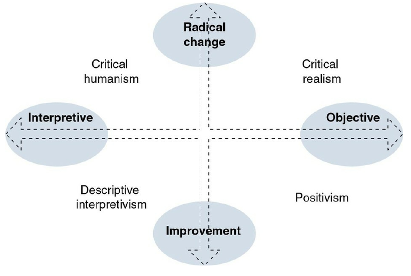
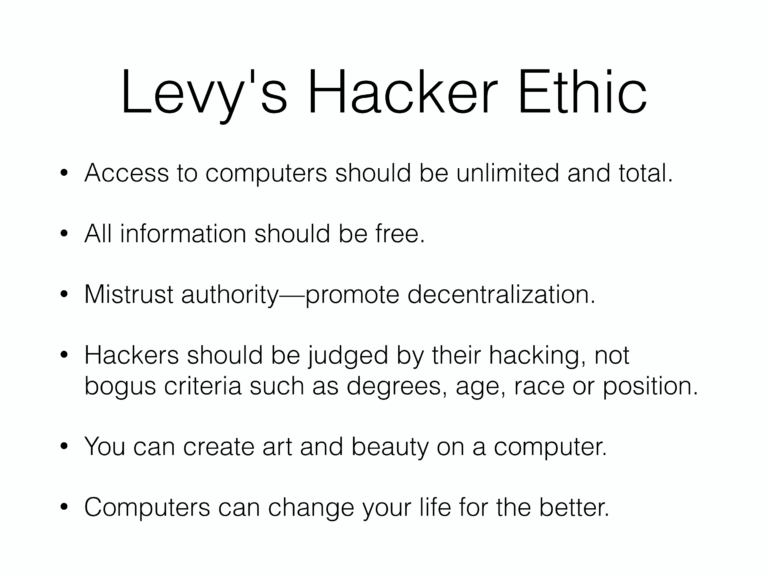
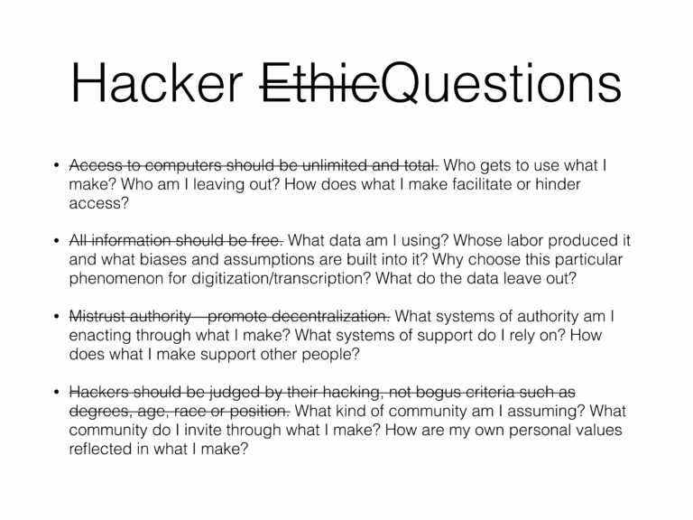

Last week I listened to the talk [*Programming is Forgetting: Toward a
New Hacker
Ethic*](http://opentranscripts.org/transcript/programming-forgetting-new-hacker-ethic/)
for a second time. This was an amazing talk given by Allison Parrish
at the Open Hardware Summit in 2016. The first time I was introduced
to this talk was over a year ago by a friend that was introducing me
to the nuanced differences between "new" and "old" FOSS cultures.
Whenever I listen to this talk I get nostalgic about 70's and 80's
hacker literature like the ["Hackers
Manifesto"](http://phrack.org/issues/7/3.html) which inspired me in
middle school.    

<youtube src="4kiXCeJwrMQ" />

Parrish's talk examined the points that Levy makes in his influential
book  *Hackers: Heroes of the Computer Revolution*. This talk picked
out how aspects of Levy's hacker ethos are problematic and how we can
work to change this Hacker Ethic to be more supportive of diverse
communities. 

However, before we dive into the breakdown of Levy's and Parrish's
arguments, it is important to have a common understanding of these
things:    

- what being a hacker means
- our assumptions about learning, knowing and society

## What "Hacker" Means

<youtube src="msX4oAXpvUE" />

The mainstream definition of a "hacker" is a derogatory term to
describe cyber-criminals; however, "hacker" in the tech world is a
positive and respected term. In the tech world, "hacker" is used
synonymously with geek: people who love to tinker with computers at
great lengths. Due to the vast differences in the interpreted meaning
of "hacker", people have been avoiding using that term. For this
article and in general when people typically talk about "hacker
culture", they are referring to the positive definition of hacker.    

## Assumptions on knowledge and society

Being the philosophy buff that I am, I believe that recognizing our
assumptions about knowledge and society is quintessential to
understanding Levy's and Parrish's views on the hacker ethic.  

On the scale of knowledge, people fall somewhere on the scale between
subjective and objective thinking. An objectivist seeks
generalizations, favors statistical analysis, and views reality as
separate from human experience. A subjectivist believes that reality
is formed through personal experience and views knowledge as a working
definition. When discussing discovery, an objectivist will try to find
the **Truth**, where a subjectivist will seek to learn **truths**. In
policy analysis, objectivists would favor quantitative methods where
subjectivists would favor qualitative methods.    

When examining socioty, people usually fall on a spectrum between
*radical change* and *improvement*.    

Status Quo (Improvement)    

- social order
- consensus
- actuality

Radical Change    

- power structures
- radical change
- modes of domination
- contradiction
- potentiality

Although people don't always fall at perfect edges of this spectrum,
it provides a good frame of reference when discussing policies. Levy's
hacker ethic falls in the *positivism* quadrant since he focused on
incremental improvements twords "ideal" software. Parrish's ethos
falls in the *Critical Humanism* quadrant because she is focused on
the multiple truths of software communities and is focuses on the
power structure that software supports. 

# Levy's Hacker Ethic

# Parrish's Hacker Ethic Rewrite

# Why the difference?

Despite the rewrite, both hacker ethics still emphasize the importance
of:   

- sharing
- openness
- free access to computers
- world improvement

The major difference between the two ethics is not in the fundamental
message but on the philosophical perspectives of the authors.   

Levy's hacker ethic was written and interpreted using the
incrementalism framework. Computer hacking is the means of
incrementally improving flawed technology moving towards the
**Truth**-- a computer system that perfectly works.   

Parrish's hacker ethic focuses on how can we use technology to better
**truths**-- computer systems designed with different purposes to
better support communities.  

# Who is right?

As a subjectivist, I would argue that the debate over which one is the
**True** or better hacker ethic is fruitless. Moving forward with this
revised working definition of the Hacker Ethic will better enable us
to better support diverse communities.  

Positivism has long been the dominant perspective in politics and
research. However, in recent years there has been a shift towards a
mix of objective and subjective perspectives in research. This is due
to the fact that when you look at the objective **Truth** or the
average of a population you often ignore minorities. In public policy,
an objective viewpoint is useful when doing cost-risk analysis;
however, subjective research is useful when identifying complex social
issues that are hard to quantify with numbers.  

# How did we get here in technology?

During the [Future is Open
Conference](https://fossrit.github.io/events/2019/10/26/the-future-is-open/)
[Mike Nolan](https://nolski.rocks/) gave an amazing analogy that
explains how we got here and why we need to have this debate in FOSS
and hacker culture. Nolan compared the beginning of computers to
homesteading in the western frontier. In the beginning, there was
plenty of land for everyone and everyone got their own chunk of land.
Everyone was happy and they maintained their land or "software"
independently of each other. There was seldom any issues. However, as
time went on you couldn't get your own plot of land. We now all live
in large cities packed with communities, governments, and law swaying
our every action. With all of these competing entities, it is
impossible to work on instrumental software without interacting other
entities. 

The things that hackers make often originate as a personal project. We
as hackers are content with perusing these projects towards our own
objective **Truth**. Over time what started as a personal project may
turn into a massive open-source project that dozens of communities
depend on. This is the root of a ton of friction now in days: our
objective **Truth** as the original developer may not align with the
**truths** or needs of the community. To alleviate this "friction", I
believe that adopting Parrish's subjective interpretation of the
Hacker Ethic is a great way to start. 
