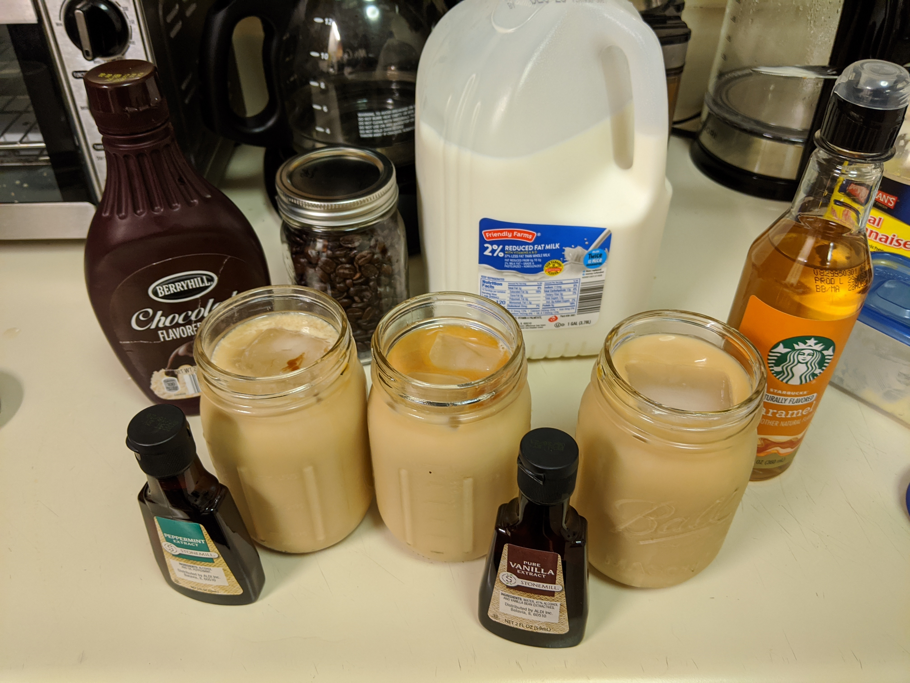
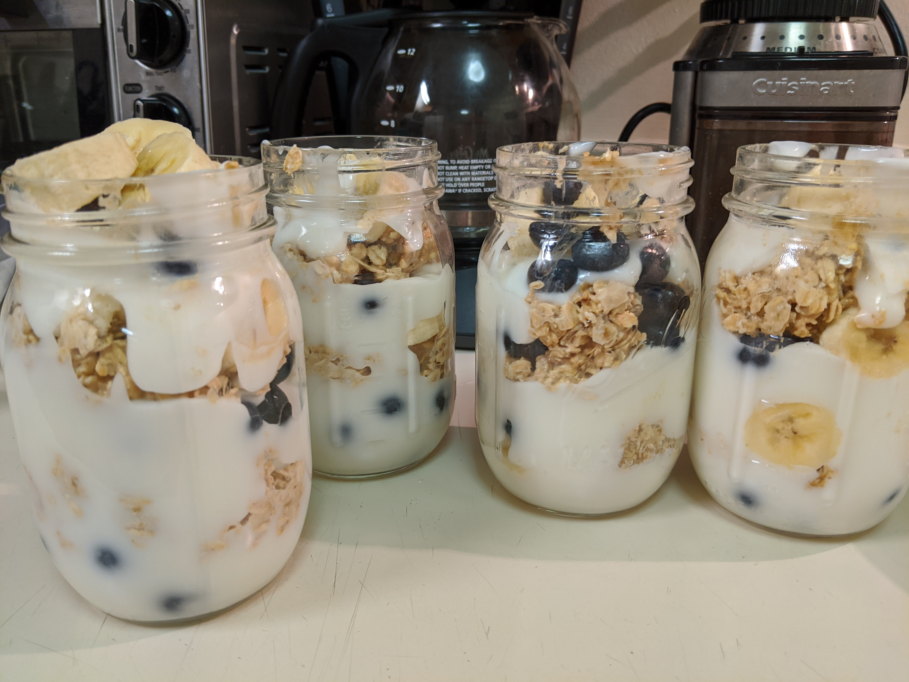
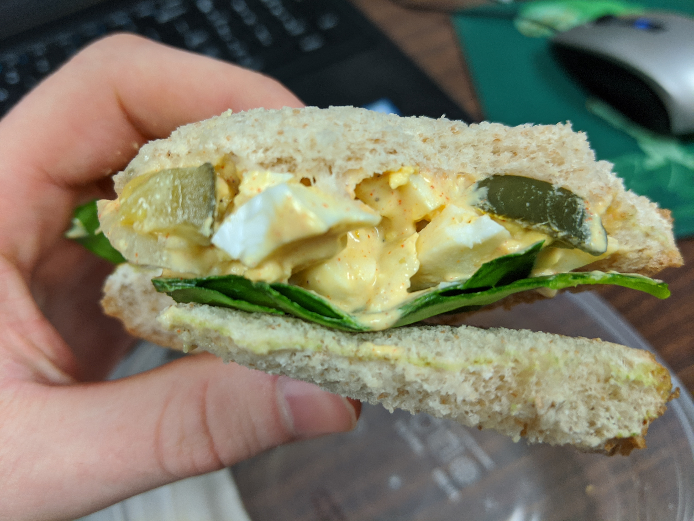

Following up on the [college cook book](https://jrtechs.net/other/college-cookbook) that I wrote a year ago, I wanted to "open source" some of my current obsessions.
I am going to highlight three recipes that are quintessential for college students because they are easy to prepare ahead of time, transportable, and are high in energy.
The combination of these three recipes makes a long day on campus a breeze. 

# Cold Brew Coffee

Cold brew coffee is currently a major fad because it is less acidic than normal coffee, high in caffeine, lasts around 2 weeks in the fridge, and tastes sweeter than normal coffee.
I am a **major** coffee fanatic, but, buying coffee on campus is expensive and the lines are long in the morning.
Cold brew is great for college students because you can make it weeks in advance and easily transport it anywhere on campus.

## Ingredients

- coarsely ground coffee
- container (most people use mason jars)
- filtered water
- coffee sweeteners

## Preparation

To make cold brew coffee, you simply mix coffee and water in a jar and let it sit 12-24 hours.
I found that if you let this soak in the fridge, it "brews" a little slower than if you let it steep at room temperature.
You will want to mix 1/4 coffee to 3/4 water in a container, but, you should play around with concentrations to find your ideal mix.
You can use discretion with what type of coffee you use but, I found that freshly ground medium/light coffee works the best.
If you use flavored coffee, it may taste weird since you are steeping it for such a long time.
Cold brew coffee takes a relatively large amount of coffee beans so, I recommend that you use cheaper coffee that you can buy in bulk. 

After the coffee has steeped for 12-24 hours, you filter the coffee grounds out and it is immediately ready to serve.
Using a cold brew stand is the easiest way to filter the coffee grounds out, but, you can still get the job done with a wire mesh and a normal coffee filter.
Some people also prepare their cold brew in a french press for the convenience of filtering; I'm not a huge fan of this approach since a french press is typically not the best at filtering out all of the coffee grounds.

## Flavoring

Since the cold brew produces coffee concentrate, you should dilute the cold brew with an equal mixture of milk.
After that, it is up to you as to how you flavor it.
**Note**: don't use any powdered creamers because they will not dissolve in the cold brew.
I "developed" three solid cold brew flavorings, but, feel free to get creative with what you put in your cold brew.

### Vanilla Latte

- vanilla extract
- sugar
- milk

### Peppermint Mocha

- peppermint extract
- chocolate syrup
- milk

### Caramel

- caramel syrup
- milk

# Overnight Oats

One of the most nutritious and filling things to eat in the morning is yogurt and oatmeal.
The premise of overnight oats is that you mix oatmeal with a liquid let it soak overnight.
This recipe requires a lot of messing around with ingredients and portions because it is easy to make this taste bad.
The first time I made this I didn't add any sweeteners leaving this tasting bad.
Overnight oats will stay good in the fridge for about 3-4, so it's easy to whip up on Monday night and have a quick breakfast to grab for the rest of the week.

## Ingredients

- Old fashioned oats (don't use quick oats)
- Brown Sugar
- Blueberries
- Nuts (I use walnuts)
- Milk (or water)
- Vanilla or Peppermint extract
- Yogurt (preferably not fat-free)
- Maple Syrup (optional)

## Directions

Mix oats, milk, and sweeteners in a bowl. 
Don't add too much milk, you want it to just soak the oats.
Layer the oatmeal mix, yogurt and berries in a mason jar.
You don't want to mix all the ingredients because it will make the oats and berries soggy.
Set the mason jars in the fridge for 8-12 hours before eating.
With these ingredients, it will stay good in the fridge for about 4 days; however, if you add bananas it will only last 2 days.

# Egg Salad

Someone once told me that this is "the best sandwich that I've ever had", but, others have ignorantly told me "egg salad nasty and you should feel bad for eating it".
Personally, egg salad is the greatest thing since sliced bread because it tastes amazing, is high in energy, and enables you to make a sandwich in 20 seconds.
What isn't there to love?

## Ingredients

- 6 hard-boiled eggs
- mayonnaise
- garlic powder
- mustard or honey mustard if that's your thing
- paprika
- salt
- pepper
- sweet dill pickles
- celery (optional)

## Directions

Prepare your hardboiled eggs-- boil eggs for 15 minutes and immediately put the eggs in an ice bath for 5 minutes.
While the eggs are boiling you can chop some dill pickles, do the dishes or prepare some overnight oats!
Peel and chop the eggs after they have cooled down.
In a medium bowl mix the chopped eggs, chopped pickles, mayonnaise, mustard, and whatever spices you warrant.
I usually eyeball all these ingredients, but, don't add too much mayo because it makes the egg salad runny thus making it hard to plate on a sandwich.
