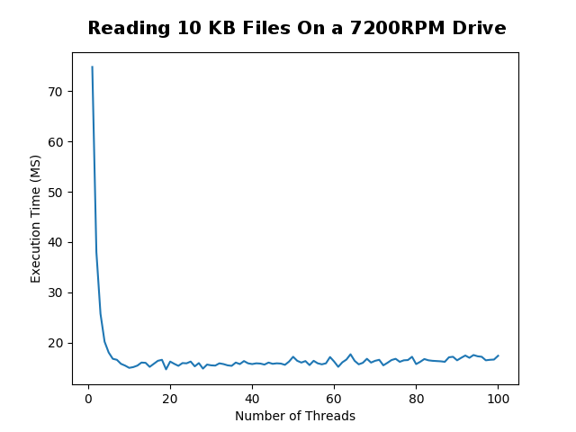
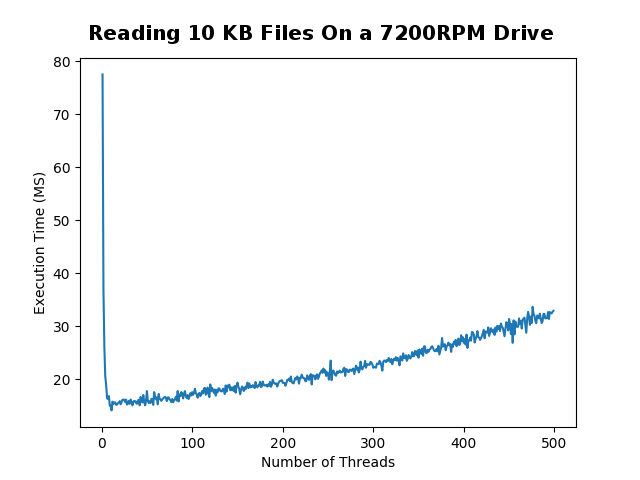
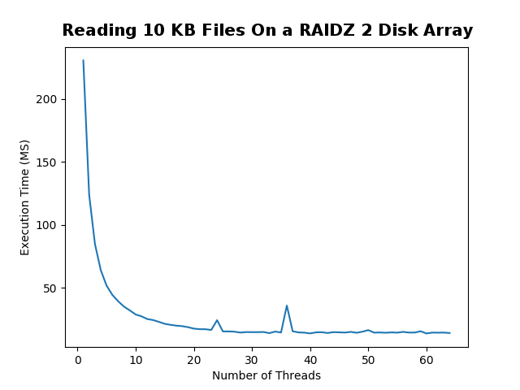
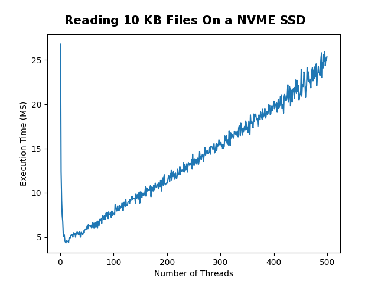
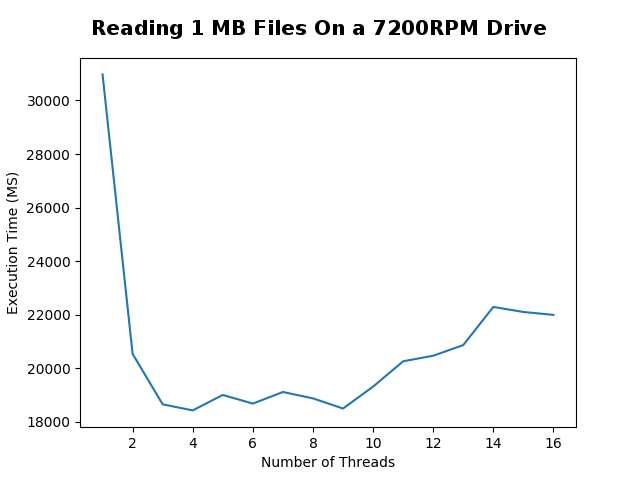
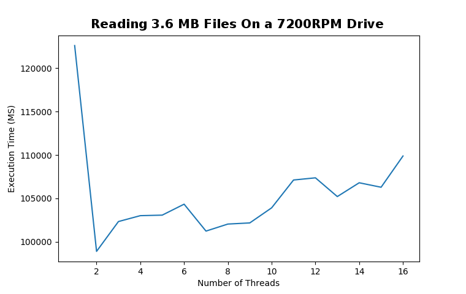
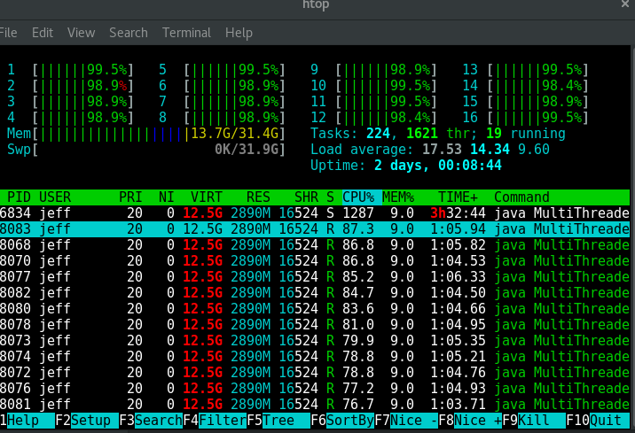

# Background

Suppose that you have a large quantity of files that you want your program to ingest.
Is it faster to sequentially read each file or, read the files in parallel using multiple threads?
Browsing this question online will give varied answers from confused people on discussion threads.
Reading resent research papers on multi threaded IO did not quite provide a clear answer my question.

A ton of people argue that multiple threads don't increase file throughput
 because at the end of the day a HHD can only read
one file at a time. Adding more CPU cores into the mix would
actually slow down the file ingest because the HHD would have to 
take turns between reading fragments of different files. The seek speed of the HHD would
heavily degrade the performance.

Other people on the internet claim that using the same number of
threads as your computer has is the most efficient way to read in files.
With these claims I did not find any evidence backing their statements.
However, I did find plenty of dead links -- you gotta love old internet forms. 
The argument typically goes that using more threads will decrease the idle time of
the HHD. Plus, if you are running any form of raid or software storage like
[CEPH](https://ceph.com/ceph-storage/) you have plenty to gain from using multiple threads.
If you use more threads than your CPU has, you will obviously suffer performance wise because
the threads will be idle while they wait for each other to finish. 

I decided to set out and determine what was the fastest approach by taking empirical measurements.

# Results

## Small Files
I started the experiment by reading 500 randomly generated 
 10 KB text files. I tested using a few hard drive types and 
configurations. The computer which I ran all the tests on
 has a Ryzen 1700x processor with 16 threads and 8 cores. 
 Each test point took a sample of 20 trials to find the average. 
 
 
  
   

   


   

## Big Files

After seeing the astonishing results of reading 10 KB files,
I wondered if anything changed if the files were larger.
Unlike the last set of trials, I did not take a sample size
to calculate the average. Although it would have made smoother graphs,
that would have taken way too long to do on the HHD I was using. 
I only tested with 1 MB and 3.6 MB as the "large" files because any larger
files *really* slowed down the tests. I initially wanted to test with 18 MB
files running 10 trials at each thread interval. I backed away from doing that
because it would have required terabytes of file IO to be performed and, Java *really* does
not like to read 18 MB files as strings. 

   



# Conclusions

For small files it is clear that using more CPU threads gives you a 
very substantial boost in performance. However, once you use the same
number of threads as your CPU has, you hit the optimal performance and any more
threads decreases performance.

For larger files, more threads does not equate to better performance. Although
there is a small bump in performance using two threads, any more threads heavily 
degrades performance. 



Reading large files like this totally renders your computer unusable.
While I was running the 3.6 MB file test my computer was completely unresponsive.
I had to fight just to get the screenshot that I included in this blog post. 

# Code

All of the code I wrote for this can be found on my [github](https://github.com/jrtechs/RandomScripts/tree/master/multiThreadedFileIO)
;however, I also want to put it here so I can make a few remarks about it. 

## Basic File IO

This first class is used to represent a task which we want to run in parallel with other tasks. In this case it is just
reading a file from the disk. Nothing exciting about this file. 

```java
/**
 * Simple method to be used by the task manager to do
 * file io.
 *
 * @author Jeffery Russell
 */
public class ReadTask
{
    private String filePath;

    public ReadTask(String fileName)
    {
        this.fileName = fileName;
    }

    public void runTask()
    {
        String fileContent = new String();
        try
        {
            BufferedReader br = new BufferedReader(
                    new InputStreamReader(new FileInputStream(filePath)));
            String line;
            while ((line = br.readLine()) != null)
                fileContent = fileContent.concat(line);
            br.close();
        }
        catch (IOException e)
        {
            e.printStackTrace();
        }
    }
}
```

## Multi Threaded Task Manager

This is where the exciting stuff happens. Essentially, this class lets your specify
a list of tasks which must be complete.
This class will then run all of those tasks in parallel using X threads
until they are all complete. What is interesting is how I managed the race conditions
to prevent multi threaded errors while keeping the execution of tasks efficient. 

```java
import java.util.List;
import java.util.Vector;

/**
 * A class which enables user to run a large chunk of
 * tasks in parallel efficiently.
 *
 * @author Jeffery 1-29-19
 */
public class TaskManager
{
    /** Number of threads to use at once */
    private int threadCount;

    /** Meaningless tasks to run in parallel */
    private List<ReadTask> tasks;

    public TaskManager(int threadCount)
    {
        this.threadCount = threadCount;
        //using vectors because they are thread safe
        this.tasks = new Vector<>();
    }

    public void addTask(ReadTask t)
    {
        tasks.add(t);
    }

    /**
     * This is the fun method.
     *
     * This will run all of the tasks in parallel using the
     * desired amount of threads untill all of the jobs are
     * complete.
     */
    public void runTasks()
    {
        int desiredThreads = threadCount > tasks.size() ?
                tasks.size() : threadCount;

        Thread[] runners = new Thread[desiredThreads];
        for(int i = 0; i < desiredThreads; i++)
        {
            runners[i] = new Thread(()->
            {
                ReadTask t = null;
                while(true)
                {
                    //need synchronized block to prevent
                    //race condition between isEmpty and remove
                    synchronized (tasks)
                    {
                        if(!tasks.isEmpty())
                            t = tasks.remove(0);
                    }
                    if(t == null)
                    {
                        break;
                    }
                    else
                    {
                        t.runTask();
                        t = null;
                    }
                }
            });
            runners[i].start();
        }
        for(int i = 0; i < desiredThreads; i++)
        {
            try
                runners[i].join();
            catch (Exception e)
                e.printStackTrace();
        }
    }
}
```

## Random Data Generation

To prevent caching or anything funky, I wanted to use completely random files of equal size.
I initially generated a random character and then concated that onto a string.
After repeating that step a few thousand times, you have a random string to save
to your disk.

```java
private static char rndChar()
{
    // or use Random or whatever
    int rnd = (int) (Math.random() * 52);
    char base = (rnd < 26) ? 'A' : 'a';
    return (char) (base + rnd % 26);
}
```

Problem: string concatenation is terribly inefficient in Java.
When attempting to make a 18 MB file it took nearly 4 minutes and I wanted
to create 500 files. Yikes.

Solution: create a random byte array so I don't need to do any string concatenations.
This turned out to be **very** fast.

```java
for(int i = 0; i < 500; i++)
{
    byte[] array = new byte[2000000];
    new Random().nextBytes(array);
    String s = new String(array, Charset.forName("UTF-8"));
    saveToDisk(s, "./testData/" + i + ".txt");
    System.out.println("Saved " + i + ".txt");
}
```


## Running the Experiments

I created an ugly main method to run all the experiments with the
task manager. To run trials with a different number of CPU threads or sample size,
I simply adjusted the loop variables. 

```java
import java.util.*;

/**
 * File to test the performance of multi threaded file
 * io by reading a large quantity of files in parallel
 * using a different amount of threads.
 *
 * @author Jeffery Russell 1-31-19
 */
public class MultiThreadedFileReadTest
{
    public static void main(String[] args)
    {
        List<Integer> x = new ArrayList<>();
        List<Double> y = new ArrayList<>();
        for(int i = 1; i <= 64; i++) //thread count
        {
            long threadTotal = 0;
            for(int w = 0; w < 20; w++) // sample size
            {
                TaskManager boss = new TaskManager(i);

                for(int j = 0; j < 500; j++) // files to read
                {
                    boss.addTask(new ReadTask("./testData/" + i + ".txt"));
                }
                long startTime = System.nanoTime();
                boss.runTasks();
                long endTime = System.nanoTime();
                long durationMS = (endTime - startTime)/1000000;
                threadTotal+= durationMS;
            }
            x.add(i);
            y.add(threadTotal/20.0); //finds average
        }
        System.out.println(x);
        System.out.println(y);
    }
}
```

## Graphing the Results

I am not going to lie, most Java graphics libraries are terrible.
Simply pasting the output of a Java list into [matplotlib](https://matplotlib.org/)
is the easiest way to make presentable graphs. If I had more time, I would export the results to
JSON for a javascript graph like [D3](https://d3js.org/) which I could embed on my website. 

```python
import matplotlib.pyplot as plt

xList = []
yList = []
plt.plot(xList, yList)
plt.xlabel('Number of Threads')
plt.ylabel('Execution Time (MS)')

plt.show()
```