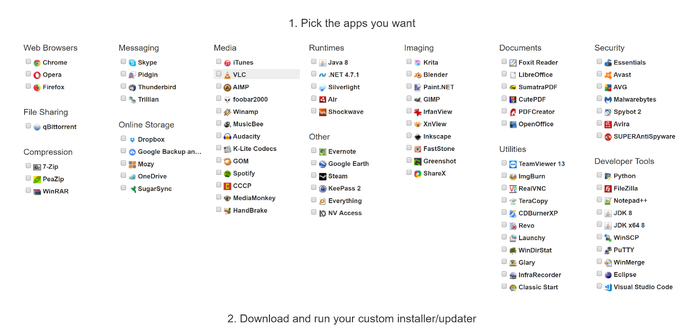

If you are anything like me, you find yourself installing windows a lot. It is
always annoying to have to run to a dozen websites just to get your basic
programs installed. To avoid this – and internet explorer – I use Ninite to
install a batch of programs at once. The program is simple, you just go to their
website and check off the programs you want and run their executable.

