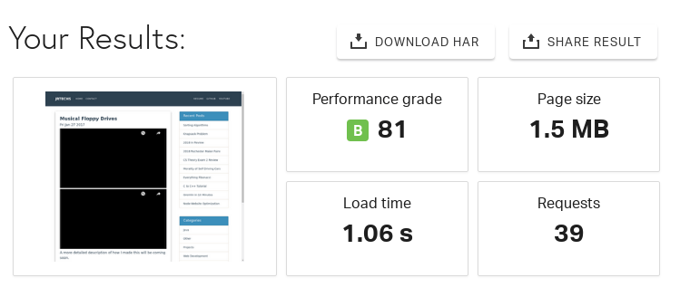
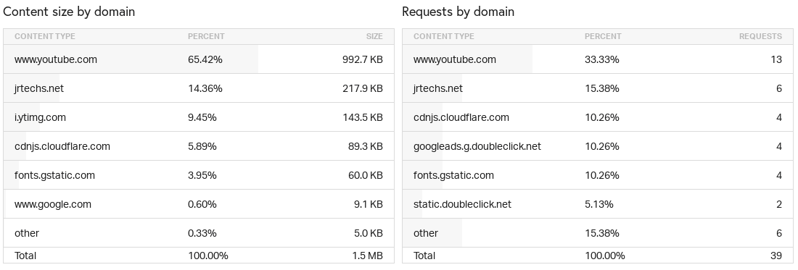
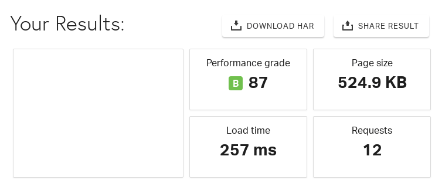
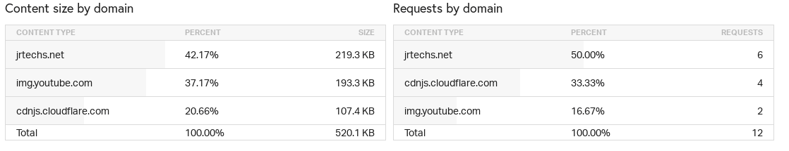

# Background

The concept of lazy loading is a design pattern where you only download the required scripts/content when the client needs it rather than when the page is loaded.
The most iconic example is the "infinite" feed that social media sites like Instagram use.
Rather than dump a ton of content to the client at once, Instagram dynamically loads more content once you reach the end of the page.
This allows websites to save bandwidth by only sending the client what they need when they need it. 

When a youtube video is embedded into a website, it pulls a ton of scripts which are required to play the video.
However, when you embed a youtube video on a blog post, most people are not going to watch that video.
Even if the visitor wanted to watch that video, there is no reason why all the scripts should be loaded when you initially land on the page.
Rather than embed the video normally, you can instead simply have a the thumbnail of the video with a play button on it.
When the client clicks the play button, the youtube scripts are then loaded. 

# Performance Without Lazy Loading





A very basic blog post with two Youtube videos is **1.5 MB** in size. 
That is a rather large page for a client to download and render.
Notice that 65% of the content by size is from Youtube and 29 requests were from Google domains.

# Performance with Lazy Loading





After lazy loading Youtube videos I was able to reduce the size of this blog post by nearly 1 MB.
This also decreased the page load time by 75%.
Additional tests show's that each embedded youtube video consumes around 500 KB.
Using the lazy loading method you can slash that 500 KB to a mere 100 KB-- size of just the thumbnail.

# Code Used

## Javascript 

This is some basic JavaScript code which selects all of the "youtube" embedded videos on our page and adds a play button handler.
When the button is clicked, it updates the div to have an Iframe with the appropriate embedded youtube video.
If you are already using jQuery, you could use that but, I did not since the **goal** of this is to optimize the page load time.
The [jQuery library](https://mathiasbynens.be/demo/jquery-size) is nearly 50 KB.

```javascript
<script>
    ( function() {

        var youtube = document.querySelectorAll( ".youtube" );

        for (var i = 0; i < youtube.length; i++) {

            var source = "https://img.youtube.com/vi/"+ youtube[i].dataset.embed +"/sddefault.jpg";

            var image = new Image();
            image.src = source;
            image.addEventListener( "load", function() {
                youtube[ i ].appendChild( image );
            }( i ) );

            youtube[i].addEventListener( "click", function() {

                var iframe = document.createElement( "iframe" );

                iframe.setAttribute( "frameborder", "0" );
                iframe.setAttribute( "allowfullscreen", "" );
                iframe.setAttribute( "src", "https://www.youtube.com/embed/"+ this.dataset.embed +"?rel=0&showinfo=0&autoplay=1" );

                this.innerHTML = "";
                this.appendChild( iframe );
            } );
        };

    } )();
</script>
```

## CSS

This CSS defines how the embedded youtube video looks before you click the play button.

```CSS
.wrapper {
  max-width: 680px;
  margin: 60px auto;
  padding: 0 20px;
}

.youtube {
  background-color: #000;
  margin-bottom: 30px;
  position: relative;
  padding-top: 56.25%;
  overflow: hidden;
  cursor: pointer;
}
.youtube img {
  width: 100%;
  top: -16.82%;
  left: 0;
  opacity: 0.7;
}
.youtube .play-button {
  width: 90px;
  height: 60px;
  background-color: #333;
  box-shadow: 0 0 30px rgba( 0,0,0,0.6 );
  z-index: 1;
  opacity: 0.8;
  border-radius: 6px;
}
.youtube .play-button:before {
  content: "";
  border-style: solid;
  border-width: 15px 0 15px 26.0px;
  border-color: transparent transparent transparent #fff;
}
.youtube img,
.youtube .play-button {
  cursor: pointer;
}
.youtube img,
.youtube iframe,
.youtube .play-button,
.youtube .play-button:before {
  position: absolute;
}
.youtube .play-button,
.youtube .play-button:before {
  top: 50%;
  left: 50%;
  transform: translate3d( -50%, -50%, 0 );
}
.youtube iframe {
  height: 100%;
  width: 100%;
  top: 0;
  left: 0;
}
```

### Example

<youtube src="DoDaHmyIPvQ" />

## HTML

Rather than use the embed code that youtube provides, you have to use the following code to integrate with the CSS and JS written. 
All you need from the youtube video is the ID which appears in the link associated with that video.

```HTML
<div class="wrapper">
	<div class="youtube" data-embed="DoDaHmyIPvQ">
		<div class="play-button"></div>
	</div>
</div>
```

## Node Templating Stuff

When witting blog posts in Markdown, it is not convenient to include 5 lines of HTML to embed a video.
On my node server I wrote some code to convert a simpler "youtube tag" into the 5 lines of HTML shown above.
This is completely optional.

```javascript
//regular expression to detect custom youtube video tag
//<youtube src="" />
var re = /\<youtube .*?>/;

//result is a string which contains a HTML document

while (result.search(re) != -1)
{
    var ytid = result.substring(result.search(re) + 14, result.search(re)+ 11 + 14);
    var youtubeHTML = "<div class=\"wrapper\">\n" +
        "\t<div class=\"youtube\" data-embed=\"" +
         ytid +
        "\" />\n" +
        "\t\t<div class=\"play-button\"></div>\n" +
        "\t</div>\n" +
        "</div>\n";

    var original = "<youtube src=\"" + ytid + "\" />";

    result = result.split(original).join(youtubeHTML);
}
```