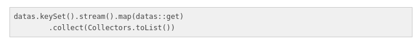
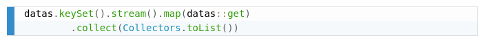
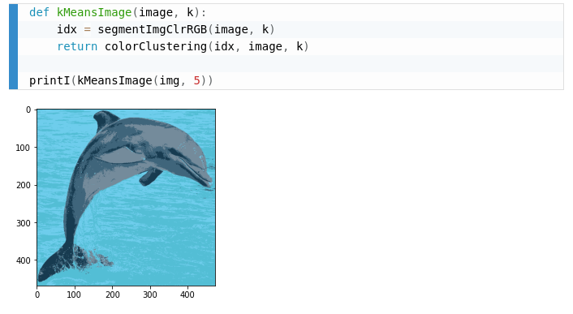

My blog uses Pandoc to convert markdown into HTML documents. However, the code highlighting that Pandoc does is dull. 

The image below is what a Pandoc code block looked like:



This is the same block but rendered using [Prism](https://prismjs.com/):



Following the [PrismJS](https://prismjs.com/) website, all you need to do is link a CSS file and some javascript files to highlight the code chunks. EZ.

```html
<link rel="stylesheet" href="https://cdnjs.cloudflare.com/ajax/libs/prism/1.20.0/themes/prism-coy.min.css" integrity="sha512-m/Sn0Ay9ynzYIZZbbw5Jy2QEJhXXeppOimbFNz+5qj1wUOnrzt9Q2a4fRMFqp8SOFNZ3ZwVf+Zm/ezabpqlXXQ==" crossorigin="anonymous" />

<script src="https://cdnjs.cloudflare.com/ajax/libs/prism/1.20.0/prism.min.js" integrity="sha512-rYNMWcr8EuYc/6mSBu0wD+hSoA4KkHvYRlmJEJGQI4bsho0OiX8fPOVB822QQZizkTUdkUCnJLnN8SAUBg9y9w==" crossorigin="anonymous"></script>
<script src="https://cdnjs.cloudflare.com/ajax/libs/prism/1.20.0/plugins/autoloader/prism-autoloader.min.js" integrity="sha512-X4dQSI7eXvU12QcGK4YiwB30fIdLL7bxJbpC8149YrjO/3nSLLDFZNWBol5hBYPLePVHr0IBBNKKtw9zfULPOw==" crossorigin="anonymous"></script>
```

On the Pandoc side, you need to disable Pandoc from highlighting the code using the "--no-highlight" command-line argument. 

```bash
pandoc --from markdown-markdown_in_html_blocks+raw_html --toc --toc-depth=3 -N --mathjax -t html5 --no-highlight file.md
```

The HTML code that Pandoc produces will look something like this:

```html
<pre class="javascript">
    <code>
        var i = 12;
    </code>
</pre>
```

The language tags that Pandoc produces is incorrect for most javascript highlighting libraries -- documented in Pandoc [issue 2858](https://github.com/jgm/pandoc/issues/3858).
The correct HTML standard for code blocks put the language tag on the code tag rather than in the pre tag.

```html
<pre>
    <code class="language-javascript">
        var i = 12;
    </code>
</pre>
```

I ended up using some hacky regular expressions to convert from the Pandoc code format to the desired output.  

```javascript
var re = /\<pre class=".*?"><code>/;
while (result.search(re) != -1)
{
    var preTag = result.match(/\<pre class=".*?"><code>/g)[0];
    var finishIndex = preTag.split('"', 2).join('"').length;
    lang = preTag.substring(12, finishIndex);
    var newHTML = `<pre><code class="language-${lang}">`;
    var original = `<pre class="${lang}"><code>`;
    result = result.split(original).join(newHTML);
}
```

Although not greatly documented on their website, if you want to re-highlight code because you have a dynamic component of your website, you can use the "Prism.highlightAll()" function.

```javascript
Prism.highlightAll();
```

I am mesmerized by how fabulous code snippets look with Prism.


