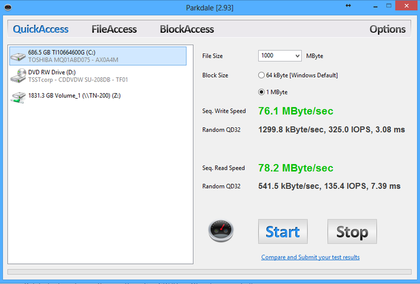
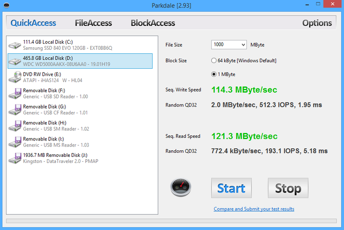
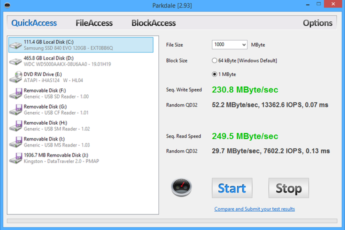

Many people don’t realize that the slowest part of their computer is the hard
drive. The read and write speeds of a hard drive affects the computer’s
performance. The most affected processes are the boot time and time it takes to
open an application.

Experiment
----------

I decided to explore the speed differences between several types of hard drives.
In all the trials I used a program called Parkdale for speed measurements.
\*Please note that these are just the hard drives I had lying around, there can
be great variation of performances between different manufacturers.

5400 RPM Toshiba Laptop HHD
---------------------------

7200 RPM HHD
------------

Samsung 840 EVO SSD
-------------------

Kingston SSD
------------

Conclusion
----------

It may be easy to conclude that SSDs are fast and you should just use those.
However, there is a time and a place for each of these HHDs due to their price
point. It would cost a ridiculous amount of money to have two terabytes of SSD
storage on my computer. My main computer has 120 GB SSD for my installation of
Linux and a 2 TB HHD for all my personal files. In this case I get the best of
both worlds. On one hand I get incredibly fast storage for all my programs which
depends on read and write speeds of the HHD. On the other hand I get relatively
cheap storage for all my movies and pictures.
