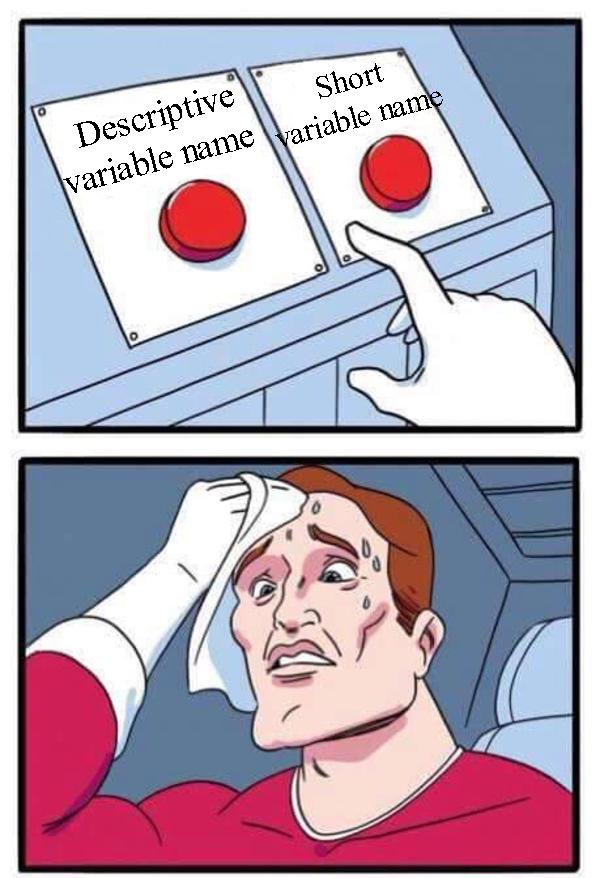

Is that English?
```
private boolean canCompressBlock(Coordinate start, int size){
   return size == (int)Arrays.stream(this.rawImage, start.getRow(), start.getRow() + size)
           .filter(r-> size == (int)Arrays.stream(r, start.getCol(), start.getCol() + size)
                   .filter(c-> c == this.rawImage[start.getRow()][start.getCol()])
                   .count()).count();
}                   
```

After 30 minutes of brain boiling work, I finally finished crafting the most
beautiful lambda statement in Java. What could have simply been done in two
nested for loops, I decided to tackle the problem with the infamous lambda
statement-- feared by most programmers. Lambda statements by no stretch makes
code any easier to read since the same tasks can be accomplished through using
simpler and more recognizable syntax. Yet I decided to utilize this excessive
lambda statement. After much contemplation, I realized that I was only using
lambda statements due to the fact that people inside of a field typically try to
write to impress their peers. This code chunk is clearly a sophisticated use of
functional programming and will likely impress people inside the computer
science community; however, 95% of my computer science class would not
understand a single word of this statement. This poses a dilemma to newer
programmers which may have difficulty reading this “sophisticated code”. After
years of helping students learn to program in my high school, I know that
students struggle with making their own code legible. Their code often lacks
sophistication and clarity. However, at the same time many of my college
professors which are embedded in the field of computer science often write code
that is too sophisticated and obscure for anybody to easily understand. This got
me thinking, how can we teach students to programming in a way that yields
legible code for everybody in the computer science field? I turned towards
English. It turns out that programming can take a few pointers from English to
improve its clarity. The same skills used to teach writing can be applied when
teaching students to program because excellent code and writing contains thought
through structure, clear phrasing and readability.

The role that composition has in programming is disputed. There are people that
gravitate towards programming in college because it is math and science
intensive. Traditionally, programming has been viewed solely as a science. Some
people may argue that composition does not play an influential role in
programming. Computers are rocks that we tricked into manipulating data for us.
However, language is inescapable and finds a way to seep into every facet of our
lives. Once we recognize the similarities that programming and English
composition have, we can move towards writing more comprehensible code. If you
ignore the parallels between writing and coding, you are disconnected from
relationships that can further enhance your code. Tom Lynch concluded in his
article “Letters to the Machine: Why Computer Programming Belongs in the English
Classroom”, “If English class is where our children already learn how to
critically engage with language, adding computational languages is a natural
complement”(96). The same skills that we have been developing for hundreds of
years to teach English can also be applied when teaching programming.

Structure is the first thing that can make or break a writing assignment or an
extensive programming project. There is nothing more cringe inducing than
sitting down to read an essay only to quickly realize that is just all heaped
into one massive body paragraph. The same is true with programming, students try
to jam all their code into a single method like an overpacked suitcase.
Typically teachers try to prevent the slaughter of an essay by giving students a
graphical organizer to fill out before the pens strike paper. The most notable
essay organizers represent the introduction as an upside-down triangle and body
paragraphs as rectangles. The triangles helps the students visualize the
specificity of details and the partitioning forces the separation of ideas into
paragraphs. It turns out that this technique also yields success in teaching
students structure in computer science. In Vincent’s master thesis he noted
“Results indicated that when students went on to their second level programming
course, the students who were provided templates wrote better code. The code
they wrote was more modular, used more effective parameter passing, and was
better documented”(63). Computer science students are provided with “skeleton
code” where the classes and method headers are provided, but, the students have
to implement the methods. This teaches students to make both methods and classes
homogeneous. In other words, functions should perform one task and should be
under 30 lines long. Functions are a lot like sentences in English where they
should convey a single message. Classes comprise both variables and functions
and should only express one idea -- a lot like a paragraph. You might be
wondering why students struggle with structure in writing when they are provided
ample templates by their teachers. In his essay “Pay Attention to the Man Behind
the Curtain: The Importance of Identity in Academic Writing” Williams states
that “Many students are taught that using the five-paragraph essay form with any
semblance of identity removed is the core of academic writing and will allow
them to march triumphantly through the writing assignments of one class after
another”(Williams 711). The truth is, writing and programming does not always
follow strict structural guidelines. Just like always writing five paragraph
essays is not always the optimal solution for essays, templates also fail in
programming. As much as we love to provide students with nifty templates to
follow, there will come a day when students have to think outside of the box and
formulate their own structure. Programming students need more exercise where
they learn to structure their code into methods and classes. A good example of
such an exercise would have students separate a cluttered chunk of code into
methods and classes. I am not suggesting that teachers should not use templates
to teach structure to students; however, I believe that the templates used
should not be stressed as the only or best solution.

Both concise composition and programming uses clear diction. It is frustrating
when you read an essay and it does not register because the concepts were
inefficiently conveyed. This is a major issue in both writing and programming.
There are simple forms of misleading phrasing that distracts the user from the
intended message. The simple use of obscure verbs or rambling may distract the
reader from the intended topic. Code and literature are competing for your
finite attention when conveying a message. If you have to read a programming
project multiple times before understanding it, its phrasing is probably poor.
An effective way that both English major and Computer Science majors can try to
improve phrasing is through peer reviews. In peer reviews it becomes obvious
which parts of your projects are hard to understand. In his paper “Letters to
the Machine: Why Computer Programming Belongs in the English Classroom” Lynch
noticed that as students become more comfortable with the computer dialect, they
imagined how their audience would respond to what they wrote”(96). Programs,
although ran on the computer are meant to be read and analyzed by other people.
People can make their programs more readable through documentation, clear
variable, and helper methods. Most inexperienced programmers use terrible
variable names which have no relationship to what they are storing. Take the
following example:
```
String s1;
String s2;
String s3;
```

```
String firstName;
String middleName;
String lastName;
```

Someone skimming over the code on the top you would have no clue what the
strings stored and would have to tear apart the program to figure out. The
example on the bottom is crystal clear on what the variables are meant to store.
Like programming students, inexperienced writers tend to struggle with using
sources to support their arguments in their essays. Just like programmers lack
documentation which informs the reader about what the program is doing,
inexperienced writers have a hard time using sources in their essay to support
their claims. In article “I Just Turned In What I Thought” Anne Elrod Whitney
examined a particular student as he struggled to find a balance between personal
ideas and sources when writing an essay(188). Although programmers and writers
may know what they are talking about, they also need to communicate those ideas
with the reader through ample sources and documentation.
```
\++++++++[\>++++[\>++\>+++\>+++\>+\<\<\<\<-]\>+\>+\>-\>\>+[\<]\<-]\>\>.\>---.+++++++..+++.\>\>.\<-.\<.+++.------.--------.\>\>+.\>++.
```
Would you believe me if I told you that the segment of code above this sentence
when ran in a Brainfuck compiler prints “Hello World”?
```
print("Hello World")
```
This programming segment also prints “Hello World”, but in Python. There is a
large variation in programming languages. However, most high level programming
languages like Python and Java are much more readable than Brainfuck. A buzz
word in the computer science field is “abstraction”. Abstraction is the process
of simplifying complicated processes into something more understandable. The
example in the top of the paragraph deals with manipulating memory registers to
become the ascii values of “Hello World”. The problem with Brainfuck is that
whenever you program for it, you have to translate every concept into a byte
array. Computer scientists solve this problem by making higher level programming
languages like Python and Java which takes care of mundane tasks under the hood.
Vincent in his master thesis noticed that “Given the similarities between spoken
languages and object-oriented programming languages that have emerged, there is
much encouragement that there may be possibilities for a new instructional
paradigm”(5). Higher level programming languages are starting to share a
shocking number of similarities with English. With these new levels of
abstraction, programmers are able to focus less on syntax and more on
structured, problem solving and documentation which enables larger teams of
programmers to work together with clarity.

When you start treating code as an extension of the English language rather than
a scientific construct, you start to write more understandable code. A few days
ago a friend of mine asked me for help on a large programming project the night
it was due. My brain groaned as I scanned his project, the bulk of the code was
jammed into an ugly 300-line undocumented method. The variable names were
obscure and there were so many nested statements that the code started to tail
off the screen. I was unable to decipher what was happening in his program. All
I could do for him was suggest how he could clean up his code and restructure
his project so that he can understand what is happening where. It is hard to
solve a bug when even the author has difficulties deciphering what is happening
in the code. Programming is another form of communication that needs to be
treated similarly to composition. The computer does not care what you write;
however, it is critical that your audience is able to understand what you are
saying with clarity and precision.


