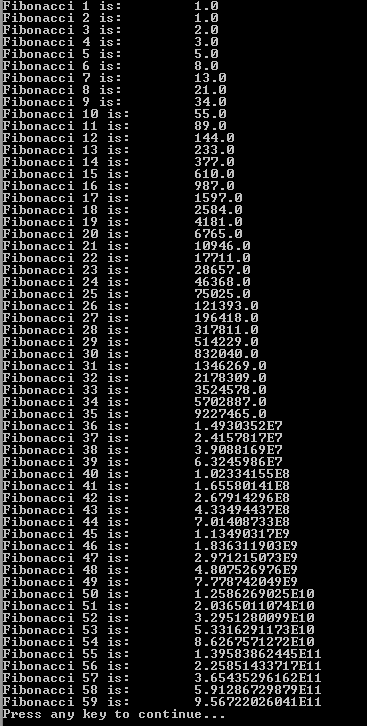

The Fibonacci Sequence is a series of numbers where the next number is found by
adding the previous two numbers.

Ex:

| n | 1 | 2 | 3 | 4 | 5 | 6 |
|---|---|---|---|---|---|---|
| x | 1 | 1 | 2 | 3 | 5 | 8 |


```
class Fibonacci
{
   public static void main(String[] args)
   {
       for(int i = 1; i < 60; i ++)
       {
               System.out.println("Fibonacci " + i + " is: t" + fib(i));
       }
   }

   //recursive definition of Fibonacci
   public static double fib(int n)
   {
       if(n == 1 \|\| n == 2)
       {
           return(1);
       }
       return(fib(n -1) + fib(n -2));
   }
}
```



I would like to note that solving each Fibonacci number recursively is not
efficient due to the enormous stack it creates for higher elements. A more
effective way to calculate the Fibonacci sequence is iteratively. I only did
this recursively to demonstrate its recursive nature.
