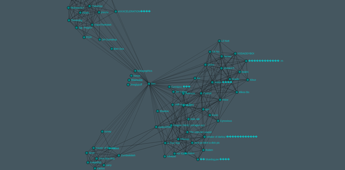
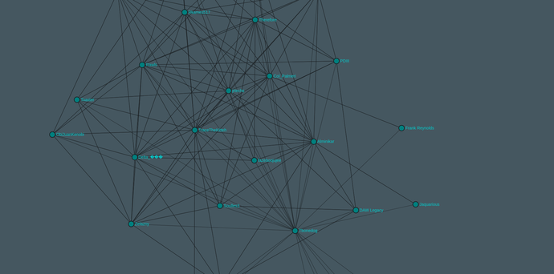

<iframe width="100%" height="315" src="https://www.youtube.com/embed/DoDaHmyIPvQ" frameborder="0" allow="autoplay; encrypted-media" allowfullscreen></iframe>

### Links

- [Github](https://github.com/jrtechs/SteamFriendsGraph)
- [Live Site](http://steam.jrtechs.net/)

### Project Description

This project utilizes the steam api and graph databases to create friend graphs for clients in a 
web browser. Currently there are two types of graphs available:
- Friends of Friends Graph:
    This graph displays all the steam friends of a single person and all of their friends friends as well.
- Common Friends Graph:
     This graph will only display your friends, however, it will draw edges between your friends if 
     they are friends with each other. 

### Motivation

While learning about graph databases I thought that it would be pretty awesome to create a massive graph
database with steam friends in it. After a quick google search, I realized that some other people have 
done similar things in python, however, nobody has ever made a live website do this. Using my prior 
knowledge of the steam api and new knowledge of gremlin, hadoop and hbase, I figured that this would 
be a great weekend project. Although I got most of the functionality done in the first weekend, I 
ended up working on it for 3 weekends to polish it for production. I am satisfied with the
appearance and functionality of the website, but, I am looking forward to make some improvements 
in the future.

### Technical Details

At the core of this project there is a java backend and a javascript frontend. I needed a backend for
this project because you cannot distribute your steam api key, plus this allows me to cache everything
in a graph database. 
The second time a player is queried, it is extremely fast since all the steam friends are cached in 
 [gremlin](http://tinkerpop.apache.org/docs/3.0.1-incubating/) server.
The only time consuming operation that the backend has to carry out is querying the steam api, querying 
the gremlin server is relatively fast.
On the front end I used [Sigma JS](http://sigmajs.org/) with a web socket to render the steam graph.
Since creating a new graph on the back end can take up to 5 minutes, I continuously send new nodes to
the client as they arrive from the steam api. This prevents the client from staring at a loading bar
for 5 minutes; plus, it makes great time lapse videos. The only draw back to this is that you cannot
start applying a force to shake the graph until all the nodes are added to the graph. 

 ### Uses of Friends Graph Data Base
 
There are tons of [academic papers](http://infolab.stanford.edu/~ullman/mmds/ch10.pdf) 
written on the usages of friends graphs. What you may be able to do with a friends 
graph may shock you. A large use of friends graphs is to view friends clusters. For a website
like facebook you may be able to identify someone's family, friends, and work groups. When looking
at steam friends graphs I was able to identify some people's high school and college friends. Another
famous example would be for friends identification. If a ton of people in your friends list is also
friends with a particular person, it is likely that you would also know that person. This is how 
websites like Snapchat, Instagram, and facebook recommend people for you to follow. Similarly, you can
use this to find out who people are best friends with. If two people share a ton of friends, it is 
more likely that they will be good friends vs the person which they only share one friend with.

Simple analysis of graphs like this may seem benign. However, there are tremendous implications when it
comes to privacy and advertising. If websites chose to, they can harvest a ton of data and start
advertising to you products based on not just what you like, but what your friends also like. Steam
already does this to a certain extent when they recommend you games that are popular among friends. 

### Hosting the Project

Hosting the front end of this project is really easy, it is just thrown on a apache server. The backend
is more tricky since it needs to run both a java app and a gremlin server. Currently I am hosting this
project on an Ubuntu VM with 4gb ram. At idle this project only takes 1gb of ram, however, under heavy 
loads it uses around 2 gb of ram and saturates the cpu. 

### Future Plans for Project

In the future I would love to add more graphs to this website. Instead of just displaying graphs it would
also be cool to create pages which try's to identify friends groups, people you may know, and best
friends. There is a ton of game information available on the steam api, it might be useful to make
graphs based on friends who play the same games. 