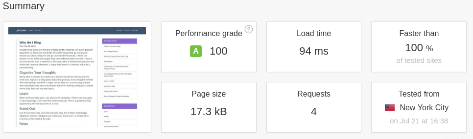
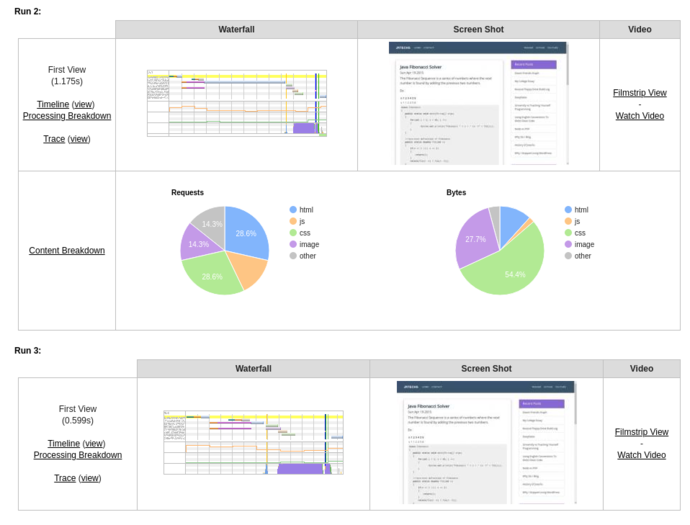

It is a well-known fact that a fast website is critical towards having high user
retention. Google looks favorable upon websites which are well optimized and
fast. If you are using a CMS like WordPress or Wix, a lot of optimization is
done automatically. If you like to build stuff from scratch like me, there is a
ton of work required to optimize a website. This post will cover the 8 things that 
I did to decrease the load time of this blog written in node by two seconds.

#### Final Results


 
This is the result for a single blog post.
 
Before the improvements my home page took 3.14 seconds to load and was 3mb. Now
my home page takes 1.22 seconds to load and is only 1.2mb in size. If you look at the 
waterfall for my home page, most of the time is a result of the youtube embedded
videos loading. 


1: Optimize Images
------------------

Since images are the largest portion of a website's size, optimizing and
reducing the size of images will decrease load time. In a perfect web
development world, everyone would use SVG images which are extremely small and
don't need compression. I wrote a script to automatically optimize JPEG and PNG
images for websites since most people don’t use SVG images.

```bash
#!/bin/bash

# Simple script for optimizing all images for a website
#
# @author Jeffery Russell 7-19-18

WIDTH="690>"  # the ">" tag specifies that images will not get scaled up

folders=("./entries" "./img")

for folder in "${folders[@]}"; do

    for f in $(find $folder -name '*.jpg' -or -name '*.JPG'); do
        convert "$f" -resize $WIDTH "$f"
        jpegoptim --max=80 --strip-all --preserve --totals --all-progressive "$f"
    done


    for f in $(find $folder -name '*.png' -or -name '*.PNG'); do
        convert "$f" -resize $WIDTH "$f"
        optipng -o7 -preserve "$f"
    done
done
```

This script will go through the ‘img', and ‘entries’ folders recursively
and optimize all the images in there. If an image is more than 690px wide, it
will get scaled down. In most cases it is useless to have images with
a width greater than 690px because it will just get scaled by the client's web
browser.

If you are running a Debian based linux distro, you can download the
dependencies for this script with the following commands:

```bash
apt-get install jpegoptim
apt-get install optipng
apt-get install convert

```

The goal of this script is to make most of the images under 100kb for the web.
It is ok to have a few images above 100kb; however, you should really avoid
having images above 200kb.

2: Take advantage of Async calls
--------------------------------

One of the largest benefits of Node is its Async abilities: code is
executed in a multi-threaded fashion. This can become a "callback hell" if not
handled correctly, but, with good code structure it can become very useful and easy to manage. When
code is executed in parallel, you can decrease run time by doing other stuff
while waiting on costly file IO and database calls.

The problem with Async code is that it is hard to coordinate. Node has a lot of
ways to handel synchronization; I prefer to use
[Promises](https://developer.mozilla.org/en-US/docs/Web/JavaScript/Reference/Global_Objects/Promise).
Here is a simple example where Async code can be misused.

Bad Async Code:

```javascript
includes.printHeader(res).then(function()
{
    return require(file).main(res, filename, request);
}).then(function()
{
    return includes.printFooter(res);
}).catch(function(err)
{
    console.log(err);
})
```

Good Code Async:

```javascript
Promise.all([includes.printHeader(),
    require(file).main(filename, request),
    includes.printFooter()]).then(function(content)
{
    res.write(content.join(''));
    res.end();
}).catch(function(err)
{
    console.log(err);
});
```

In the second example, three blocks of Async code are executed in parallel and in
the first example three blocks of async code are executed one after another.
Many people may initially do the first option because it may seem like you must
create and render the footer after you render the header and body of the page.

A great way to handel async calls is by having most of your methods returning
promises which resolve to the HTML or DB information that they produce. When you
run Promise.all, it returns an array of the results of the promises which enables you to
preserve the order ie header, body, footer. After you do this for all your code,
it creates a async tree which runs very fast.

Another Good Async Example:

```javascript
/**
 * Calls posts and sidebar modules to render blog contents in order
 *
 * @param requestURL
 * @returns {Promise|*}
 */
main: function(requestURL)
{
    return new Promise(function(resolve, reject)
    {
        Promise.all([renderPost(requestURL),
            require("../sidebar/sidebar.js").main()]).then(function(content)
        {
            resolve(content.join(''));
        }).catch(function(error)
        {
            reject(error);
        })
    });
}
```

3: Client-Side Caching
----------------------

Client-side caching is where the client's web browser stores static content they
download from your website. For example, if a client caches a CSS style sheet,
they won't have to download it again for the next page they visit.

You should cache all images, JavaScript and CSS files since those typically
don't change. It is a good idea to set the expiration date of the cache to be
something longer than a week, I typically set mine for a month.

For a web browser to accept and cache files, you must set some tags in the HTTP
header. In the HTTP header you must specify the content type and cache variables
like max age. You also must assign a ETag to the header to give the client a way
to verify the content of the cache. This enables the client to detect if there
was a change to the file and that they should download it again. Some people set the ETag equal
to the version of the stylesheet or JavaScript, but, it is far easier to just
set it equal to the hash of the file. I use md5 to hash the files since it is
fast and I'm not worried about hash collisions for this application.

You can do this in NGINX if you use it to serve static files, but, you can also
do it directly in Node.

#### Caching CSS

```javascript
var eTag = crypto.createHash('md5').update(content).digest('hex');
result.writeHead(200, {'Content-Type': 'text/css', 'Cache-Control': 
                        'public, max-age=2678400', 'ETag': '"' + eTag + '"', 
                        'Vary': 'Accept-Encoding'});
result.write(content);
result.end();
```

#### Caching Images

```javascript
var eTag = crypto.createHash('md5').update(content).digest('hex');
result.writeHead(200, {'Content-Type': 'image/png', 
                        'Cache-Control': 'public, max-age=2678400', 
                        'ETag': '"' + eTag + '"'});
result.write(content);
result.end();
```

4: Server-Side Caching
----------------------

Even with the best async server, there are still ways to improve performance. If
you cache all the static pages that you generate in a HashMap, you can quickly
access it for the next web user without ever having to query the database or
do file IO.

#### Ex:

```javascript
const cache = require('memory-cache');

var html = cache.get(filename);
if(html == null)
{
    // Generate page contents
    Promise.all([includes.printHeader(),
        require(file).main(filename, request),
        includes.printFooter()]).then(function(content)
    {
        res.write(content.join(''));
        res.end();
        cache.put(filename, content.join(''));
    })
}
else
{
    res.write(html);
    res.end();
}
```

I found that it is the fastest to cache everything from static html pages, CSS,
JavaScript, and images. For a larger site this may consume a boat load of ram,
but, storing images in a HashMap reduces load time since you don't need to read
the image file from the disk. For my blog, server-side caching nearly cut my load time
in half.

Make sure that you don't accidentally cache a dynamic page like the CMS page in
your admin section — really hard to realize while debugging.

To demonstrate the performance increase of this method, I restarted my web
server (clearing the cache) and ran a speed test which ran three trials. The
first two trials were slow since the server did not have anything in its cache.
However, the third trial ran extremely fast since all the contents were in the
server's cache.



5: Enable Compression
---------------------

Compressing content before it is transferred over the internet can significantly
decrease the loading time of your website. The only trade off from this approach
is that it takes more CPU resources, however, it is well worth it for the
performance gains. Using Gzip on CSS and HTML can reduce the size by 60-70%.

If you are running an NGINX server, you can enable Gzip there. There is also a
simple node module which will use Gzip compression on an Express app.

#### Gzip on Express App

```bash
npm install compression
```

```javascript
var compression = require('compression')
app.use(compression());
```

6: Remove Unused CSS Definitions
--------------------------------

If you use a CSS library like Bootstrap or W3-CSS, you will have a ton of css
classes which go unused. The standard BootStrap CSS file is around 210kb. After
I removed unused CSS definitions the size of the BootStrap file was only 16kb
for my website.

For my blog I used the node dependency PurgeCSS to remove unused CSS.

This command will install PurgeCSS for CLI (command line interface).

```bash
npm i -g purgecss
```

This is an example of how you could use PurgeCSS to remove unused css
definitions.

```bash
purgecss --css css/app.css --content src/index.html --out build/css/
```

PurgeCSS CLI options.

```bash
purgecss --css <css> --content <content> [option]

Options:
  --con, --content  glob of content files                                [array]
  -c, --config      configuration file                                  [string]
  -o, --out         Filepath directory to write purified css files to   [string]
  -w, --whitelist   List of classes that should not be removed
                                                           [array] [default: []]
  -h, --help        Show help                                          [boolean]
  -v, --version     Show version number                                [boolean]
```

This is not the ideal solution since some CSS definitions may be used on some
pages yet unused on other pages. When running this command be sure to select a
page which uses all your CSS to prevent losing some CSS styling on certain
pages.

You don't have to use this through the command line, you can run this directly
in your node app to make it automated. Check out their
[documentation](https://www.purgecss.com/) to learn more.

7: Minify CSS and Javascript
----------------------------

This is the easiest thing you can do to reduce the size of your website. You
just run your CSS and JavaScript through a program which strips out all
unnecessary characters.

Ex of Minified CSS:

~~~~~~~~~~~~~~~~~~~~~~~~~~~~~~~~~~~~~~~~~~~~~~~~~~~~~~~~~~~~~~~~~~~~~~~~~~~~~~~~
.bg-primary{background-color:#3B536B!important}#mainNav{font-family:Montserrat,'Helvetica Neue',Helvetica,Arial,sans-serif;font-weight:700;text-transform:uppercase;padding-top:15px;padding-bottom:15px}#mainNav .navbar-nav{letter-spacing:1px}#mainNav .navbar-nav li.nav-item a.nav-link{color:#fff}#mainNav .navbar-nav li.nav-item a.nav-link:hover{color:#D2C0FF;outline:0}#mainNav .navbar-toggler{font-size:14px;padding:11px;text-transform:uppercase;color:#fff;border-color:#fff}.navbar-toggler{padding:.25rem .75rem;font-size:1.09375rem;line-height:1;background-color:transparent;border:1px solid transparent;border-radius:.25rem}.table .thead-dark{color:#fff;background-color:#513E7D;border-color:#32383e}footer{color:#fff}footer h3{margin-bottom:30px}footer .footer-above{padding-top:50px;background-color:#3B536B}footer .footer-col{margin-bottom:50px}footer .footer-below{padding:25px 0;background-color:#3B536B}
~~~~~~~~~~~~~~~~~~~~~~~~~~~~~~~~~~~~~~~~~~~~~~~~~~~~~~~~~~~~~~~~~~~~~~~~~~~~~~~~

There are Node libraries which can minify CSS and Javascript, however, if you
are lazy, just use a website like [this](https://cssminifier.com/).

8: Keep Minimal JavaScript
--------------------------

Ignoring the gross amount of Node dependencies you have, it is critical to
minimize the amount of dependencies the client needs. I completely removed
BootStrap's JavaScript and jQuery from my blog by simply writing a javascript
function for my nav bar. This reduced the size of my website by 100kb.

```javascript
const e = document.querySelector(".navbar-toggler");
const t = document.querySelector(".navbar-collapse");

e.onclick = function()
{
    if (e.getAttribute("aria-expanded") == "false")
    {
        t.classList.remove('collapse');
        e.setAttribute('aria-expanded', true);
    }
    else
    {
        e.setAttribute("aria-expanded", false);
        t.classList.add('collapse');
    }
}
```

You should debate how much you need 3rd party scripts like Google Analytics. In
most cases people don't full take advantage of Google Analytics, a simple
backend analytics service would work just as good while saving the client load
time.

Resources
---------

-   [Pingdom Speed Test](https://tools.pingdom.com/)

-   [Google Website Speed
    Test](https://developers.google.com/speed/pagespeed/insights/)

-   [Code to My "Optimized" Node Blog](https://github.com/jrtechs/NodeJSBlog)

-   [Purge CSS](https://www.purgecss.com/)

-   [CSS and JavaScript Minifier](https://www.minifier.org/)
