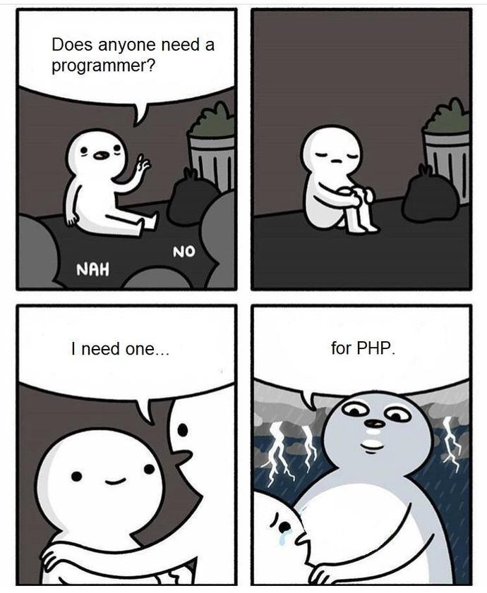

It used to be the case that you wrote PHP for the backend and JavaScript on the
front end. However, that has all changed with the invention of Node.js. Some kid
invented a clever way to run JavaScript on the server. Now we can develop a
website that runs JavaScript on both the front and back end. This is good right?
We should all learn JavaScript. The one language to rule them all. Although
Node.js has taken the web by storm, I would argue that there are cases where PHP
is still relevant and even preferable.

Where PHP Wins
--------------

The major benefit with PHP is the low development time. You can write a website
in PHP much faster than you could with Node.js. PHP is simply easier to work
with than Node.js. Things like GET, POST, and SESSION information is simply a
variable that you reference. Doing the same things in node.js is trickier
because they require node dependencies – which vary in quality. Next, PHP was
built to work nicely with databases like Mongo, and MySQL. In PHP you can make
database query without falling into the callback hell that you experience in
Node.js. It is not impossible or impractical to work with databases in node.js,
I have done it plenty of times. However, synchronization of the database calls
can be tricky and requires more code than it does in PHP.

Another key point is that PHP has been out for a longer amount of time so there
is an abundance of code on the web for reference. Not only is there more code
but there is also an abundance of tutorials, and books written on PHP. The last
reason why I love PHP is that it is really easy to deploy. If you updated a file
all you have to do is upload it to your apache web server. That’s it. With
Node.js you would have to upload the file and restart the server for the change
to take effect.

Where Node.js Wins
------------------

If you only want to know one language, Node.js wins because you can now just
become a master at JavaScript. Many larger companies are starting to use Node.js
simply because it is faster than PHP. The asynchronous calls in Node.js is a
huge time saver for applications that heavily rely on database or API calls. The
brilliant use of callback functions can make your application run wickedly fast.
However, callback functions and synchronization promises can be a headache to
write. Once you get into the groove of it, it is not terrible, but it will add
development time to your project.

Compared to PHP, Node.js is a newer language. There is currently a lot of people
actively developing for it. Therefore, the libraries that you are using are
newer and are often faster than their PHP counterparts. NPM is a lifesaver. NPM
offers thousands of modules at your fingertips which can easily add
functionality to your project.

Conclusion
----------

I don’t want to sound like I hate Node.js, I enjoy using both PHP and Node.js.
PHP is better for smaller projects due to it’s fast development time. I would
recommend Node.js for any project that deals with heavy database usage. The
perfect use case for Node.js would be for a web API. If your project is heavily
dependent on HTML - like a blog- I would urge you to use PHP.

If you are still undecided, just learn Node.js. It pains me to say it but,
Node.js is slowly taking over PHP.

